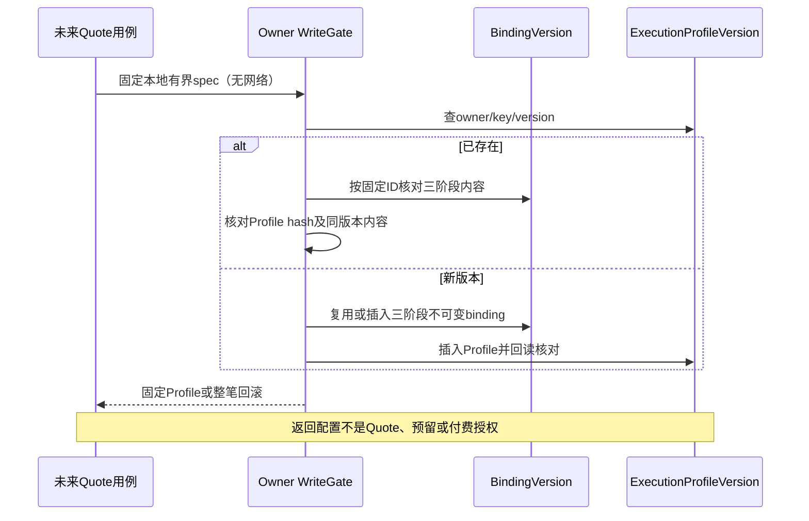

# 固定执行配置 · M2-B1内部契约

2026-09-13。**内部事务原语，不是已开放的Quote/API，也不是模型可执行证明。** 只补生成主链必要身份；原3100页面、开局协议、前端mock职责不改变。

## 1. 一个Profile覆盖一个有界回合

`ExecutionProfileSpec` 固定：

- `ownerId / profileKey / versionNo / schemaVersion=1 / currency`。
- `graph: {version, sha256}`；planner/validator各自`prompt / outputSchema: {version, sha256}`。
- planner/video/validator各自完整供应商Binding快照：精确model、connection、region、账号scope、credentialRef、协议、adapter/capability版本、有效参数。
- planner/validator为明确`mode=text, operationKind=structured-generation`；输入模态仅`[text]`或`[text,image]`，validator必须声明图像输入，防止用纯文本自证画面。声明模态不是已验证供应商能力。
- text固定每次最大输入token（1–1,000,000）、最大输出token（1–100,000）、temperature（0–2）；这是应用边界，实际模型/上下文/SDK计数准入还要进一步收紧。
- text阶段最多1–3次总调用（含初次、重试或修复），video当前严格job/t2v或i2v、一次创建。未知提交从来不因maxCalls有余量而获得重发许可。
- 各阶段`maxCostMicros`是**整个阶段全部允许调用累计上限**，不是每次上限。规范正整数字符串；三阶段求和不超过signed int64。当前保守要求正上限，不把未知价格写0。费用上限与价格、费用预留、供应商账单均不相等。

Profile保存未知能力证据是允许的，便于审计配置；Quote必须额外核对真实登记、模态/素材、价格版本、artifact可用性和费用包络。未经这些校验的Profile绝不自动授权派发。没有任何生产默认text模型、假定价格或额外供应商回退。

## 2. 内部原语与所有权

```ts
pinExecutionProfile(scope, owner, spec, services?) -> PinnedProfile
readExecutionProfile(scope, owner, id) -> PinnedProfile
```

`owner`由宿主提供；scope属于同一个认证owner事务。pin必须在同一WriteGate内完成，不自行嵌套事务。未来Quote组合使用`createExecutionProfileWriteScope(tx, ownerId)`；单独Store仅提供这一原语的事务边界，没有Profile管理CRUD。

同一`(ownerId,profileKey,versionNo)`：同完整快照复用、内容漂移`EXECUTION_PROFILE_CONFLICT`。三个Binding沿同一个`ProviderBindingVersion(ownerId,bindingKey,versionNo)`真实唯一键固定；同Binding版本更换账户/地区/模型/参数/能力即`PROVIDER_BINDING_CONFLICT`。不同Profile key允许同配置，不按hash合并。

低层只提供insert，不提供覆盖/删除；插入Profile前检查三个引用均属于owner。应用回读再核对完整binding、Profile身份和内容、createdAt及引用，错误整笔回滚。无SQL外键/触发器。

Profile hash是规范JSON SHA256，包含dataset、Profile自身身份/三个持久binding ID、完整spec和createdAt；不是签名或独立授权。内部snapshot包含credentialRef和账号作用域等非秘密身份，**不直接序列化到公共HTTP或日志**；没有实际密钥值。未来Quote公开摘要另行投影。

已固定配置读回不访问当前宿主registry、可编辑剧本或网络；真实供应商下线不改写原配置。读取异常固定错误、不回显内部内容。

## 3. 表与迁移

新增一表`execution_profile_versions`，id为runtime UUIDv7，createdAt为runtime UTC毫秒，无数据库时间/ID自动生成。不可变版本只有createdAt，没有没有意义的updatedAt/deletedAt/revision；变更新增version，历史不可复用。

唯一新增业务唯一：`uq_execution_profiles_version(owner_id,profile_key,version_no)`。所有字段非空。共17业务主键、14真实业务唯一；不为snapshotHash、model、owner单列、创建时间添加伪唯一。见[登记表](../architecture/UNIQUE-KEY-REGISTER.md)。

`202609130001_execution_profiles`只创建该表和一个唯一索引；原authoring migration保持不变。runtime要求**完整两条批准migration及checksum/完成状态＋精确最终sqlite_master DDL**；缺一条、错误checksum、失败/回滚或多一条皆拒绝。生成脚本从仓库SQL在内存生成指纹，不从用户数据库学习白名单。

部署升级是显式维护流程：停止原launcher/worker，使用可靠SQLite备份（WAL状态不能只复制主db，迁移前显式关闭全部备份连接/句柄），在相同受控环境用`prisma migrate deploy`执行已审核迁移，`runtime --check`验证，然后启动原launcher。HTTP和普通读取不自动迁移；不reset、不伪造迁移完成记录。现有镜像/发布流程的自动迁移仍需部署阶段另行验证，不能仅凭本片内部测试宣称已发布。



## 4. 完成边界与紧接工作

本片覆盖纯严格契约、同事务pin/read、真实SQLite漂移/owner/hash/引用/回滚/断开重开、完整迁移链和无损增量升级反例。没有模型网络端口、没有读取密钥、没有公开quote按钮。

下一片先落实宿主持久storeEpoch及恢复隔离，再Quote（绑定当前经历/节点/revision、动作/素材/规格、Profile、价格证据、总费用、有效期和可读告知）。首次接受必须连同BudgetScope、两级预算、TurnRun/Reservation/Quote一次消费/回执/Outbox完成；再接LangChain有界planner、PreparedGeneration、一次submit/未知核对、私有媒体与播后互动。当前还未完成整个视频产品。
