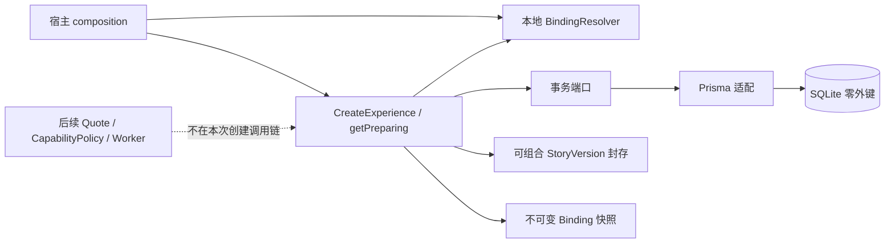
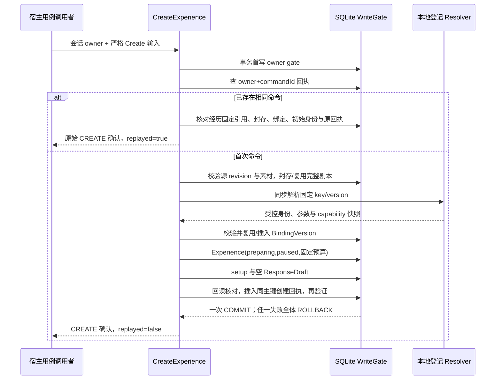

# M2-A2 · 正式开局持久契约

> **M2-A4更新：** 下方为内部用例语义；同一AppRouter现已接入[三个正式HTTP操作](OPENINGS-HTTP-M2-A.md)，通过隔离dev/production验证。原UI尚待消费，不代表已生成。


2026-09-13。**内部 runtime 用例已实现；本文件不是已上线的 tRPC/REST 路由。** 原 3100 页面尚未调用本用例，视频提交/报价/媒体仍按后续计划实施。不可把本片的 `preparing` 当作已经开始生成。

## 1. 范围与入口

`createExperienceOpeningService(db, resolver, services)` 显式注入 Prisma、宿主本地绑定登记解析器和时钟/UUIDv7。提供 `create(owner,input)` 和 `getPreparing(owner,input)`。不创建第二个应用、连接框或数据目录；不做新旧数据协议兼容层。

客户端未来只能选择绑定 key/version。`owner={ownerId,datasetId}` 来自宿主会话，绝不是用户提交的字段。当前内部函数不授予 HTTP 调用权。

```ts
type CreateExperience = {
  protocolVersion: 1;
  datasetId: string; // UUIDv7，必须匹配宿主数据世代
  commandId: string; // UUIDv7，同一次操作的未知结果恢复必须重用
  storyDraftId: string;
  expectedStoryRevision: number;
  bindingKey: string;
  expectedBindingVersion: number;
  budget: {limitMicros: string; currency: 'CNY' | 'USD'};
};
```

严格拒绝额外字段、客户端 owner/URL/key。预算是 `0…9223372036854775807` 的规范十进制字符串；不接受 number、小数、指数、负数、前导零、空白或隐式汇率。零预算允许准备，**并不表示模型免费，也不构成付费授权**。

## 2. 成功与历史回放

`create` 返回 `{data:ExperienceOpeningDTO,replayed:boolean}`。`data` 是第一次 CREATE 的不可变确认，不是当前世界状态。

| 字段 | 意义 |
|---|---|
| id / revision / createdAt | 服务端 UUIDv7，初始业务修订 1，UTC 毫秒时间 |
| story | 完整封存剧本：内容/角色版本/覆盖/三图槽/封口摘要，不查当前模板 |
| binding | 明确白名单：id、bindingKey/versionNo、providerId、精确 modelId、mode、公开 connectionId/region、adapter/capability 版本、snapshotHash |
| budget | 固定上限和币种，BigInt 入库、字符串出库 |
| status / schedulingPaused | `preparing / true` |
| setup | 初始节点 id、experienceId、`kind:setup`、experienceRevision 1、`options:[]` |
| responseDraft | 初始草稿 id、experienceId、interactionEventId、空 text、revision 1 |
| media / canRespond / canDispatch | `null / false / false`；未生成、未开放回应、未授权派发 |

这不是无引导聊天的产品裁决：**真正播完后的情境建议和自由回应仍是后续正式节点的要求**。setup 没有视频内容证据，因此不伪造建议。

同 owner/commandId 下：同规范请求返回原确认，异请求或异业务命令抛 `IDEMPOTENCY_CONFLICT`。回放发生在读取当前草稿、当前素材和 resolver 之前；当前源修改、默认模型变化不重新开局。

回执不是仅靠自身 JSON 自证：回执主键与 Experience 主键共享同一个服务端 UUIDv7（不是 commandId）；以主键读取真实经历，核对固定 StoryVersion、BindingVersion、预算、创建时间、初始节点/草稿身份；由这些独立持久事实重建请求摘要和公开返回，逐字段比较。回执整体交换、合法金额替换、绑定漂移、来源替换均失效。

经历后来播放、草稿后来修改或软删除，不改历史 CREATE 确认；回放不复活记录。历史确认绝不能直接覆盖未来 Player 当前状态。

`getPreparing(owner,{protocolVersion:1,datasetId,id})` 仅用于仍保持初始准备态的聚合读回：要求 preparing、paused、dispatchEpoch=0、业务/行修订=1、空初始草稿、无归档；非初始状态抛 `PREPARATION_NO_LONGER_CURRENT`，软删除或跨 owner 返回 `EXPERIENCE_NOT_FOUND`。未来完整状态快照要单独实施，不把这一专用方法扩散成播放查询。

## 3. 固定供应商—连接—模型

`BindingResolver.resolve(owner,{bindingKey,versionNo})` 是**同步、有界、本地登记解析**，不发网络、不读真实秘密、不探测账户，不在事务里调用 SDK。即使可信来源仍解码其输出并检查 owner/key/version。

沿既有 `ProviderBindingVersion` 表：

| 位置 | 固定内容 |
|---|---|
| 顶层 | ownerId、bindingKey/versionNo、providerId、精确 modelId、adapterVersion、capabilityVersion、mode、credentialRef、schemaVersion、服务端 id/createdAt |
| parameters | schemaVersion=1、connectionId、region、endpointProfileId、providerAccountScopeId、catalogId、operationKind、protocolVersion、generation |
| capabilities | schemaVersion=1 的有界、规范化 JSON 快照 |

parameters 身份字段严格，generation/capabilities 只接受有界 JSON：深度≤12、节点≤4096、对象/数组≤256项、字符串≤8192、总序列化≤65536字符；拒绝非有限数、稀疏数组、getter、符号/隐藏状态和原型字段。生成参数和能力的**组合语义**不在这次零调用封存中解释，后续 CapabilityPolicy 必须依 capabilityVersion 解码对应矩阵，验证登记部署、输入用途、账户证据及成本后才可报价/派发。`unknown` 不会被转成执行许可。

同 owner/key/version 已存在：严格解码、规范比较后复用；同版本账户/地区/参数漂移返回 `PROVIDER_BINDING_CONFLICT`。没有 upsert、普通更新或静默 fallback。key 轮换由宿主更新秘密引用背后的值；换账户/地区必须新连接/绑定版本。

公开返回不包含 credentialRef、账户 scope、端点配置、原始 capability/generation 或文件路径。snapshotHash 绑定固定记录和 dataset，仅是完整性指纹，不是签名、能力证明或授权。

## 4. 架构与时序





孩子插入端口也执行逻辑关系约束：setup先确认同owner的初始preparing父经历，ResponseDraft再确认同owner且属于该经历的setup和一致创建时间，缺失/错绑/跨owner直接拒绝，防止损坏他人历史。这不是物理外键。

所有新写在同一个 owner WriteGate 事务；不嵌套封存 store 的 write。任一写点或回读/回执失败，封存/绑定/经历/节点/草稿/回执全体回滚；先前已存在的封存/绑定不删除。并发相同命令最多创建一次；新 command 可以创建相同配置的另一经历，不加伪唯一。

## 5. 错误与恢复裁决

| code | 调用方处理 |
|---|---|
| CLIENT_RELOAD_REQUIRED / DATASET_CHANGED | 停止本次命令，重新同步协议/世代；不换 command 偷重发 |
| INVALID_EXPERIENCE_COMMAND / INVALID_EXPERIENCE_QUERY | 修正严格输入 |
| OWNER_UNAVAILABLE | 重建有效宿主会话，不信任前端 owner |
| REVISION_CONFLICT / STORY_ARCHIVED / STORY_ASSET_NOT_READY | 重新读取源并由用户明确新操作；已受理回放不走此路径 |
| INVALID_PROVIDER_BINDING / PROVIDER_BINDING_MISMATCH | 宿主登记异常，停止，不把原始登记/秘密泄露到 UI |
| PROVIDER_BINDING_CONFLICT / STORED_PROVIDER_BINDING_INVALID | 固定版本漂移/损坏；不覆盖旧绑定 |
| IDEMPOTENCY_CONFLICT | command 被用于别的内容，停止并保留原操作 |
| EXPERIENCE_PARENT_INVALID | 内部孩子写入的父归属/节点关联/初始状态不成立，事务回滚，不插入孤儿或跨owner引用 |
| COMMAND_RECEIPT_INVALID / STORED_EXPERIENCE_INVALID | 停止并诊断持久事实；不生成替代回执或假成功 |
| EXPERIENCE_NOT_FOUND / PREPARATION_NO_LONGER_CURRENT | 不将历史创建确认当当前状态或复活数据 |

未来 tRPC 适配需统一映射公共错误、epoch 和 unknown 操作保留；本片不新造 REST 客户端。当前测试在真实隔离 SQLite 上验证断开重连、重复/并发命令、全写点故障回滚与独立身份篡改；这不等于真实生成/浏览器开局/费用验收。

## 6. 下一依赖

受控宿主 connection/deployment 登记及 capability matrix policy → 原页面准备入口与 tRPC 用例 → 固定 ExecutionProfile/价格/Quote/授权包络与预留 → 首回合/持久操作及后台恢复 → 官方提交/查询和私有媒体 → 播后上下文节点/回应/下一幕 → 合格存档树。先前确定的用户体验及预算边界不因本片拆分减少。
