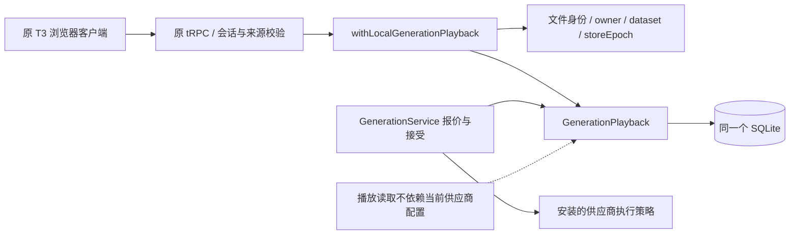
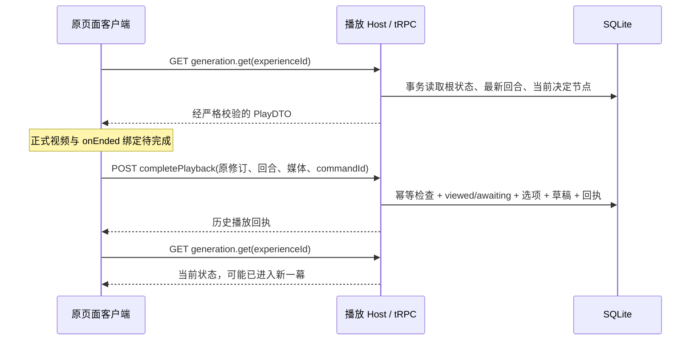
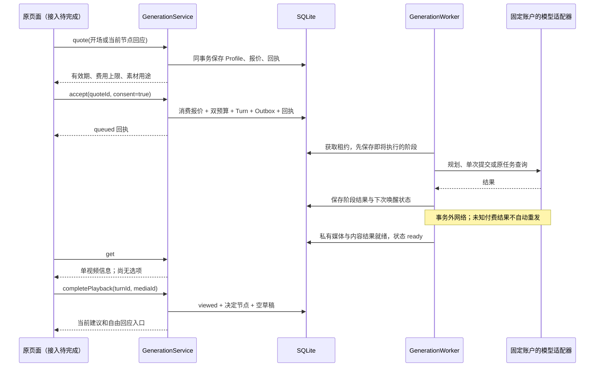
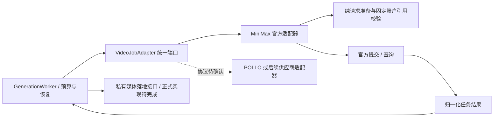

# 分段生成主链与播放 API 契约

2026-09-14。生成实现位于 `apps/runtime/src/application/generation.ts` 和 `generation-worker.ts`；播放读取/回执独立位于 `generation-playback.ts`。`generation.get` 与 `generation.completePlayback` 已注册到原应用的 Host/tRPC，并有浏览器客户端。[私有视频落地与认证读取](PRIVATE-GENERATION-MEDIA.md)已实现独立端口和原应用 GET/HEAD/Range。报价与接受仍是内部契约，**正式导演、供应商/私有媒体执行组合、内容校验适配、调度及原舞台绑定尚未完成**。测试用显式假传输及本地渲染视频验证协议、文件与数据库行为，不是付费模型验收。

## 输入与回执

所有操作由已认证宿主注入 owner、dataset、storeEpoch；请求不能提供 owner、账户、价格、密钥、执行器或费用证明。标识为 UUIDv7，金额用最小货币单位的百万分之一整数字符串。

| 操作 | 输入（除 protocolVersion=1、datasetId 外） | 返回及副作用 |
|---|---|---|
| quote 开场 | commandId、experienceId、expectedExperienceRevision、kind=opening | `{data: QuoteDTO, replayed}`；固定 Profile、素材摘要和最多五分钟的报价，不建任务、不调用模型 |
| quote 回应 | 同上，kind=response、interactionEventId、text（1–2000字符） | 仅当前 awaiting 节点可报价，固定自由回应、上一幕 ID 和摘要 |
| accept | commandId、experienceId、expectedExperienceRevision、quoteId、consent=true | `{data: TurnDTO, replayed}`；同一事务消费报价、占用预算、创建回合和 Outbox，返回 queued |
| get | experienceId | 当前 PlayDTO；纯读取，不触发生成或重发 |
| completePlayback | commandId、experienceId、expectedExperienceRevision、turnId、mediaId | ready 且绑定媒体匹配后，原子转换为 viewed/awaiting，创建决定节点及空回应草稿 |

`QuoteDTO.summary` 含标题、本次输入、模型、地区、时长、分辨率、比例、声音方案、明确发送的私有图片 ID。不得将此摘要说成视频中已发生的内容。`TurnDTO` 是接受回执；其 queued 状态为接受时的历史事实，当前状态以 get 为准。播放回执同样不替代当前读取。

相同命令和规范化输入返回原回执；不同输入复用命令 ID 报 IDEMPOTENCY_CONFLICT。报价回放不续期、不读取当前价格；接受回放不重新预留预算。新命令重用已消费报价被拒绝。修改本轮输入后需要新报价和新的明确确认。

## 原应用播放接口

| 路径 | 方法 | tRPC 输入 / 输出 |
|---|---|---|
| `/api/trpc/generation.get` | GET | `input` 为 JSON 查询参数；输入为上表 get，输出 `result.data = PlayDTO` |
| `/api/trpc/generation.completePlayback` | POST | JSON 请求体为上表 completePlayback，输出 `result.data = {data: PlayDTO, replayed: boolean}` |

两者复用原本机会话 cookie、已配置来源和 `3100` 入口。POST 必须带相同 Origin 与 `x-everwoven-request: 1`；不接受单项或混合 batch。GET URL 上限 8192 字节，POST 流上限 16384 字节；响应 `no-store`、`nosniff`。浏览器读取成功响应最多 128 KiB，错误响应最多 8 KiB，越界立即取消读取。读取状态没有业务写入，也不唤醒 Worker。

`PlayDTO` 的固定字段：`protocolVersion`、`datasetId`、`experienceId`、`title`、`revision`、`status`、`turn`、`interaction`。`turn` 仅含 `id/status/media/errorCode`；`media` 仅含私有 ID 和正数时长，不含绝对路径或供应商 URL。`interaction` 仅含 ID、1–2000 UTF-16 单元的摘要与 2–4 个去重建议；建议含 `id/title/text`，标题最多 100 单元，回应最多 2000 单元。

输出校验关系：preparing 无 turn；generating 只允许执行中的 turn，且无媒体/选项；playing 必须 ready 且有媒体但无选项；awaiting 必须 viewed、有媒体和合法建议。unknown/failed 对应同名 turn，隐藏媒体和建议。成功/已播放状态不能带错误码。任何未知字段、跨数据集/经历响应或不一致状态都转为固定内部错误。

当前幕定位使用已接受报价的 `experienceRevision`（逻辑修订），并验证报价 acceptedTurnId 与回合 quoteId、owner、经历、interactionEventId 的双向关系。接受使经历修订 +1，播放完成再 +1；同一逻辑节点出现多份已接受报价按数据损坏拒绝。报价、播放读取/完成和下一幕父节点选择共用此定位规则，系统时间回拨不会切换回旧幕。不增加物理外键或新的唯一约束。

播放回执必须关联原请求的 turnId/mediaId，返回修订精确等于请求修订 +1。旧命令重放返回历史 awaiting 回执，**不代表当前仍可回应**；客户端应另行 GET 后渲染。新命令使用旧修订返回 409。当前 completePlayback 是受认证客户端的播放完成通知，尚不证明实际播放覆盖范围；正式媒体服务/播放凭据门锁仍待补齐，不能据此宣称真实视频验收完成。

错误：无效参数 400；会话失效 401；来源拒绝 403；经历不存在 404；修订/幂等冲突、当前不可播放、内容未确认 409；数据集/协议变更 412；超大请求 413；未知内部失败 500；存储 epoch 暂不可用 503。返回固定标识，不传递堆栈、数据库路径、供应商响应。网络中断、无效响应、5xx 保持结果 unknown，不自动重发任何命令。

## 持久执行

Worker 每次 tick 只做一步。queued → planning → prepared → submitting → polling → materializing → checking → validating → ready。暂停在 ready 等播放确认，不自动生成下一幕。

planning/submitting/validating 在调用前已持久化。租约过期后发现这些阶段，标记 unknown、暂停经历、保留费用占用；迟到回调不覆盖新状态。有供应商 task reference 的 polling 只查询原账户原任务。查询暂时中断延后查询，不重新 POST。默认租约两分钟；正式 executor 仍须实现各调用的超时和退出取消，宿主调度也尚未注册。

`GenerationExecutor.assertProfile` 必须验证安装的 graph/prompt/schema/adapter；`plan` 不接收或输出模型选择和任意图像 URL。图像 URL 由独立的受信素材解析步骤提供，须只解析本次报价已同意的素材。正式图像解析与私有媒体落地尚待接入，不能用外部 URL 直接充当私有视频。

### 供应商无关的视频任务端口

`GenerationExecutor.jobs(binding)` 返回 `VideoJobAdapter`，Worker 不再导入 MiniMax 模型枚举、请求构造器或供应商结果类型。接口位于 `apps/runtime/src/ports/video-jobs.ts`：

| 操作 | 边界 |
|---|---|
| prepare(plan) | 纯函数；只接收提示词与已经同意的首/尾帧，模型、规格从封存 binding 获取 |
| validatePrepared(unknown) | 纯函数；对 SQLite 中恢复的请求重新做供应商规格校验，不能只信 TS 类型 |
| reference(unknown) | 纯函数；校验已保存任务所属的供应商、固定账户、模型、地区及配置摘要 |
| submit(operationId, prepared, signal?) | 一次提交；前面必须已经完成预算接受与持久阶段写入 |
| read(reference, signal?) | 查询原供应商原账户的任务，不切换账户或自动重新提交 |

适配器必须暴露绑定 ID 和摘要，Worker 在规划/提交/查询/下载恢复之前与封存 binding 比较。任务引用含显式 `providerId`，并由适配器及 Worker 双重核对 operationId、bindingId/hash、connectionId、accountScopeId、region、modelId。不存在按模型名称自动挑选供应商的回退。当前 MiniMax 官方适配器已实现该端口；POLLO 适配器仍待实际协议和模型 ID 确认，不把内部测试供应商注册为产品能力。

归一化结果由 `parseVideoJobSnapshot` 在收到和重新读取 SQLite 时校验：succeeded 必须有 HTTPS 视频、正数时长与规格；非成功状态不携带视频；未知字段、凭据 URL、非有限/负费用计量被拒绝。结果 taskId 要匹配保存的任务引用，素材下载前再次核对报价规格，落地媒体时长也须匹配。缺少 usage 保持缺少，不变为零费用；实际结算仍待完成。

固定身份错误（适配器错配、任务引用无效、任务关联不匹配）以及下载恢复时已经损坏的存储结果会进入 unknown/blocked，保留预算、不再每十秒重试。临时网络查询中断仍只重查原任务。引用中的 providerId 为必填，当前未发布的开发协议不添加旧格式兼容；上线生成前要完整验证正式执行器。2026-09-14 只读核实原用户库生成任务为零，本次不迁移或删除用户数据。

## 存储与费用

- 新增 generation_quotes、budget_scopes、generation_turns、budget_reservations、runtime_outbox 五表；全部没有物理外键。
- Experience.budgetScopeId 在第一次接受时分配；准备阶段不消耗费用。将来的分支必须继承根预算 scope。
- GenerationTurn.parentTurnId 记录上一幕；一个父节点可有多个子节点，使用普通索引。当前已实现同经历的后续幕；跨经历 fork/Savepoint 入口尚未实现。
- generation_turns.quoteId 是真正唯一：一份明确确认的报价最多对应一次生成。其他标题、摘要、父节点、内容 hash 不唯一。
- 报价覆盖 planner/video/validator 的固定最大调用次数、输入输出 tokens、视频秒数、原图及校验采样帧数量上限。整数 BigInt 运算，每项计量向上取整，禁止用 Number 表示金额或把未知费用当 0。
- 根 scope 和当前经历的责任额都必须容纳新报价。held 责任包含未完成和未知；提交失败不推断免费。
- 当前保守地一直保留整份预留。**实际费用结算、释放未使用额度、对账和异常任务人工恢复仍未实现**，因此不把内部状态 ready 当作经济闭环完成。

## 验收界限

已覆盖真实 SQLite 的报价/一次接受、事务回滚、重启原任务查询、未知不重提、播放前无选择、播放后决定节点、自由回应生成子幕和原幕保留。供应商 HTTP、导演、落地视频、内容检查在这些测试中是显式测试替身，生产不会注册这些替身。

下一项是同一原页面/宿主/正式 executor 的组合接入及实际私有媒体播放。完整验收还包括响应草稿编辑持久化、分支存档、实际结算、关闭应用后续玩，以及取得明确预算后两幕真实模型实测。当前没有这些完成声明。
