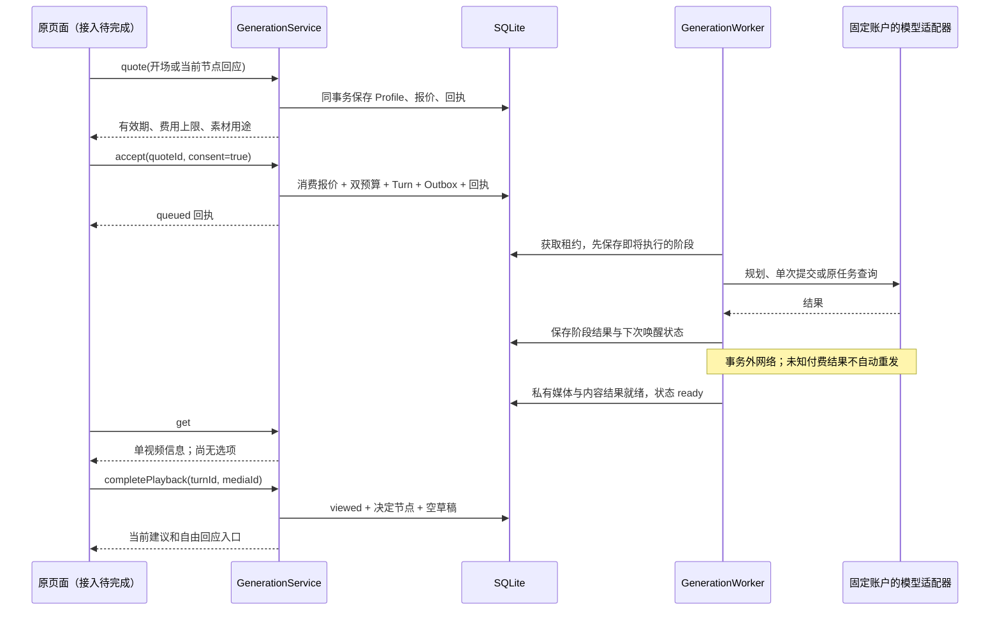

# 分段生成主链：内部应用契约

2026-09-14。当前实现位于 `apps/runtime/src/application/generation.ts` 和 `generation-worker.ts`。本文记录内部已实现契约，**尚未注册到原页面 tRPC/Host，也没有正式的导演、私有视频和校验适配组合**。测试用显式假传输验证协议和数据库行为，不是付费模型验收。

## 输入与回执

所有操作由已认证宿主注入 owner、dataset、storeEpoch；请求不能提供 owner、账户、价格、密钥、执行器或费用证明。标识为 UUIDv7，金额用最小货币单位的百万分之一整数字符串。

| 操作 | 输入（除 protocolVersion=1、datasetId 外） | 返回及副作用 |
|---|---|---|
| quote 开场 | commandId、experienceId、expectedExperienceRevision、kind=opening | `{data: QuoteDTO, replayed}`；固定 Profile、素材摘要和最多五分钟的报价，不建任务、不调用模型 |
| quote 回应 | 同上，kind=response、interactionEventId、text（1–2000字符） | 仅当前 awaiting 节点可报价，固定自由回应、上一幕 ID 和摘要 |
| accept | commandId、experienceId、expectedExperienceRevision、quoteId、consent=true | `{data: TurnDTO, replayed}`；同一事务消费报价、占用预算、创建回合和 Outbox，返回 queued |
| get | experienceId | 当前 PlayDTO；纯读取，不触发生成或重发 |
| completePlayback | commandId、experienceId、expectedExperienceRevision、turnId、mediaId | ready 且绑定媒体匹配后，原子转换为 viewed/awaiting，创建决定节点及空回应草稿 |

`QuoteDTO.summary` 含标题、本次输入、模型、地区、时长、分辨率、比例、声音方案、明确发送的私有图片 ID。不得将此摘要说成视频中已发生的内容。`TurnDTO` 是接受回执；其 queued 状态为接受时的历史事实，当前状态以 get 为准。播放回执同样不替代当前读取。

相同命令和规范化输入返回原回执；不同输入复用命令 ID 报 IDEMPOTENCY_CONFLICT。报价回放不续期、不读取当前价格；接受回放不重新预留预算。新命令重用已消费报价被拒绝。修改本轮输入后需要新报价和新的明确确认。

## 持久执行

Worker 每次 tick 只做一步。queued → planning → prepared → submitting → polling → materializing → checking → validating → ready。暂停在 ready 等播放确认，不自动生成下一幕。

planning/submitting/validating 在调用前已持久化。租约过期后发现这些阶段，标记 unknown、暂停经历、保留费用占用；迟到回调不覆盖新状态。有供应商 task reference 的 polling 只查询原账户原任务。查询暂时中断延后查询，不重新 POST。默认租约两分钟；正式 executor 仍须实现各调用的超时和退出取消，宿主调度也尚未注册。

`GenerationExecutor.assertProfile` 必须验证安装的 graph/prompt/schema/adapter；`plan` 不接收或输出模型选择和任意图像 URL。图像 URL 由独立的受信素材解析步骤提供，须只解析本次报价已同意的素材。正式图像解析与私有媒体落地尚待接入，不能用外部 URL 直接充当私有视频。

## 存储与费用

- 新增 generation_quotes、budget_scopes、generation_turns、budget_reservations、runtime_outbox 五表；全部没有物理外键。
- Experience.budgetScopeId 在第一次接受时分配；准备阶段不消耗费用。将来的分支必须继承根预算 scope。
- GenerationTurn.parentTurnId 记录上一幕；一个父节点可有多个子节点，使用普通索引。当前已实现同经历的后续幕；跨经历 fork/Savepoint 入口尚未实现。
- generation_turns.quoteId 是真正唯一：一份明确确认的报价最多对应一次生成。其他标题、摘要、父节点、内容 hash 不唯一。
- 报价覆盖 planner/video/validator 的固定最大调用次数、输入输出 tokens、视频秒数、原图及校验采样帧数量上限。整数 BigInt 运算，每项计量向上取整，禁止用 Number 表示金额或把未知费用当 0。
- 根 scope 和当前经历的责任额都必须容纳新报价。held 责任包含未完成和未知；提交失败不推断免费。
- 当前保守地一直保留整份预留。**实际费用结算、释放未使用额度、对账和异常任务人工恢复仍未实现**，因此不把内部状态 ready 当作经济闭环完成。

## 验收界限

已覆盖真实 SQLite 的报价/一次接受、事务回滚、重启原任务查询、未知不重提、播放前无选择、播放后决定节点、自由回应生成子幕和原幕保留。供应商 HTTP、导演、落地视频、内容检查在这些测试中是显式测试替身，生产不会注册这些替身。

下一项是同一原页面/宿主/正式 executor 的组合接入及实际私有媒体播放。完整验收还包括响应草稿编辑持久化、分支存档、实际结算、关闭应用后续玩，以及取得明确预算后两幕真实模型实测。当前没有这些完成声明。
