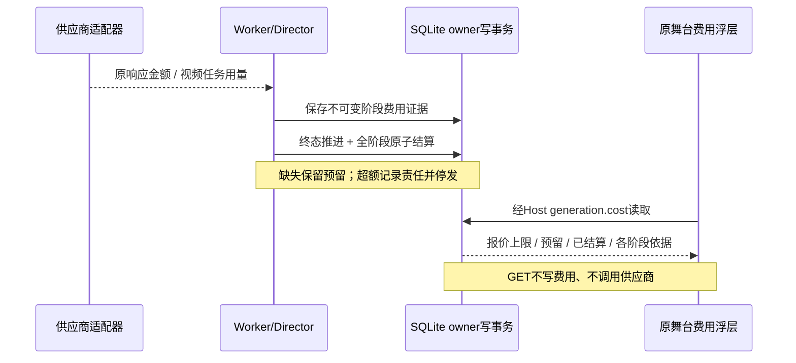

# 分幕费用结算与读取 · V1

2026-09-14 · 原 Host、Worker 与 generation tRPC；本轮无付费调用。

## 费用证据

- planner/validator：保存 OpenRouter `usage.cost` 对配置账户的扣费，金额保留 JSON 原始十进制文本。Node22 JSON.parse reviver source 在转成浮点之后仍取得原文，随后 BigInt 向上取整到微单位。明确0与缺失不同；币种不一致不兑换、不释放。
- video：独立保存任务引用、终态与用量，不保存短期下载URL；后续 SceneResult 不覆盖费用证据。成功任务使用已接受报价的完整费率及实际 output_seconds/input_image_count。小数秒以十进制乘费率向上取整。字段不足则最终金额为空，但已知计量下界仍计入超额检查。
- 文本标记 account-charge，视频标记 metered-tariff。按用量核算不是最终发票。费用范围为开局配置账户；外部 BYOK 供应商、充值手续费、税和汇率不伪装成已涵盖。

官方依据：[OpenRouter Usage Accounting](https://openrouter.ai/docs/cookbook/administration/usage-accounting)定义 cost 为账户扣费；[MiniMax Task Query](https://platform.minimax.io/docs/api-reference/video-generation-v2-query)返回视频计量，没有最终发票金额。当前视频价格模型仅适用于经安装器确认覆盖全部收费维度的输出秒数/输入图片计费；其他计费模式须新增显式费率模型。

## 数据与事务

第七迁移 `202609140005_cost_evidence`：新增 StageCostEvidence，BudgetReservation 增加 reviewRequired。当前29业务表、19业务唯一、零FK。

StageCostEvidence 包含 UUIDv7/id、owner/dataset/storeEpoch、turnId、quoteId、stage、bindingHash、basis、amountMicros?、currency、规范化 evidence、contentHash、createdAt、schemaVersion。不可变首次观察，没有伪更新/删除时间。真正唯一(turnId,stage)：当前每阶段最多一次付费尝试；不同回合允许相同供应商responseId或相同内容hash。

文本证据与 TextUsageObservation 同事务写入；视频证据与查询阶段推进同事务写入。每次绑定已接受报价、固定profile/model/account和原费率。费率过期后使用报价创建时有效的原版本，不读取当前价格。

整回合进入终态且三个阶段金额均有证据、未超阶段/总上限时，一次写事务设置 reservedMicros=0、settledMicros=三阶段金额之和、status=settled（明确总额0时released）。同事务完成回合状态推进；重复核对验证同一金额，不重复记账。缺证据保持held，不能把缺失看作零或用报价上限代替实际费用。

超额时记录完整已知责任、reviewRequired=true，预留扩大到max(原预留,已知费用下界之和)，不截断成原报价。Worker暂停为unknown，整scope的新接受/付费阶段均被挡住。回看与分支仍免费可用。后续追加调整/供应商最终对账未实现，不能手改既有证据覆盖历史。

崩溃恢复遇到已派发阶段仍转业务unknown、不重新发送；若三阶段扣费证据已完整持久化，同一恢复事务可以完成费用结算。费用已结算不等于剧情结果已确认，二者状态分离。

## API

`GET /api/trpc/generation.cost?input=...`

输入：`{protocolVersion:1,datasetId,experienceId,turnId}`。owner来自会话；同Host/Origin/session/CSRF门禁，不接受batch、额外owner或供应商URL。读取无需安装当前供应商凭据。失败按既有公开错误映射，不泄露私有路径或账单原文。

输出：输入范围字段＋currency、quotedMicros、reservedMicros、settledMicros、status(held/settled/released)、reviewRequired、stages。stages按planner/video/validator固定顺序，每项仅stage/basis/amountMicros?；不返回原始账户引用或完整provider响应。金额均微单位字符串。

原舞台“费用”按钮打开可收纳浮层，明确展示待结清、需核对和已结算；同一视频保留。刷新费用只读。历史分支不重复计算来源回合的费用，所有路线继续共用既有BudgetScope。

## 验收

实际SQLite测试覆盖完整/缺失/零/币种边界、报价到期、十进制精度、已知部分超额、仅validator超额、并发重复、删除来源与重连、事务回滚、崩溃阶段经济核对。HTTP测试验证会话、作用域、错误边界和响应关联。Chrome生产构建以本地MP4/明确测试传输走真实Worker→费用浮层→进程重启→相同费用，无外部付费请求。

真实供应商两幕与最终账单对账尚未验收；本文件证明本地结算实现，不证明供应商实际扣款结果。
