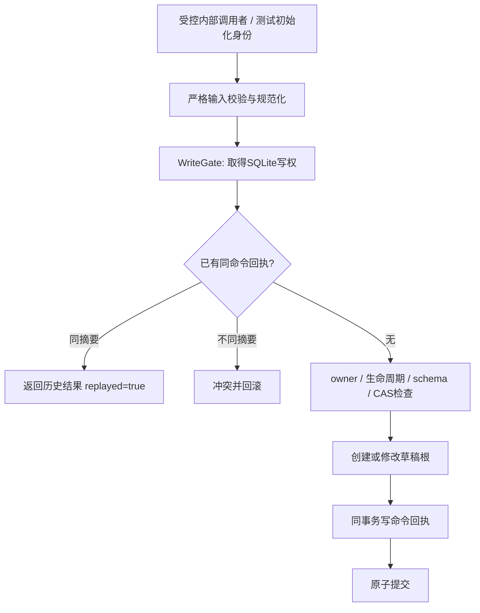
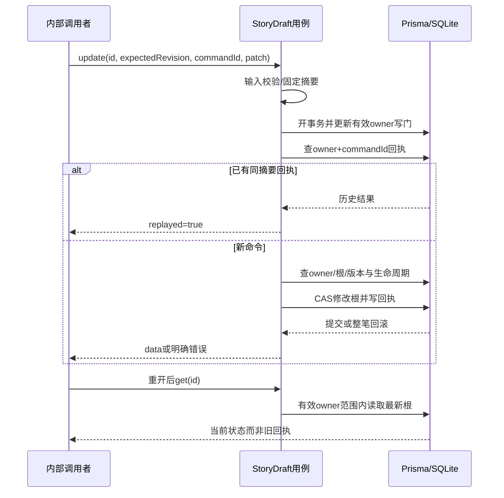

# 内部剧本草稿根契约 · M0-B

2026-09-10 · 实现入口：`apps/runtime/src/application/story-drafts.ts`。

> **2026-09-12 M0-C1：** 应用函数的第一个参数由 `PrismaClient` 改为 `StoryDraftStore`；这是内部调用签名调整。宿主使用 `createStoryDraftService(db, services)` 组合入口，返回 `create/get/list/update/delete/restore`。命令输入、返回DTO、错误码与事务语义不变。详情见[事务边界实施记录](../implementation/M0-C1-STORY-STORE-2026-09-12.md)。

这是内部TypeScript应用用例，不是可访问的REST/tRPC接口。旧OpenAPI中的正式创作操作继续保持未实现；当前Web仍只有公开、非敏感的模型配置查询。不得把本契约示例包装成无需身份的公开路由。

## 1. 上下文与输入

每个用例单独接收 `InternalOwnerContext {ownerId}`，来自受控宿主或测试初始化。该类型不构成鉴权机制，客户端自报ownerId也不构成身份。输入中的未知字段（包括ownerId/客户端创建ID）会被拒绝。

| 用例 | 命令/查询输入 | 返回 |
|---|---|---|
| createDraft | commandId、title、settings | `{data: DraftDTO, replayed}` |
| updateDraft | commandId、id、expectedRevision、patch | 同上 |
| deleteDraft | commandId、id、expectedRevision | 同上，data为软删除墓碑 |
| restoreDraft | commandId、id、expectedRevision | 同上，data.deletedAt为null |
| getDraft | id、includeDeleted（默认false） | DraftDTO |
| listDrafts | limit（默认20，1–100）、deleted（exclude/only，默认exclude）、cursor（可选） | `{items, nextCursor}` |

`commandId`、资源ID与内部ownerId均为小写UUIDv7；它们不是权限凭证。expectedRevision为正32位整数；用完版本空间时拒绝继续递增。

`patch`至少一项，允许title/settings；settings出现时整体替换，不隐式深合并。不接收cast/assets/archivedAt/deletedAt等任意字段。关系绑定、版本冻结、归档管理是后续用例，根更新不会顺便修改它们。

## 2. 内容与返回值

- title：1–120个Unicode码点，拒绝纯空白，保留有效原文，不偷偷trim再保存。
- settings：严格包含premise（≤12000）、playerRole（≤4000）、worldRules（≤30项，每项≤1000）、tone（≤500）。字符串可以为空，允许保存未完成草稿；是否可以进入游戏由后续准备校验决定。
- DraftDTO：id、title、settings、schemaVersion=1、revision、createdAt、updatedAt、deletedAt、archivedAt。
- 时间为UTC毫秒字符串；可空时间明确返回null，不泄露数据库路径、ownerId或Prisma对象。
- 列表按updatedAt DESC、id DESC稳定排序。默认排除软删除；本内部切片不提供归档筛选，archivedAt原值保留，列表可包含归档项。
- 游标绑定owner与deleted筛选并验证版本/ID/时间。游标只是分页位置，不是授权签名；每次查询仍限制当前owner。分页不是冻结快照，并发编辑可能改变排序，正式UI应刷新或按ID合并。

## 3. 写入与回执

1. 在进入数据库前校验并重建白名单输入，固定键顺序，冻结本次摘要所用内容。
2. WriteGate在事务内先更新有效LocalProfile.writeEpoch。
3. 按owner/commandId查回执：相同命令类型/摘要返回历史结果，replayed=true；不同则冲突。
4. 新命令核对根的owner、删除状态、schemaVersion、expectedRevision，再CAS写入。
5. 业务结果和回执同事务提交；任意错误整笔回滚。

命令命名：`m0.story-root.{create|update|delete|restore}.v1`，不会与早期rename探针混用。

回执是历史结果，不代表资源此刻状态。例如旧恢复命令重放时资源可能已经再次被删除；读取最新状态必须getDraft，重放绝不反向恢复新状态。回执schema/内容异常时报错，不重新执行业务。

SQLITE_BUSY等驱动错误不转成成功，不偷偷换commandId重试。本切片无网络/文件上传副作用。后续受保护传输层必须映射错误、提供同键核对/重试行为。

## 4. 错误语义（内部错误码，不是HTTP状态）

| 代码 | 含义 |
|---|---|
| INVALID_STORY_COMMAND / INVALID_STORY_QUERY | 输入、未知字段、ID、版本或参数异常 |
| INVALID_CURSOR | 格式、版本、owner或筛选不匹配 |
| OWNER_UNAVAILABLE | 内部身份缺失、无效或已删除 |
| STORY_NOT_FOUND | 不存在、不属于当前owner，或默认读取已删除根 |
| STORY_NOT_DELETED | 对仍有效根请求恢复 |
| REVISION_CONFLICT | 旧窗口/旧前置版本，原文需保留并重新比较 |
| REVISION_EXHAUSTED | 版本整数空间耗尽 |
| IDEMPOTENCY_CONFLICT | 同commandId改了操作或内容 |
| STORED_STORY_INVALID / COMMAND_RECEIPT_INVALID | 未知schema或存储内容异常，停止覆盖 |
| CLOCK_INVALID / ID_FACTORY_INVALID | 内部服务异常，事务回滚 |

原始数据库异常仅限内部边界。将来进入HTTP时必须映射、脱敏，不把SQL/stack作为业务提示。

## 5. 当前执行图





## 6. 数据与接入限制

无SQL迁移：沿用15表、13项真实唯一及零物理外键，不修改已应用迁移。删除只更新根的deletedAt/updatedAt/revision，保留冻结版本与既有引用。

宿主稳定身份、会话交换、CSRF、单实例、备份、tRPC路由与UI迁移均不在本轮。前端Mock与浏览器用户数据不导入或重置；正式UI接入时应复用这些用例，而不是复制另一套CRUD逻辑。

## 7. 宿主组合入口（M0-C1）

实现：`apps/runtime/src/composition/story-draft-service.ts`；专用端口：`apps/runtime/src/ports/story-draft-store.ts`；具体适配器：`apps/runtime/src/infrastructure/db/prisma-story-draft-store.ts`。

```ts
// 仅受控宿主内部调用；db生命周期和trustedOwner来自宿主，不接受客户端自报身份。
const stories = createStoryDraftService(db, runtimeServices);
const result = await stories.create(trustedOwner, createCommand);
const latest = await stories.get(trustedOwner, result.data.id);
```

应用用例不再导入Prisma类型/查询方法；组合入口显式注入。Store.write先取得WriteGate并限定owner，整段命令及回执共享事务；Store.read在同一读事务验证有效owner并读取快照。端口不负责HTTP认证，不允许将write scope保存到事务回调之外复用。

`settings`与历史`response`在存储读接口中保持unknown，经用例校验后才返回DTO。适配器投影不输出owner与其他内部字段。禁止把JSON类型断言代替格式检查。
