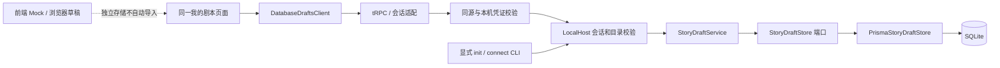
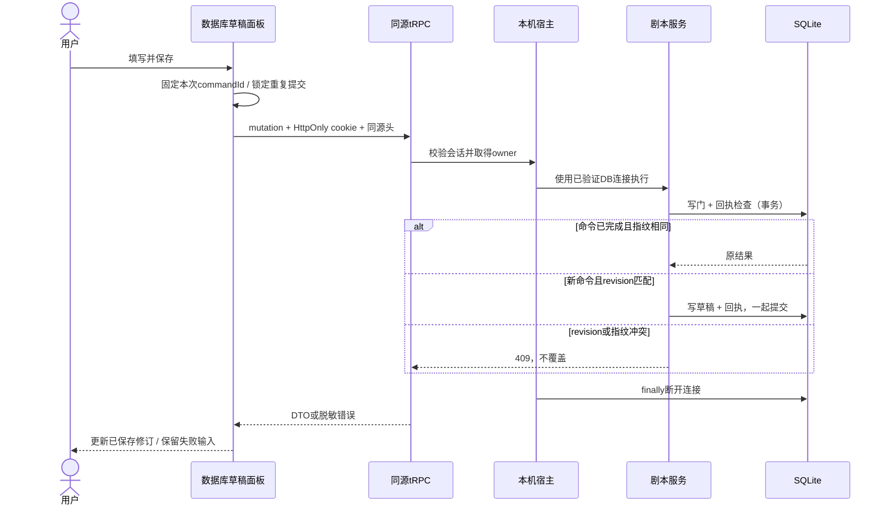

# 本机创作契约 · 当前开发基线

实施版，2026-09-12。M1-A1直接替换旧settings与命令namespace，无旧字段兼容；当前仍为剧本根用例，角色/素材聚合及datasetId门禁待后续实施。此文描述当前可调用边界；历史 `/api/v1` OpenAPI 仍是未实施候选，不为同一业务维护第二套 REST 客户端。

## 分层与身份

接口只在专用 loopback 启动器 + APP_ENV=dev/prod + 已初始化的 RUNTIME_DATA_DIR 下可写。ownerId 来自本机会话，不接收客户端 owner。Host/Origin 精确匹配 APP_ORIGIN，无通配 CORS；拒绝跨站请求。写请求必须有准确 Origin 和 `X-Everwoven-Request: 1`。该常量不是秘密；安全依赖严格同源检查、自定义头不能跨站简单提交、无跨站 CORS 放行及 HttpOnly 会话共同成立。

## 会话引导（非业务 CRUD）

| 路径/方法 | 请求 | 成功 | 错误 |
|---|---|---|---|
| GET /api/local-session | Cookie 可选 | `{authenticated:boolean}` | 未启用 404；来源不符 403 |
| POST /api/local-session | JSON `{code}`，唯一字段 | `{authenticated:true,expiresAt}` + Set-Cookie | 非法结构 400；无效/过期/已用 401 |
| DELETE /api/local-session | 会话 Cookie | `{authenticated:false}` + 清 Cookie | 来源不符 403；宿主故障 503 |

code、会话 token 为 32 字节 CSPRNG base64url。code 5 分钟且原子单次兑换；会话 8 小时。token 仅通过 `everwoven_local` HttpOnly/SameSite=Strict/Path=/ Cookie 交付，HTTPS 加 Secure；正文不返回 token。code 交换载荷上限 1024 字节；请求与返回均不缓存。没有通过 HTTP 签发连接码的入口。

## tRPC：`storyDrafts`

机器基准是 AppRouter 输入校验、runtime/contracts 和真实 HTTP 集成测试；使用已有 `createAppClient`，不手工拼 tRPC batch 包络。

| 操作 | 形态 | 输入 | 输出 |
|---|---|---|---|
| create | mutation | commandId, title, settings | `{data:DraftDTO,replayed}` |
| get | query | id, includeDeleted? | DraftDTO |
| list | query | limit?, deleted?, cursor? | `{items:DraftDTO[],nextCursor}` |
| update | mutation | commandId, id, expectedRevision, patch | `{data:DraftDTO,replayed}` |
| delete | mutation | commandId, id, expectedRevision | 同上，软删除 |
| restore | mutation | commandId, id, expectedRevision | 同上，恢复 |

- commandId/id 是小写 UUIDv7；业务 ID 不是访问凭证。
- settings：`world`、`opening`、`genre`、`playerRole`、`worldRules:string[]`、`tone`，六项必填，文本可空用于草稿；禁止旧premise、未知字段与owner注入。标题1–120；world/opening≤12000、genre≤80、playerRole≤4000、worldRules≤30×1000、tone≤500。不静默截断或补齐；命令namespace固定authoring.story.*.v1。
- DraftDTO：id、title、settings、schemaVersion=1、revision、createdAt、updatedAt、deletedAt、archivedAt。UTC ISO 日期或生命周期 null；无 Prisma 对象、ownerId、路径或密钥。
- 列表默认排除已删除；`deleted:'only'` 查询回收项。limit 1–100；游标绑定当前查询/owner，前端用 nextCursor，不自行构造。查看回收项需显式 includeDeleted=true；不等于恢复。
- 服务端规范化输入后计算命令指纹。同 owner、同 commandId、同请求重放原结果；异载荷 409。写入和回执同事务，先重放后 CAS。
- 前端同一载荷重试复用 commandId；响应丢失进入独立“结果待确认”状态，保持离开保护。先用原命令确认历史结果，保留期间的新输入，再对确定 ID/revision 提交新命令；不因修改标题重复 create。忙碌时防重复点击。409 保留输入并要求显式重载/人工合并，绝不自动覆盖。
- Mutation JSON 上限 256 KiB，包括实际流式读取而非只信 Content-Length。
- tRPC 标准错误：401 UNAUTHORIZED、403 FORBIDDEN、400 BAD_REQUEST、404 NOT_FOUND、409 CONFLICT；内部错误统一 500，无堆栈/SQL/路径。

## 写入时序

每次受保护操作打开、验证并关闭 DB；SQLite 写门处理并发。这不是后台 worker 单实例/任务恢复实现。多标签页使用 revision 冲突防丢写，不宣称跨实例任务调度或云同步。

## 剩余边界

本切片不包括角色/图片落库、角色版本冻结、经历/树形分支、模型调用、费用授权、worker、备份恢复。正式数据库草稿没有“假装开始游戏”的跳转。先验证存储闭环，再逐项接入这些聚合与对应验收。
