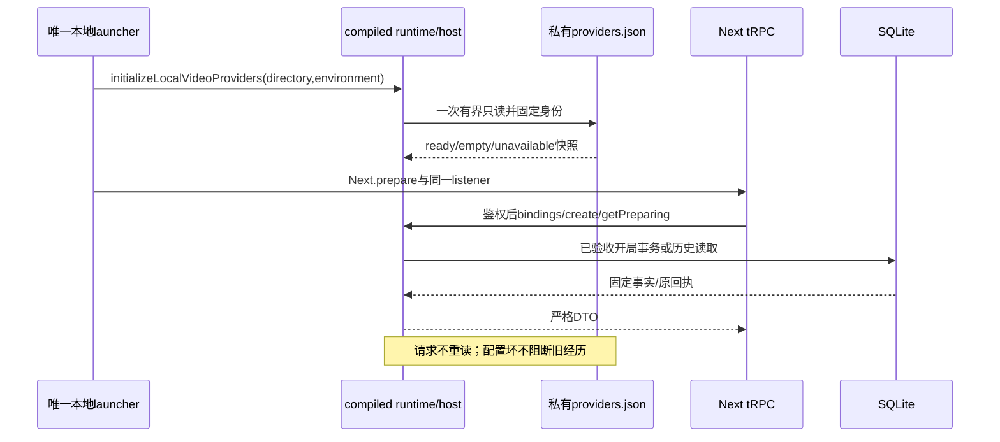
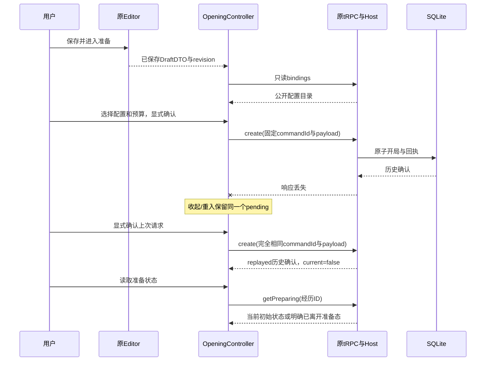

# M2-A4 · 本地正式开局 HTTP 契约

2026-09-13。**同一应用的 Host/tRPC 已接通，并在隔离 dev、production 的真实 Node launcher＋Next＋SQLite 验证。** 原准备浮层还未消费这些新方法；本片不是视频任务或 Player 验收。

## 1. 三个正式 tRPC 操作

| 操作 | 传输 | 输入 | 返回 |
|---|---|---|---|
| `openings.bindings` | GET query | `{protocolVersion:1,datasetId}` | `BindingDirectory` |
| `openings.create` | POST mutation | [严格CreateExperience](EXPERIENCE-OPENING-M2-A.md) | `{data:ExperienceOpeningDTO,replayed:boolean}` |
| `openings.getPreparing` | GET query | `{protocolVersion:1,datasetId,id}` | `ExperienceOpeningDTO` |

路径为既有 `/api/trpc/<operation>`；GET参数`input`为JSON URL编码，POST为JSON body。返回沿现有tRPC `{result:{data:...}}`，不新增REST客户端。机器基准为AppRouter＋runtime parser。全部要求原本机HttpOnly会话，包括binding目录；owner不在请求中。

### BindingDirectory

```ts
type BindingDirectory = {
  protocolVersion: 1;
  datasetId: string;
  status: 'ready' | 'empty' | 'unavailable' | 'not_initialized';
  items: VideoBindingChoice[];
};
```

- ready：有已配置的准备选择，返回公开key/version、供应商/精确型号、connectionId/region、operation、generation，以及`canPrepare:true,canDispatch:false,accountVerification:'unknown'`。
- empty：启动时文件缺失或有效空配置。没有自动MiniMax/fal默认项。
- unavailable：配置非法或与当前宿主身份不匹配；目录为空。不返回路径、解析错误、账号scope或credentialRef。
- not_initialized：没有通过本地launcher装配启动快照；请求不会自行读文件补初始化。

当前目录输出复用纯地区/模型generation约束，拒绝假ready、未知地区及不可能的型号/规格。历史PublicBinding只检查历史形态，不套当前模型限制。

## 2. HTTP与输出边界

- 复用同一监听器、AppRouter、Host鉴权和owner WriteGate；Web不打开Prisma。
- 校验精确本机Host/Origin、拒绝cross-site；POST必须同源Origin及`x-everwoven-request:1`。
- 禁止batch，单操作`?batch=1`也拒绝；混合story/opening请求不进入任何业务方法。
- GET URL≤8192 UTF-8字节，POST body≤16384字节；按实际流计数，不仅看Content-Length；POST严格UTF-8/JSON。
- `Cache-Control:no-store`、`X-Content-Type-Options:nosniff`。错误仅固定ID，不回显stack/cause/SQL/provider参数。
- 共享output parser校验完整快照、UUID/时间、story.dataset、setup/草稿关系和不可派发初始状态。create进一步核对请求来源/revision、binding版本、预算；getPreparing核对请求id。形态合法但属于另一请求的DTO同样拒绝。
- 路由返回CREATE的历史确认，不得拿它覆盖未来播放中的当前状态。初始准备查询仍保留`PREPARATION_NO_LONGER_CURRENT`语义。

## 3. 一次性宿主配置

配置位置固定为显式`RUNTIME_DATA_DIR`下的`providers.json`，形态见[registry说明](../architecture/VIDEO-BINDING-REGISTRY-M2-A.md)。它只有非秘密身份和credentialRef，不存实际API key。**本片不替用户创建、chmod或修复这个文件。**

启动器在Next.prepare前通过`createRequire(... )('runtime/host')`调用`initializeLocalVideoProviders`；与现有Next webpack `commonjs runtime/host` external指向同一个compiled模块。单进程一次快照，不同时加载src另一实例，不在HTTP请求中重读配置，更改需重启。

文件规则：同一FD以`O_NOFOLLOW`、只读方式打开；正常文件、当前UID、0600、单link、2–65536字节；实际有界读取、严格UTF-8、前后inode/大小/mtime/ctime和目录/manifest身份检查，finally关闭FD。只有真实最终文件缺失才empty，坏symlink/权限/目录/UTF-8/超限为unavailable；确定性replace/grow测试验证拒绝且FD关闭。这里没有宣称可防御同UID恶意程序的所有时序攻击。

快照固定directory/environment/owner/dataset。配置失败保留惰性失败resolver：**既有CREATE回执和getPreparing不查询当前registry，仍正常读回；新开局才失败并回滚。** 角色、图片、剧本不依赖provider配置健康。缺密钥不在这里探测、也不触发测试收费。

## 4. 状态与错误

| HTTP | 固定ID（主要） |
|---|---|
| 400 | INVALID_EXPERIENCE_COMMAND / INVALID_EXPERIENCE_QUERY |
| 401 / 403 | LOCAL_SESSION_INVALID / LOCAL_ORIGIN_DENIED |
| 404 | EXPERIENCE_NOT_FOUND / STORY_NOT_FOUND / PROVIDER_BINDING_NOT_REGISTERED |
| 409 | REVISION_CONFLICT / IDEMPOTENCY_CONFLICT / STORY_ASSET_NOT_READY / STORY_ARCHIVED / PROVIDER_BINDING_CONFLICT / PREPARATION_NO_LONGER_CURRENT |
| 412 | DATASET_CHANGED / CLIENT_RELOAD_REQUIRED |
| 413 | EXPERIENCE_REQUEST_TOO_LARGE |
| 503 | PROVIDER_CONFIGURATION_UNAVAILABLE / PROVIDER_NOT_INITIALIZED |
| 500 | EXPERIENCE_INTERNAL_ERROR（包括不可信异常及坏持久事实/DTO） |

未知传输结果仍需保留同一command/payload再核对；不得靠重连、重开浮层或换model生成另一个command掩盖未知提交。原准备浮层已接入此控制逻辑，见第6节；不因为后台幂等就假定浏览器丢失所有内存之后也已经恢复。

## 5. 实际时序与验证



`scripts/smoke/local-openings.mjs`使用临时私有目录、原启动器和真实Chrome会话，在production/dev分别验证：未登录拒绝→自动会话→空目录→写配置但请求不热读→重启ready→真实开局→删配置后旧进程不变→重启empty且回执/get仍正常→坏配置unavailable且新命令503、原剧本可读→换账号同版本冲突且历史不变。脚本零模型请求，不是伪Provider或演示数据库。

下一步：Quote/执行Profile/持久任务/媒体/播后回应，以及经历目录与冷浏览器续玩入口。两幕实际生成与恢复验收前，产品goal保持未完成。

## 6. M2-A5 原准备浮层与前端契约

唯一原入口：Editor「保存并进入准备」收到真实DraftDTO后，展示该来源修订。表单期间后续修改不混入已确认版本，浮层提示未包含未保存修改；不新建页面或第二个播放器。

- `OpeningClient`只使用原非batch tRPC三条操作，same-origin cookie/请求标记/no-store/禁止redirect；没有会话重试、付费重试或浏览器业务存储。
- 请求和响应逐项严格parse；响应dataset/来源/revision/binding版本/预算/get身份均对应原请求。错误必须匹配白名单code、HTTP状态和tRPC元数据；传输失败、坏JSON/坏DTO、未知代理错误均为unknown。
- 成功响应有界 **2MiB**，错误8KiB；读到上限立即取消流。上限覆盖冻结世界58,700码点、角色version/overrides/effective三份54,360码点及relationship两份8,000码点，即使astral按12字节JSON转义仍有固定结构余量；目录最多128项。真实SQLite最大字段中文及转义astral create/replay/get回归验证。不能采用低于合法聚合体积的256KiB界限。
- 预算由规范十进制文本转BigInt micros，不经浮点乘法。最多6位小数，最终不超过有符号64位整数。0不产生费用；正预算也仅保存上限，不是Quote或付款授权。

### 状态与动作

| 状态 | 用户可做 | 明确禁止 |
|---|---|---|
| 空/坏模型目录 | 继续编辑、显式刷新启动快照 | 伪造可选模型、自动改用fal、输入密钥到聊天 |
| 有可选配置 | 显式选择模型/币种/上限，确认开局配置 | 打开浮层就创建或开始生成 |
| 提交中 | 收起浮层、通过「继续故事准备」回来 | 双击重复提交、修改该请求、丢弃恢复入口 |
| unknown | 重连后显式「确认上次开局请求」 | 重开/重连自动提交、新command替换旧command |
| 历史确认收到 | 查看固定开局；显式读取准备状态 | 根据CREATE回执声称当前正在preparing/playing |
| dataset变化 | 保留原上下文，接回原数据集后再确认 | 把原请求迁移到新dataset |

`OpeningController`生命周期在Platform内而非Dialog内。只有一个pending intent和一个flight；同dataset会话重连同样切epoch，旧目录/成功/401/finally不覆盖新attempt。已有unknown即使重试得到明确400/404等也继续保留，因该拒绝只描述这次尝试，不能证明原提交没发生。

关闭浮层仅隐藏，不销毁命令；pending/unknown时离开编辑器会返回原准备入口。beforeunload提醒避免关闭/刷新导致内存意图丢失。**当前未实现浏览器完全关闭后的unknown查询恢复，不宣称此项完成。** 后续经历目录和恢复用例需要服务端事实支持，不把正式业务数据塞回localStorage。



真实production Chrome新增 `scripts/smoke/local-opening-ui.mjs`：原编辑器输入→真实保存→server binding选择→零预算开局→实际提交后故意损坏响应→关闭重入/导航守卫→宿主重启→同command确认→独立当前状态读取，禁用浏览器业务存储且零模型调用。它保留同一浏览器内存，不等于冷浏览器续玩、真实生成或最终产品验收。
