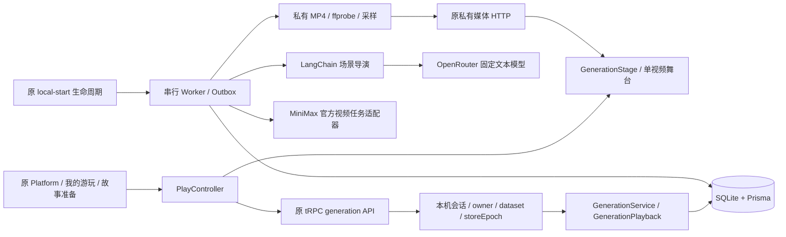
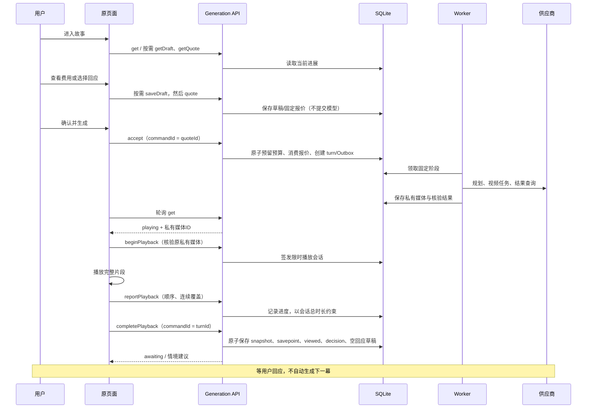

# 原应用分幕游玩接线（2026-09-14）

状态：原3100前后端入口已接线；真实SQLite/HTTP/浏览器客户端两幕测试、Chrome原页面交互测试均使用明确的供应商/媒体替身。没有调用付费模型。不能将这些结果称为真实供应商验收或整个V1完成。

## 用户路径

我的剧本 → 保存并准备 → 确认开局配置 → 进入故事；已有旅程从“我的游玩”进入。进入和刷新只读取已保存状态。准备页固定的是设定、供应商绑定与预算上限，费用确认发生在舞台内。

舞台占满当前窗口，单视频和可收纳的悬浮回应区。逐幕生成，生成和播放期间不能插入回应。视频播完且后端保存播放结果后，才出现2–4条情境建议，以及“自己回应”。建议可直接采用或修改。每个回应先保存本机草稿，再获取下一幕报价；确认费用后才入队。

## 架构

## 时序

## 新增 API 契约

沿用 `/api/trpc/generation.<方法>`。GET单请求查询；POST单请求修改；禁batch、cookie会话、同源校验、请求marker、严格字段校验、有界响应及no-store。所有输入共有 `protocolVersion:1, datasetId, experienceId`；ID为UUIDv7。owner来自服务端会话，客户端不得指定。

| 方法 | 类型 | 额外输入 | 输出 |
| --- | --- | --- | --- |
| get | GET | 无 | PlayDTO |
| quote | POST | commandId、expectedExperienceRevision、kind；response还需interactionEventId、text | `{data:QuoteDTO,replayed}` |
| getQuote | GET | quoteId | `{quote:QuoteDTO,acceptedTurnId:string或null}` |
| accept | POST | commandId、expectedExperienceRevision、quoteId、consent:true | `{data:TurnDTO,replayed}` |
| beginPlayback | POST | commandId、expectedExperienceRevision、turnId、mediaId | PlaybackSessionDTO |
| reportPlayback | POST | commandId、playbackSessionId、sequence、positionMs、coveredMs | PlaybackSessionDTO |
| completePlayback | POST | commandId、expectedExperienceRevision、turnId、mediaId | `{data:PlayDTO,replayed}` |
| getDraft | GET | interactionEventId | ResponseDraftDTO |
| saveDraft | POST | commandId、interactionEventId、expectedDraftRevision、text | ResponseDraftDTO |

ResponseDraftDTO为公共三字段加 `interactionEventId,revision,text`。text最长2000个UTF-16代码单元，允许空串。仅当前awaiting节点可读写；不能修改已离开的节点草稿。保存按revision做并发检查，同命令重放原回执。保存不推进体验修订，不调用模型，也不生成新节点。

PlayDTO/QuoteDTO/TurnDTO的完整严格结构以runtime/contracts/generation及generation-output为准。原播放与媒体协议见GENERATION-PLAYBACK、PRIVATE-GENERATION-MEDIA相关文档。

## 恢复与错误语义

- URL只存dataset/experience/quote的UUID和confirm标志，不存剧情、密钥、供应商地址。生成接受前写入原报价身份；刷新不自动重发accept。
- getQuote证明已经接受时，直接读取当前进展。结果未知仍保留原命令。原命令明确返回报价过期，且服务端复查该报价未接受且已过期，才解除确认锁；普通4xx不替代这个证明。
- get的响应以请求序号和连接epoch隔离。Worker推进阶段未必改变experienceRevision，因此不能只按revision判断新旧。
- 草稿800ms空闲保存，报价和离开前再次保证保存。保存结果未知只核对原命令；另一窗口引发revision冲突时，读取新版本并让用户明确选择使用已保存回应或保存当前输入，不静默覆盖。
- 播放通知丢失可重放相同turnId命令；HTTP回执成功后仍GET当前状态，不把历史回执当最新现场。浏览器检查played连续覆盖，服务端要求匹配当前owner/dataset/storeEpoch/经历修订/turn/媒体hash的完整限时会话。仅发送ended不会推进剧情。该机制是服务端计时约束下的客户端报告，不证明真人注意力。
- 媒体播放错误只重新读取/重新加载原文件。失败与unknown不自动重新提交视频。
- 首次accept检查宿主运行、profile和资产后，才创建预算预留/任务。原回执重放不要求当下模型配置存在。

## 正式供应商安装边界

`providers.json`继续负责供应商连接和视频模型目录。`generation.json`是同一私有宿主目录中mode0600的执行配置，启动时一次性读取，不从HTTP或浏览器接收。缺失时剧本、旅程读取和历史播放仍可用；新报价/首次accept返回固定的配置未就绪错误。

每份配置包含schemaVersion=1及1–8个profiles，各项：

- profile：ExecutionProfileSpec，planner/video/validator固定供应商—连接—模型版本，graph/prompt/schema取已安装sceneArtifacts。
- prices：三阶段StagePrice，币种、有效期、bindingHash、计量项完整；不在代码中猜测实时价格。
- textInputBounds：planner/validator各自的method=context-window、modelId、tokens、source。tokens必须等于配置的maxInputTokens，作为运营者依据公开模型规格提供的保守上界；代码仅校验声明一致性，不代表已经在线验证metadata或精确计数。
- audio、validatorImageLimit、dimensions、cdnHosts：固定媒体规格与下载白名单。提前检查像素总量、比例、官方视频规格和本机ffmpeg/ffprobe。
- 凭据通过绑定credentialRef读取env:OPENROUTER_*或env:MINIMAX_*，只在服务端。不得把POLLO_API_KEY交给MiniMax官方域名。

本安装器当前实现OpenRouter结构化文本与MiniMax官方text-to-video。Pollo和image-to-video尚未安装；需要实际供应商完整公开base/protocol/model ID后实现对应适配，不能凭截断截图推测。

启动器在listener成功后开始处理已接受Outbox；关闭时取消lifetime、停止领取、等待阶段处理与drain、断开DB。仅明确SQLite锁错误有界退避重试tick，业务/供应商未知结果不直接重发。并发stop共享同一清理任务。启动会恢复已有已授权队列，因此操作真实宿主前须确认没有未授权的待执行任务；本轮本机无generation配置、无turn/Outbox。

## 数据与验收

新增第五迁移202609140003_qualified_savepoints：PlaybackSession、不可变StateSnapshot和Savepoint。累计26主键、17真实业务唯一、零FK。Savepoint(sourceTurnId)唯一：一个已播放回合只有一个正式存档节点；多次播放尝试和多个子节点均允许。下一幕通过parentTurnId连接上一幕，已播放存档同时记录parentSavepointId。可选择旧节点的存档/fork界面及服务不在本次接线中宣称完成。

本地验证：`pnpm test`、`pnpm typecheck`；生产构建在独立依赖目录执行，避免破坏原3100开发服务。`node apps/web/scripts/verify-stage-flow.mjs`要求原3100已运行、Chrome/ffmpeg可用；仅在独立浏览器上下文拦截生成接口和旅程列表，以测试素材检查原页面播放、回应、刷新与第二幕，不写用户业务表、不调用供应商。真实SQLite→原HTTP→客户端→controller测试另见generation-flow.integration.test.ts。

剩余真实闭环：核实供应商公开协议并安装配置、实际账单结算、历史浏览/fork，以及明确预算授权后的真实两幕验收。当前没有该预算授权；零付费测试。

## 播放会话与原子存档

PlaybackSessionDTO除公共字段外含id、turnId、mediaId、experienceRevision、durationMs、coveredMs、sequence、status（active/complete）、expiresAt。首次begin核验本机原文件hash与metadata后签发30分钟会话；同commandId重放原结果。每次report使用下一sequence及独立commandId，进度单位毫秒，覆盖单调且不超过会话已过时间+350ms；片尾允许250ms解码误差。使用总时间避免网络抖动把正常播放误判成快进。

前端约每秒报告；ended等待在途报告，再提交最终进度。报告回执丢失保留原commandId/sequence，先重放确认再发送下一条。明确重新加载媒体或退出后再进入会建立新的免费播放会话；不重交生成。旧completePlayback命令按原回执重放，刷新仍以get为准。

播放完成在同一SQLite写事务中消费会话、写入snapshot/savepoint、更新回合viewed和经历awaiting、创建decision与空draft、写回执。任何一步失败全部回滚。快照绑定固定剧本/profile及hash、媒体与核验结果、父snapshot和已确认场景前缀；后续修改剧本不覆盖这些事实。当前没有历史列表/fork API，不能将这三张表当作分支功能已经完成。

错误：PLAYBACK_MEDIA_UNAVAILABLE（文件不可读）、PLAYBACK_SESSION_UNAVAILABLE（会话失效）、PLAYBACK_PROGRESS_CONFLICT（序号冲突）、PLAYBACK_COVERAGE_INCOMPLETE（覆盖不足）、SAVEPOINT_SOURCE_UNAVAILABLE（来源完整性失败）。界面保留原视频与进展，重新播放不创建付费任务。

浏览器验收：`node scripts/smoke/local-qualified-playback.mjs` 在一次性本机Host上使用同一生产应用、真实SQLite和本地ffmpeg测试片段，验证自然播放、原子存档、回应落库及进程重启。它不配置供应商，也不是模型生成验收。

## 已播历史与独立路线（2026-09-14）

舞台工具栏“足迹”打开可收纳浮层，历史预览复用唯一视频且不写播放进度。从已播点另开路线前保存原回应；创建暂停的独立child，显式继续后给出新建议/自由回应。刷新只读找回原fork结果，来源删除后仍可找回已创建child。完整契约见[分支API](BRANCH-CONTRACT-DRAFT.md)，架构/时序与数据映射见[专项设计](../architecture/BRANCH-SAVEPOINTS-DESIGN.md)。

本地验收覆盖A/B/C→B分叉→D，只继承A/B；费用仍共用一个scope。历史和分支不调用模型。真实付费模型及实际结算仍为未完成项。

## 本幕费用

原舞台工具栏以可收纳浮层展示报价、预留、已结算与阶段依据。真实实现及证据边界见[结算契约](GENERATION-SETTLEMENT-V1.md)。费用GET不调用供应商；三个阶段证据齐全才释放多余预留。未决/超额继续保留责任，不显示成免费。
