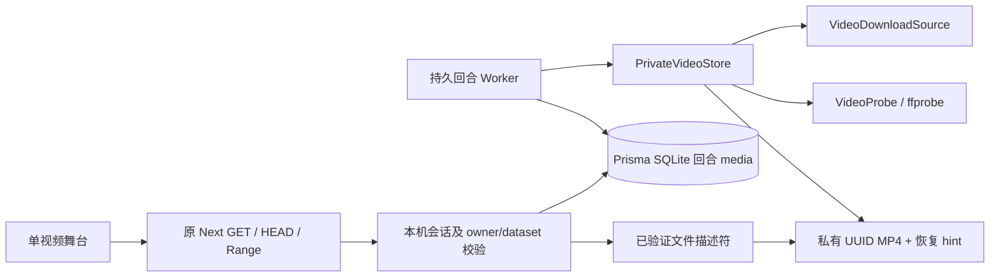
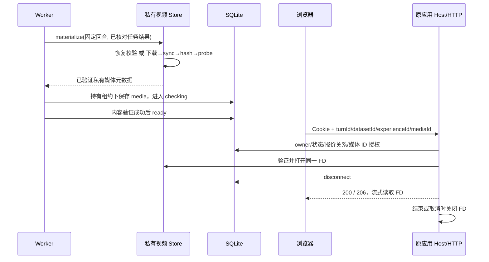

# 私有生成视频读取契约

2026-09-14。此接口已接入原 T3/Next 应用，复用本机会话。生成视频落地实现与读取接口属于媒体基础设施；生产供应商执行器、费用确认及原舞台绑定仍待完成，不能以本地视频测试代替模型验收。

## 请求

`GET /api/local-generation-media/{turnId}?datasetId=…&experienceId=…&mediaId=…`

同路径支持 `HEAD`；其余方法返回 405，`Allow: GET, HEAD`。路径/查询四个 ID 均为 UUIDv7；查询恰好三个字段，重复或未知字段返回 400。使用原 `everwoven_local` HttpOnly 会话 cookie；不把 token 放入 URL，不接受调用者指定文件路径、供应商链接、账户或 owner。

Host、Origin（若存在）、Fetch Metadata 使用原本地来源规则。GET/HEAD 均为读取，不要求 mutation header；跨站请求拒绝。服务端验证当前 owner/dataset、未删除账户、未删除且未归档经历、ready/viewed 回合、同 dataset 的已接受报价及双向 turn/quote/event 关系。请求 mediaId 必须等于该回合持久元数据。磁盘候选或恢复 manifest 本身没有读取授权。

## 响应

| 情况 | 状态与头部 |
|---|---|
| GET 完整视频 | 200，`Content-Type: video/mp4`，精确 `Content-Length` |
| 单段有效 Range | 206，`Content-Range: bytes start-end/size` |
| HEAD | 200，无正文，完整表示的长度；忽略 Range |
| 不合法、多段或越界 Range | 416，`Content-Range: bytes */size` |
| If-Range 与当前强 ETag 不同 | 忽略 Range，返回完整 200 |
| 参数无效/无会话/跨站/未授权媒体/数据集变更 | 400 / 401 / 403 / 404 / 412 |
| 文件缺失、损坏或未识别内部错误 | 503，固定 `VIDEO_UNAVAILABLE` |

媒体返回 `Accept-Ranges: bytes`、内容 SHA-256 的强 ETag。所有响应 `Cache-Control: no-store`、`X-Content-Type-Options: nosniff`、`Cross-Origin-Resource-Policy: same-origin`。不重定向供应商，不返回本地路径或底层诊断。支持闭区间、开放结尾与后缀 Range；不做 multipart ranges 或 304 缓存协商。

打开前验证完整文件的大小、SHA-256、权限、单链接与 inode；之后 Range 从同一已验证 FD 按位置读取，每块最多 64KiB，不重新按路径打开。SQLite 在返回流前关闭，FD 由 HTTP 持有，在结束、取消、请求中断、读取异常或 120 秒生命周期上限时关闭。已经发出的字节不因会话撤销而收回；后续请求重新认证。每次 Range 当前会重新校验完整文件，尚无校验缓存。

## 落地与恢复

视频独立于 WebP 图片上传流程。限制为 128MiB、120 秒、H.264 MP4，可选 AAC。受信安装配置提供精确像素尺寸解析，不从 `768P`/`2K` 名称猜尺寸。ffprobe 先读取轨道元数据再完整解码计帧；验证实际像素、比例、视频轨时长、容器/音频轨一致性（允许 250ms 封装误差）、起始时间及有界帧数。元数据记录逻辑批准时长与实际毫秒时长。

下载只允许显式安装的 HTTPS CDN 主机，使用公网 IPv4 DNS 结果固定 TLS 连接，禁止重定向、URL 用户名/密码及非 443 端口；不继承代理或发送供应商鉴权头。正文流式限长，90 秒整体下载/落地期限；DNS 等待可中断。IPv6-only CDN 当前未适配。

文件采用独占 UUID `.mp4`、0600 权限，保存在原私有 dataset 目录；同步和校验后才发布恢复 hint。hint 绑定回合与归一化视频结果摘要，临时文件完整写入后原子 rename 和目录 sync。并发落地产生不同 UUID 候选，hint 最后发布者可替换缓存指向，但从不覆盖视频；SQLite 最终提交的 media 决定播放器读取哪个文件。

重启后先校验 hint 指向的文件并重新 probe，通过才复用。缺失文件可重新下载，异常 hint/内容不会被当作成功。确定性媒体内容/策略错误使 Worker 停在 unknown/blocked 并保留预算，避免每十秒重复下载；临时传输错误仍可重查/重下载原任务结果。孤立候选清理尚未实施，不调用图片清理器删除视频。

需要系统 `ffprobe`；本地素材验收另外使用 `ffmpeg`，CI 显式安装。当前 Docker 镜像仍是 Web 原型交付，未宣称包含可运行的本地视频执行器。目录身份保证沿用合作进程不替换目录的边界，不宣称抵御任意同 UID 文件竞态。

## 架构与时序

媒体 GET、下载完成和浏览器缓存命中均不调用 completePlayback、不创建选项、不发起下一幕。播放覆盖证据、原 Stage 绑定和真实两幕生成仍是后续验收项。
