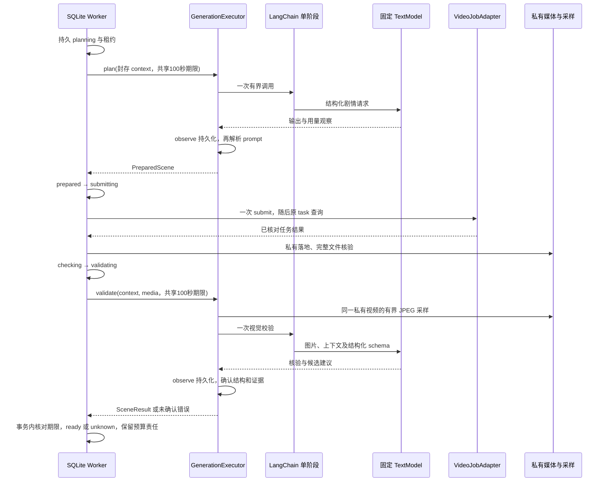

# 有界剧情导演与视觉校验执行组合

2026-09-14。实现为内部执行组合，尚未安装到本机 Host 的付费入口。不能把以下组件和测试当作两幕真实生成验收。

## 组件职责

| 组件 | 实现与边界 |
|---|---|
| `scene-artifacts.ts` | 固定图语义、planner/validator 系统提示与 JSON schema；版本加 SHA-256 纳入原 ExecutionProfile |
| `scene-director.ts` | `@langchain/core` 1.2.11 Runnable 执行单次文本阶段；校验封存摘要、输入边界、模型绑定及结构化结果 |
| `StructuredTextModel` | 供应商无关的单次结构化调用；返回内容和已知的用量观察，未提供的计量保持缺失 |
| `openrouter-text.ts` | 官方 OpenRouter `/api/v1/chat/completions`；固定模型、账户配置与显式端点偏好，不接受请求时 base URL |
| `generation-executor.ts` | 把导演、视频 job adapter、私有媒体落地和采样组合成原 GenerationExecutor；Worker 继续负责持久阶段/租约/预算/未知结果 |
| `video-frame-sampler.ts` | 从已授权且 hash 验证的文件描述符读取视频采样；有界 JPEG、按时间顺序输出，完成/错误关闭 FD |

采用 LangChain 模型阶段调用，没有 ReAct 工具循环、自动结构修复、备用模型或额外生成尝试。[LangChain 结构化输出文档](https://docs.langchain.com/oss/javascript/langchain/structured-output)说明其 agent 策略可能自动选择工具方案并进行错误重试；本实现将这些策略留在付费热路径之外，由现有 Worker 管理单次尝试。

## 剧情输入与输出

`plan(context)` 只发送封存的剧本标题、世界设置、有效角色信息、已确认过去摘要、用户本次行动以及批准的视频时长/分辨率/比例/声音方案。供应商账户、Key引用、内部价格和本地路径不进入剧情提示。

输出严格为 `{prompt: string}`，1–7000字符；不接纳模型生成的供应商参数、图片URL、费用、工具或执行指令。原 Worker 用固定视频 adapter 构造请求；图片来源另由已批准素材服务解决。用户世界/人物/行动均作为 JSON 素材而非系统指令。模型遵守剧情边界的效果仍须真实评估，提示文本不是可靠性证明。

`validate(context, media, evidence)` 要求证据对应同一 mediaId/SHA-256、符合批准时长及采样数量，时间递增且在视频范围内。核验提示明确区分用户期望与实际可见内容，不把未经音频核验的台词或采样以外的事件写为事实。返回 `verdict/summary/choices/evidenceFrameIndices`；只有 confirmed、合法样本引用和2–4条互不重复回应通过。uncertain、无效结构、空证据或引用不存在的帧均停止阶段，不自动重发模型请求。

这些是视觉采样核验，不能证明整个视频每一帧或音频正确；schema合格也不代表语义必然正确。实际画面理解能力、角色连续性和误判率仍需后续有预算的模型验收。

每次成功返回的文本观察必须经过 `observe(context, stage, observation)` **持久保存成功**才继续；该回调没有生产 no-op 默认。`createPersistedGenerationExecutor` 已安装[正式SQLite观察记录](TEXT-USAGE-OBSERVATIONS.md)，绑定已接受报价/回合/阶段并验证幂等。结算仍须独立证据。观察写入失败会传播给 Worker，维持未知状态和预留，不授权再次付费调用。

## OpenRouter 适配准入

- `providerId=openrouter`、`adapterVersion=capabilityVersion=openrouter-structured-v1`。
- `protocolVersion=openrouter-chat-v1`、`endpointProfileId=openrouter-global-v1`、`region=global`；不声称地区固定或地区合规能力。
- 模型必须是显式 `publisher/model`，不接受 auto router 或动态 `:free` 等变体。本项目模型 ID 校验独立于内部账户/连接标签，允许合法命名空间斜杠，禁止将其当路径使用。
- capabilities 显式声明 structuredOutputs、imageInput、providerEndpoint。构造 adapter 不代表这些能力已经被实际供应商验证，Quote 准入仍需受信证据。
- 请求固定 `only/order`、`allow_fallbacks=false`、`require_parameters=true` 和严格 JSON schema，无工具/插件/备用模型列表。OpenRouter 基础 provider slug 可能匹配多个端点，需按实际配置选择精确 slug；见[官方路由规则](https://openrouter.ai/docs/guides/routing/provider-selection)。此初版仅声明 global 通道。
- 必须安装模型专用输入 token 计数或经验证的上界计算器，包含消息、schema和图片开销；没有字符串长度猜测或零值默认。超出封存 maxInputTokens 在发送前拒绝；maxOutputTokens 显式传输。计量与完整价格必须在正式 Quote 中一起核验。

[OpenRouter 结构化输出文档](https://openrouter.ai/docs/guides/features/structured-outputs)建议显式 `require_parameters` 和 `json_schema`；各供应商对 strict 的支持有差异，所以本地还会再校验结构。适配器核验响应模型、单个 stop 完成结果、无工具/拒答内容以及有界响应；网络/HTTP错误、截断、模型错配或解析失败不自动重试。返回的用量是观察，尚未自动结算，未返回字段不当作0。

HTTP响应限256KiB、最长60秒、禁止重定向。输入图片最多16张、单张256KiB，发送请求上限6MiB。外部诊断不回传。构造时注入服务端凭据，不查找或记录用户Key。`LANGCHAIN_TRACING`、`LANGCHAIN_TRACING_V2`、`LANGSMITH_TRACING`、`LANGSMITH_TRACING_V2`、`LANGCHAIN_VERBOSE` 任一开启时，本地导演在调用前阻断，等待显式设计的数据导出配置；不改写用户环境变量。

## 采样与执行时序

采样从同一已验证 FD 读取，不接受 URL/文件路径。ffmpeg 禁用外部MOV数据引用，输出最长边640像素的JPEG，每帧≤256KiB，1–16帧，总期限90秒。采样前后核对原FD文件身份/大小/修改时间。采样时间为请求的截取位置，可能受实际帧时间精度影响。调用者必须先完成owner/回合/媒体授权；采样器不替代授权服务。

Worker 的每个持久阶段共享100秒总期限，早于120秒租约；领取与SQLite排队耗时从期限扣除。该 signal 传入采样、文字请求及 observe，子步骤同时受各自上限和总期限约束，90秒采样和60秒文字请求不会叠加成150秒。阶段推进在身份重校验/写锁排队后、事务最后一次写入后再次检查期限；过期时回滚成功状态。超时的独立处理可写入 unknown/blocked，保留 held 预算；忽略 signal 的迟到结果也不会推进状态或授权再次付费调用。这里不承诺撤销供应商已接受的任务或撤销其费用。

## 下一实施切面

正式 Host 仍需：固定供应商及凭据解析、精确视频尺寸/CDN、模型计量/价格准入、安装现有持久执行器、采样授权和 scheduler。配置未就绪时不开放 accept。

原 UI 需完整覆盖“旅程入口→generation.get按当前状态分流→quote/费用确认→accept→等待→私有视频→播放回执核对→回应/重新报价”。非 preparing 旅程当前入口限制、异步 Stage、同revision状态读取乱序、未知命令持久保留、回应草稿及覆盖凭据分别落地。它们没有被当前导演组件或媒体smoke替代。
