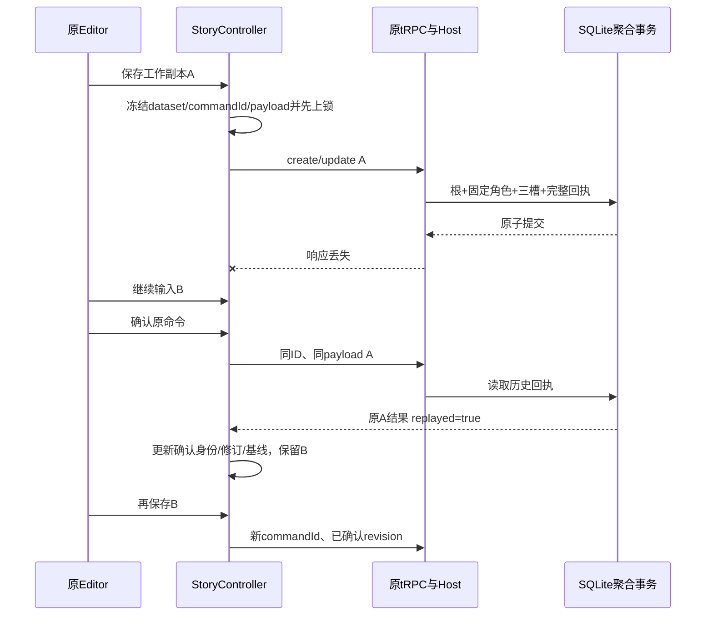

# 原剧本聚合 API · M1

状态：当前开发分支实现，整仓/原页面验收中。精确通过状态见PROGRESS，不表示v0.1.0镜像已有功能。唯一契约源为apps/runtime/src/contracts/story-draft.ts、story-draft-validation.ts、story-draft-output.ts；传输表为apps/web/contracts/story-http.ts。

## 1. 入口与身份

复用同一Next应用 `/api/trpc/storyDrafts.{create|get|list|update|delete|restore}`。create/update/delete/restore使用POST JSON；get/list使用GET，input查询参数为URL编码JSON。Story客户端使用单次非batch httpLink；包含story的单项batch、多操作或混合batch明确拒绝。

- 同源HttpOnly本机会话cookie，`x-everwoven-request: 1`，POST Origin匹配既定部署来源。
- owner来自真实Host认证，不是客户端字段。客户端只提交当前datasetId，它不是授权凭据。
- 六操作必填 `protocolVersion:1` 和 `datasetId:UUIDv7`。缺/错协议为412 CLIENT_RELOAD_REQUIRED；当前协议结构错误为400；错数据集为412 DATASET_CHANGED，不能混为自动刷新指令。
- 所有未知字段拒绝，旧根DTO/请求不补默认、不注册兼容路由。查询参数也不是旧的裸ID。
- 单story mutation实际流字节最多2MiB；查询URL最多16KiB UTF-8字节。其他JSON仍256KiB，图片走独立二进制通道。客户端错误响应读取最多8KiB。
- no-store、nosniff；前端同源凭据且拒绝重定向，不自动重试写操作。

## 2. 六操作

以下字段均叠加protocolVersion/datasetId：

| 操作 | 输入 | 返回 |
|---|---|---|
| create | commandId、title、settings、显式mainCharacter或null、完整assetSlots | `{data:DraftDTO,replayed}` |
| get | id、可选includeDeleted | 完整DraftDTO |
| list | 可选limit/deleted/q/genre/cursor | protocolVersion/datasetId/items/nextCursor/totalMatching |
| update | commandId、id、expectedRevision、非空patch | `{data:DraftDTO,replayed}` |
| delete | commandId、id、expectedRevision | 同上，带deletedAt |
| restore | commandId、id、expectedRevision | 同上，deletedAt为null |

patch只允许title/settings/mainCharacter/assetSlots。整个字段缺省才保留；settings出现时完整替换，mainCharacter出现时完整替换绑定描述与overrides，assetSlots出现时必须完整三槽。显式null不等同缺省。

ID为小写UUIDv7；revision为正32位整数。createdAt/updatedAt/deletedAt/archivedAt由服务端维护，前端不写这些字段。标题至少有一个非空白字符；允许保存未完成世界设定，生成准备校验与保存不是同一门槛。

## 3. 世界、角色与图片

### settings

| 字段 | 上限（Unicode码点） |
|---|---:|
| world / opening | 各12000 |
| genre | 80 |
| playerRole | 4000 |
| tone | 500 |
| worldRules | 最多30条，每条1000 |

title最多120码点。严格保存原文字；不靠隐式trim、转义归一化或补空覆盖现有字段。

### mainCharacter

- `null`：不设主角色；update移除现主角色时自动清未显式提交的character覆盖槽。显式提交非空character槽与null矛盾，拒绝。
- `library`：templateId、expectedTemplateRevision、overrides。只接受当前owner下可用library模板，核对修订，固定/复用不可变版本。不相信客户端上传的模板快照。
- `bound`：characterVersionId、overrides。仅update，ID必须等于此根当前main版本，不去读活模板更新内容。
- `inline`：name、完整CharacterSettings、portraitAssetId、overrides。仅沿此根当前main追溯自己的内部模板；没有当前inline则新建，不按sourceStoryDraftId随便复活旧角色。

CharacterSettings包括personality≤8000、appearance≤4000、speakingStyle≤2000、boundaries≤4000。overrides含必填relationship≤4000与portrait，另可覆盖name≤120及部分CharacterSettings。缺省覆盖项表示继承固定版本，显式空字符串表示清除。首次无来源角色有草稿文字但姓名未填时，前端保留输入并反馈，不静默丢弃角色内容。

### portrait与assetSlots

`assetSlots`恒为 `{cover:string|null,opening:string|null,character:string|null}`：

| portrait | 有效头像 | character槽 |
|---|---|---|
| `{mode:'inherit'}` | 固定version的基础头像 | null |
| `{mode:'none'}` | null | null |
| `{mode:'asset',assetId}` | 指定assetId | 必须同assetId |

三槽不是三次HTTP保存。新引入或换槽/换绑定的引用须同owner、ready且未删除；完全相同原槽/同绑定的历史引用可保留，即使后来unavailable。此规则只为保留历史文本，不等同图片仍可用于生成。清除表单引用不删除图片文件，根软删/恢复也不重写版本或删资产。

## 4. 详情与列表

DraftDTO包含协议/dataset、根ID/标题/settings、mainCharacter、assetSlots、assets、schemaVersion=1、revision及四个生命周期时间。

- mainCharacter返回固定version、完整overrides、计算后的effective；effective不是另一组可写真值。
- assets按ID去重排序，包含三槽和固定版本的基础头像，至多4项：present携带AssetDTO，missing保留ID/dataset，不偷偷把引用改null。
- 损坏/缺失固定CharacterVersion明确失败，不拼活模板补救；历史文件失效与世界文字分开显示。
- list为轻量summary，不回传完整世界/角色长文本。summary含id/title/genre/mainCharacterName/coverAssetId/revision/时间/协议/dataset。
- q只按标题字面匹配，genre精确；limit默认20、最大100；deleted为exclude或only。totalMatching不带cursor条件，与相同筛选一致。
- 稳定updatedAt DESC/id DESC keyset；游标绑定dataset与owner/filter scopeHash，不公开明文owner，不充当权限签名；并发编辑时不是冻结列表快照。

## 5. 事务、回执与未知结果

服务端严格解析→dataset→WriteGate→查原回执→CAS/绑定及新引用核对→内部模板/固定版本/cast/三槽→完整DTO和回执→一次提交。任何一步失败全部回滚；事务内不做文件/解码/网络/模型工作。

create使用同一个服务端ID作为StoryDraft.id与create CommandReceipt.id，验证历史创建身份；其他回执独立ID。命令类型为authoring.story.{action}.v1。相同owner/commandId且相同规范化payload返回原完整历史DTO，replayed=true；同键不同内容冲突。历史回执不由当前模板/素材/根重新拼装。

本次确认在回执查询前被拒绝，不证明之前提交失败。已有unknown不会因新的400或协议拒绝被清空；首次且无旧unknown的可信明确拒绝可终止。跨dataset停重放并清旧身份/图片，只有显式从保留文本新建。当前pending保留在页面内存；硬关闭期间的未确认命令持久恢复不冒充已实现。

## 6. 固定错误

| HTTP | 标识 |
|---|---|
| 400 | INVALID_STORY_COMMAND / INVALID_STORY_QUERY / INVALID_CURSOR |
| 401 / 403 | LOCAL_SESSION_INVALID / LOCAL_ORIGIN_DENIED |
| 404 | STORY_NOT_FOUND / CHARACTER_NOT_FOUND / ASSET_NOT_FOUND |
| 409 | REVISION_CONFLICT / TEMPLATE_REVISION_CONFLICT / STORY_NOT_DELETED / REVISION_EXHAUSTED / IDEMPOTENCY_CONFLICT / STORY_ASSET_NOT_READY |
| 412 | DATASET_CHANGED / CLIENT_RELOAD_REQUIRED（不同处理） |
| 413 | STORY_REQUEST_TOO_LARGE |
| 500 | STORY_INTERNAL_ERROR |

客户端另有STORY_NETWORK_ERROR/STORY_RESPONSE_INVALID。StoryClientError提供code/status/outcome，outcome只描述本次尝试。服务端不按前缀或任意TRPCError透传内部原因，错误不带SQL、路径、stack或owner。SQLite竞争可以失败，不自动改commandId重试；当前EXPLAIN仍存在临时排序B-tree，不宣称所有查询免排序。

本片不创建StoryVersion发布、Experience、模型任务或费用记录。保存并进入准备不是付费生成授权，也不进入前端Mock游玩。
