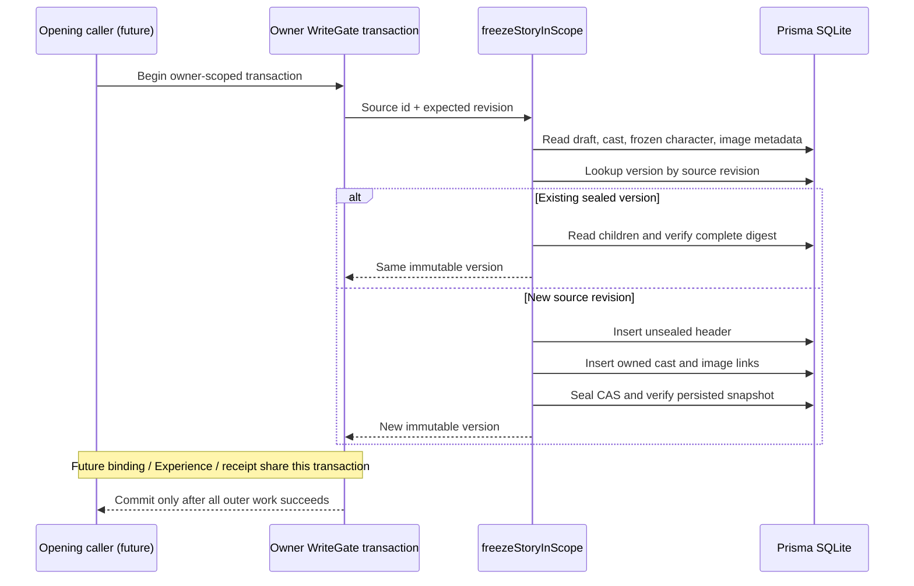

# M2-A 剧本封存内部契约

状态：已实现内部原语，测试/提交结果见PROGRESS；尚未开放HTTP或用户“发布”入口。它必须在后续CreateExperience完整事务内调用，不独立提交，不创建经历或费用。

## 输入与输出

`freezeStoryInScope(scope, owner, input, services)`：

- `owner`仅宿主可信上下文，含ownerId/datasetId；必须与事务scope.ownerId一致。
- `input`严格包含`protocolVersion:1`、UUIDv7 `datasetId`、UUIDv7 `storyDraftId`、1..2147483647整数`expectedRevision`。额外owner/provider/预算/force字段均拒绝。
- `services`为既有服务端UUIDv7与时钟端口，不接受客户端生成的版本ID。

返回`StoryVersionDTO`：协议/dataset、版本id、来源storyDraftId/sourceRevision、versionNo、title、完整settings、mainCharacter（固定version/overrides/effective）、三图assetSlots、schemaVersion1、createdAt、sealedAt、contentHash。DTO不包含owner、凭据、文件路径、图片临时URL或供应商配置。

`readStoryVersionInScope(scope, owner, id)`：读取已封存正文，校验所有引用形状、角色版本、完整摘要；不读取当前草稿/当前角色模板，不把现今素材ready状态写回历史。媒体读取和新生成素材预检是另一个明确边界。

## 一致性

1. 本层调用者已持`withOwnerWrite`。source owner/有效状态/revision核对后读取同一聚合快照；不存在、已删、归档或revision不符均阻断。
2. 所有引用的图片元数据必须仍ready且未软删，包括继承头像；历史查看可保留旧assetId，但新开局必须重新准入。这里只证明数据库元数据，尚不证明文件、传输或模型输入可用。
3. 同来源修订唯一；已有版本必须封口且自身摘要正确，与同修订源正文相同，才可复用。坏半成品不自动修复，标题相同不构成唯一约束。
4. 新版本先写未封口header，复制main角色版本/覆盖与三槽引用，再CAS封口并回读。孩子、封口或外层绑定/经历/回执任一步失败，外层事务回滚整笔。
5. 子引用写端口只接受当前owner的未封口header；封口后不允许追加孩子，封口CAS不可重复更新。不存在普通版本update/delete方法。
6. SHA256摘要以显式规范顺序绑定owner、dataset、版本和来源身份、编号、时间、完整正文；不是签名或针对拥有本机数据库写权限者的防篡改认证。可变素材状态不进入hash。
7. 冻结不修改草稿revision。真正唯一沿既有`(storyDraftId,sourceRevision)`及`(storyDraftId,versionNo)`；UUIDv7、零外键/触发器及现有精确schema门禁不变，本切片无DDL迁移。

## 原子时序（实线为已实现内部逻辑）

## 错误归属

| 错误 | 含义 |
|---|---|
| CLIENT_RELOAD_REQUIRED / INVALID_STORY_COMMAND | 协议或内部输入非法 |
| OWNER_UNAVAILABLE / DATASET_CHANGED | 可信owner不匹配或数据集已变 |
| STORY_NOT_FOUND / STORY_ARCHIVED / REVISION_CONFLICT | 当前来源不可开局；不悄悄用新修订 |
| STORY_ASSET_NOT_READY | 当前保留引用缺失、已删或非ready |
| STORED_STORY_INVALID | 来源聚合已有结构错误 |
| STORY_VERSION_NOT_FOUND | 版本不在当前owner或header缺失 |
| STORY_VERSION_SEALED | 写孩子端口企图追加已封口版本 |
| STORED_STORY_VERSION_INVALID | 封口、正文、孩子、摘要或回读不一致 |
| REVISION_EXHAUSTED / ID_FACTORY_INVALID / CLOCK_INVALID | 版本序号或宿主服务异常 |

数据库I/O错误沿事务失败处理；未来HTTP错误映射须在真实CreateExperience路由接线时明确，本文不虚构已存在的路由或状态码。

## 后续衔接

CreateExperience复用`createStoryVersionWriteScope(tx,ownerId)`，不调用Store.write形成嵌套事务；在同事务固定ProviderBinding/预算/命令回执。任务网络调用仍在事务外。单独封存通过不代表开局、视频生成、播放、情境建议、续玩或分支已经通过。
