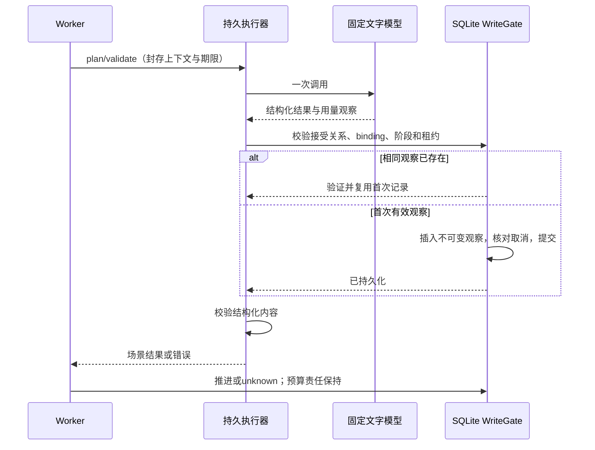

# 文字调用持久观察

2026-09-14。本模块是正式生成主线的内部服务；没有新增HTTP入口，也不触发模型请求。

## 接口与数据

`createTextObservationRecorder(db, owner, authority, services)` 返回与导演 `observe(context, stage, observation, signal?)` 一致的回调。`createPersistedGenerationExecutor` 自动安装此回调，调用方只注入文字/视频/媒体适配器。旧的底层组合函数仍供受信组装与测试使用；本函数无内存保存或no-op默认。

`TextUsageObservation` 保存UUID、owner/dataset/storeEpoch、turn/quote/profile、planner或validator阶段、bindingHash、供应商与模型ID、responseId、已知input/output/total token计量、contentHash、schemaVersion、createdAt。schema及SQL见`docs/architecture/data/text-observations.generated.sql`。不可变事件没有updatedAt/deletedAt；更正费用需要新的调整事实。

严格字段白名单拒绝原始响应、剧情正文、Key、本地路径等扩展字段。用量必须是非负安全整数，缺失字段保持缺失；这些用量是供应商观察，不能仅凭完整token字段推断全部计费维度齐全。

## 写入规则

1. 使用固定Host身份与storeEpoch，原WriteGate串行短事务内读取已接受回合、报价、经历、预留和Profile。
2. 校验报价接受关系及摘要、上下文报价/剧本版本/行动、封存Profile和阶段binding。当前版本每个文字阶段maxCalls必须为1。
3. 已有记录先验证自身字段和摘要；相同内容直接返回，不依赖阶段仍在执行。不同responseId或usage报`TEXT_OBSERVATION_CONFLICT`，损坏记录报`STORED_TEXT_OBSERVATION_INVALID`，不覆盖首次事实。
4. 新记录仅可写入对应planning/validating阶段、有效leased任务、generating经历和held预算。事务入口及写入后检查取消信号与租约；取消时回滚。没有供应商I/O、自动重试或费用释放。
5. 保存返回之后，导演才处理结构化内容并推进阶段。因此模型内容不合格可以同时存在持久用量记录与unknown业务状态。记录写失败使Worker进入unknown/blocked，原预算责任保持held。

## 尚待接入的费用闭环

该表保存首次文字响应证据。网络断开、模型不匹配、供应商响应解析失败或取消发生在记录前时，仍可能已有真实费用而没有观察；原预留必须保持。业务ready也不会让此模块自动释放预算。

下一步结算应使用报价中封存的完整价格、计费维度、视频任务用量与文字观察，验证首次结算幂等、已知/未知责任及追加调整。Host长期调度/生命周期、实际供应商配置和原页面费用确认仍需后续接线，不以当前内部测试替代两幕真实生成验收。
