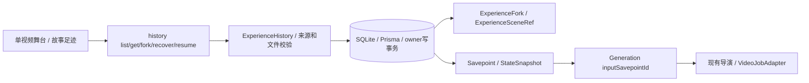
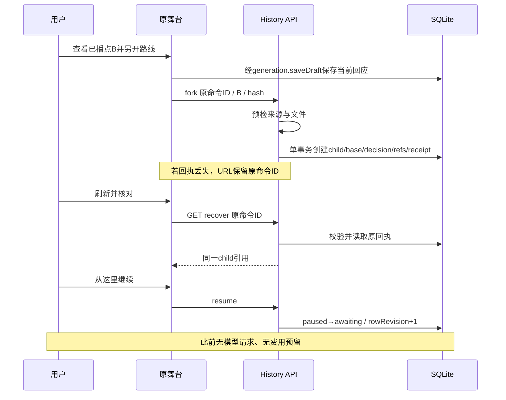

# 分支存档技术设计 · 1.0

2026-09-14 · 已实现基础历史回看、独立分支及恢复。下方逻辑设计保留背景，当前实际映射以本节与已实现API为准。

## 当前实现映射

- 第六迁移 `202609140004_experience_forks`：28业务表、18真实业务唯一、零外键。SQL见 [experience-forks.generated.sql](data/experience-forks.generated.sql)。
- ExperienceFork.id 即 child Experience.id；来源/root/hash/base 为独立不可变记录，无冗余一对一唯一键。ExperienceSceneRef 显式登记 child 可读取的已确认前缀。
- Savepoint 的 sourceTurnId/playbackSessionId 仅 fork_base 允许空，普通 played_segment 保持本路线真实证明要求。GenerationTurn.inputSavepointId 将新生成连接到本路线输入点。
- child 首次 turn 的 parentTurnId=null、inputSavepointId=本地 fork_base；新已播点 parentSavepointId=该基点，快照包含继承前缀与新一幕。
- 前缀上限1000，超过拒绝；实际导演输入在quote/accept前验证65536字符限额。来源后续剧情不进入子路线输入。
- 同scope未知责任阻止新接受及付费阶段；planning/submitting/validating 的持久阶段标记串行化付费派发，read/materialize仍可恢复。实际结算账本尚未交付。
- UI使用原舞台唯一视频，可收纳故事足迹；先保存原回应，显式创建paused child，再显式resume到awaiting。重启只读找回原fork回执，来源删除也保留入口。

关联：[产品需求](../product/BRANCH-SAVEPOINTS-PROPOSAL.md) · [ADR](adr/ADR-0001-branch-experience-and-shared-budget.md) · [候选tRPC契约](../api/BRANCH-CONTRACT-DRAFT.md)。整体一期不因本设计直接扩大为全部分支UI交付。

## 1. 决策与范围

采用“不可变存档点＋显式fork新Experience＋共享媒体引用”。一条Experience代表一条独立续玩的路线，不再建立另一个拥有相同进度的Branch聚合。用户的故事树是来源关系的查询投影。

- 新分支从已确认的历史状态出发，原路线不回退、不覆盖。
- 用户可以选建议或自由表达；未选方向不生成视频，不建成已发生节点。
- 同根树暂不合流。跨世界/跨人物版本合并、分支内原地换模型不在本方案。
- 回看、继续当前路线、fork、技术重试、主动重新生成是不同命令；相同界面位置不代表同一业务行为。
- 不把视频URL、聊天历史或LangGraph checkpoint当成游戏存档真值。

## 2. 存档点与恢复点不是同一概念

### 2.1 可分叉存档点

`Savepoint.kind=played_segment`：由同一短事务提交“有效完整播放证据＋已验证事实＋不可变StateSnapshot＋可回应InteractionEvent＋Savepoint”。该事务重复执行只回放原结果。

只有此稳定边界才可作为首版fork来源。正在生成、播放未完成、验证不确定、片段生成失败的恢复目标不是可分叉存档点。`SaveAndPause`可以保存任何合法阶段的恢复进度，但不能凭暂停动作签发新的剧情事实或分叉资格。

源节点后来被消费、原线继续产生C/D，不改变B存档点的内容或资格。来源资格同时受owner、生命周期、素材及兼容性检查约束，不靠客户端传`canFork=true`授权。

### 2.2 新分支的fork_base

fork事务创建子Experience及其本地`Savepoint.kind=fork_base`，引用源StateSnapshot；源经历与源Savepoint保存在子Experience的不可变origin字段中。

- fork_base的`parentSavepointId=null`、`mediaSegmentId=null`，不是伪造一个重新播放过的视频节点。
- 建立新的、属于child的decision InteractionEvent和空ResponseDraft，继承源保存点内已冻结的情境文本/建议值，而不是复用源节点/建议ID。
- 没有保存建议时保留自由回应；fork本身不调用LLM补建议。
- child读取初始已确认状态来自共享Snapshot引用，不再次把来源事实作为新事件提交；后续仅追加child自己确认的新事实。
- child初始`status=paused`、`schedulingPaused=true`、`revision=1`、`rowRevision=1`、`dispatchEpoch=0`。新的事件流、空任务集合、无控制lease、无已接受Quote。
- 恢复目标由fork_base＋可用decision＋无本地在途回合确定为`awaiting_input`。取得child控制权并显式resume后才可报价/回应；不调用root的start开场流程。

这是对原“decision必须有同经历播放证据”的**有界扩展**：普通decision仍要求本经历证据；fork_base decision必须通过本经历origin与来源已确认存档证明链，不能接收任意外部媒体ID来豁免。

## 3. 逻辑数据字典（未来迁移，非当前M0 schema）

| 对象 | 必需字段/引用 | 不变量 |
|---|---|---|
| Experience扩展 | rootExperienceId、sourceExperienceId?、sourceSavepointId?、budgetScopeId、currentSavepointId? | root自身rootExperienceId=id；fork继承根/预算scope；source两字段同空或同非空，创建后不变 |
| Savepoint | id、ownerId、experienceId、kind、parentSavepointId?、mediaSegmentId?、stateSnapshotId、decisionSeed、sourceTurnRunId?、schemaVersion、createdAt | 普通点属于本经历、指向本地前一个Savepoint；fork_base通过Experience.origin解析外部来源；无未来状态引用 |
| StateSnapshot | id、ownerId、schemaVersion、contentHash、state、createdAt | 不可变；世界状态、角色可知事实、关系状态、固定版本及证据引用；多个fork可以合法共享同一个snapshot |
| MediaSegment | id、ownerId、experienceId、turnRunId、assetId、验证/实际规格 | 不覆盖已有媒体；上一幕通过TurnRun.inputSavepointId及保存点关系确定，不额外维护第二套next指针 |
| TurnRun扩展 | inputSavepointId、sourceInteractionEventId、已接受意图/Quote/执行profile引用 | 输入来自当前节点；候选输出不提前改Snapshot |
| InteractionEvent扩展 | savepointId、证据模式normal/fork_inherited | normal绑定本经历播放/媒体证明，fork_inherited仅允许本地fork_base的封闭来源证明 |
| ExperienceAssetRef | id、ownerId、experienceId、assetId、role、sourceSavepointId、createdAt | fork事务登记其可继承前缀的必要素材引用；不给整条源经历的通配读取权 |
| BudgetScope | id、ownerId、rootExperienceId、limitMicros、currency、createdAt、updatedAt、deletedAt、revision | 一棵树一个费用总上限；删除不抹掉已发生或未决责任 |

Savepoint/StateSnapshot为不可变记录，不伪造updatedAt/deletedAt；清理通过所属经历生命周期、存活引用、备份pin与受控GC判定。Experience/BudgetScope等可变根继续createdAt/updatedAt/deletedAt/revision规范。ID统一UUIDv7。

Snapshot采用有版本的结构化JSON及确定性序列化hash，不用泛型扩展JSON随意塞聊天上下文。内容保存完整已确认状态，初版优先恢复确定性；是否增量压缩后续实测，不以重放任意Agent代码补状态。

### 3.1 索引与唯一约束评审

普通索引：Experience(ownerId, rootExperienceId, createdAt, id)、Experience(ownerId, sourceSavepointId)、Savepoint(ownerId, experienceId, createdAt, id)、Savepoint(parentSavepointId)、Savepoint(stateSnapshotId)、ExperienceAssetRef(assetId, experienceId)。按分页/溯源/GC查询验证EXPLAIN。

候选真实唯一（M2/M3迁移评审时精确定名）：

- BudgetScope(rootExperienceId)：每个根树一个共享预算账户，不因分叉创建第二个。
- Savepoint(mediaSegmentId)只对非空普通片段形成“一份已确认存档点”约束；若SQLite/Prisma声明差异需使用审核后的partial unique迁移。fork_base的空值不用于保证“每经历一个基点”，后者由显式初始化事务及命令回执保证。
- ExperienceAssetRef(experienceId, assetId, role, sourceSavepointId)：只有四元组完全相同才是重复引用。
- CommandReceipt(ownerId, commandId)沿用，处理fork重试。

禁止将parentSavepointId、sourceSavepointId、rootExperienceId（在Experience表中）、snapshotId或内容hash误设为唯一。一个源点有多个分支是正常基数。

所有关系只有标量ID与索引，无物理外键/关系触发器。WriteGate中显式验证同owner、存在性、可引用状态、同根、来源边界与无环；新child在事务中生成，origin后续不可修改，阻断回指未来/自身；不相信客户端提交祖先数组。

## 4. 前缀、媒体与删除

### 4.1 继承边界

从B分叉只继承B的Snapshot和B及以前实际引用的媒体/素材清单。清单由服务端沿已验证Savepoint与origin链构建；不读取源经历“最新记忆”，不继承C及以后的事实、未发送稿、任务、lease、报价或费用回执。

UI可以把相同前缀折叠显示为一棵树。底层fork_base仍有独立ID；首版不将fork_base再次签发为可fork来源，UI折叠节点需返回实际来源played_segment的ID和所属Experience。若原来源已删除，child仍可回看/续玩，但再次从该来源fork须先合法恢复；不得用视觉合并绕过来源生命周期。浏览位置viewedSavepointId属于前端查看状态，和服务端currentSavepointId/当前已消费节点分开。

树查询采用分页/懒加载，不返回全量状态或媒体字节。服务端对遍历深度、节点数、返回字节设版本化上限；到上限返回明确cursor/截断原因而非伪装完整树。实施前用实际规模压测冻结阈值。

### 4.2 引用准入与GC

首次fork要求源经历未软删除，必要素材均未软删除且status=ready；不为创建新分支偷开“软删除素材也允许新增引用”的例外。来源被删除时明确拒绝新fork，可先走合法恢复流程。

fork成功后，child拥有明确的历史素材引用与Snapshot引用。后来删除source不使child断档；GC必须检查child引用、所有活跃fork origin、快照/保存点祖先链、备份pin与未决操作。源经历的必要元数据/祖先记录保留为内部可追溯记录；用户的child接口只返回其授权前缀，不借此恢复对原经历全部内容的访问。

不能只检查source.deletedAt再物理清理整条记录。最后引用释放后，按宽限期/deleting/purged协议清理。普通软删除不承诺磁盘擦除；隐私清理涉及全部引用的受控流程，不能悄悄删坏另一条路线。

根经历软删除只隐藏该路线，不级联删除BudgetScope或让仍存活child从故事树查询消失。rootExperienceId仍作稳定分组键，查询以本owner的存活分支与scope为入口；已删祖先可显示不含私密内容的来源占位。scope只有在全树无存活经历、无未决责任且满足账务保留策略时才可归档，归档不是把账本归零。

文件可读性预检在事务外做；事务内复查元数据版本/状态并登记引用，防与应用GC竞争。磁盘或文件在之后被外部破坏，显示media_missing并阻断需要该素材的下一步；不以重新生成冒充恢复，也不许数据库事务长时间读取/上传文件。

### 4.3 回看与播放证明隔离

回看走只读历史媒体授权，使用现有AssetStore的本机/Range能力；不复用会更新当前播放instance的“继续播放”命令，不提交reportPlayback、不合并事实、不消费互动节点。来源signed URL过期时重取本机授权地址，不更改assetId或触发模型。

## 5. fork事务与切换

### 5.1 来源预览（零生成）

受保护只读查询返回源SP的版本/hash、情境/角色、媒体状态、是否可fork及真实阻断原因、共享预算摘要。可预检素材但不轮询供应商、不生成建议、不预留费用。UI显示“从这一刻另走一条线，原路线保留”。

### 5.2 ForkExperience命令

输入：sourceExperienceId、sourceSavepointId、expectedSnapshotHash、branchBudgetLimitMicros、currency、commandId。无ownerId、无客户端Snapshot、无parent列表、无模型/剧情覆盖字段。

事务前：身份/CSRF及规范化输入校验后，先以短事务检查同owner的CommandReceipt；相同摘要直接返回原child引用，异摘要报冲突。不因来源删除、素材缺失或child已继续而重做已提交命令。回执未命中才读取来源并做事务外文件预检；预检失败返回前仍复查回执，覆盖同键并发请求已经提交的情况。最终事务再次检查回执，确保并发创建只提交一次。

最终事务内：

1. WriteGate取得owner写权；先查回执。相同摘要返回同一个child，历史响应不等于child当前状态；重复回执不因source后来删除而重新创建。
2. 新命令复查source owner/生命周期、SP归属/kind/已确认来源/兼容schema/hash、素材版本与scope；用户自报hash仅防目标变化，不提供授权。
3. 固定子ID，继承StoryVersion、人物版本、视频Binding、源Snapshot的执行profile作为初始profile基准；root/scope由服务端继承。
4. 创建paused child、fork_base、fresh decision/建议ID、空草稿、独立流身份和初始化事件、必要持久引用。
5. 记录命令回执，同事务提交。任何失败整笔回滚；无生成Job/报价/预算预留/LLM网络调用。

### 5.3 切换不是fork的隐含副作用

在某条路线正在进行时，前端先保存并暂停当前路线（可能不是被回看的source），收到回执后才执行fork并进入child。失败保留原位置/未发送稿，不清空当前界面。fork成功但导航失败，重取原命令回执可找到同一个paused child。

Fork API本身不替所有窗口暂停source，更不取消供应商任务。其他窗口控制按各自lease处理；禁止把child控制token用于source。原任务若已经受理，仅继续核对/结算，责任保留。

child的resume只恢复控制/交互资格，不调用模型。用户实际提交新回应时才生成独立Quote、消费child新节点并创建新TurnRun。

## 6. 预算：总上限与分支子上限

为阻止复制分支扩大可支出额度，首个正式预算迁移引入BudgetScope：root经历的初始授权额度创建同金额scope，fork继承此scope，不再铸造一个同额度钱包。

- Experience.budgetLimitMicros保留，表示该分支自创建后新增操作的子上限，不含继承的历史片段成本。
- BudgetScope.limitMicros是根树所有分支的共同总上限，统计已删除分支的历史支出及所有未决责任。
- 一个UsageEntry/BudgetReservation记录同时携带scopeId与experienceId；两级摘要是同一账本的不同汇总，不能插两条费用后相加。
- scopeAvailable = scopeLimit - scopeSettled - scopeReserved；branchAvailable = branchLimit - branchSettled - branchReserved；可接受上界为两者最小值。
- unresolved是reserved的子集，不重复扣。接受Quote时同一WriteGate事务检查两级额度、消费报价、登记一次预留；释放/结算同样原子反映两级。
- fork只确认子上限，不做金额划拨或预留；branchBudgetLimit不得超过scopeLimit、币种必须一致。实际余额可能被其他分支占用，最终以接受Quote时检查为准。
- 删除/暂停/切换/fork不释放旧预留，不复制退款或许可。任何scope未解决的submission_unknown阻断该scope新付费派发；零调用fork/回看仍可用，界面明确“生成待核对”。
- 已受理回合保留原Quote/Profile/上界及责任；不因树形存储重新算历史成本。

迁移门禁：M0 Experience只有初始额度尚无真实费用；迁移时每个既有独立根回填一个scope并保持原值。若届时已有真实账本，必须先逐操作核对回填、禁止调度并验证余额守恒；不能按空账本假定零支出。首次预算实施即做scope基础，fork UI可后置，避免发版后重构费用所有权。

### 6.1 scope级派发串行化

两级余额检查只解决超额，不独自保证“未知提交后不再发新请求”。M2必须建立单调度拥有者管理的scope级短派发门锁；涉及同一scope的最终准入/开始发送与写入submission_unknown互斥。固定取锁顺序：**scope门锁 → Experience门锁 → WriteGate短数据库事务**；不持有数据库事务反向等门锁，暂停/失效等涉及两级门禁的操作也遵循此顺序。

- 在scope门内最终检查当前未知责任、控制/epoch、原操作/预留；短事务登记submitting后提交，再开始网络发送，确认传输已开始即释放门锁，不等待模型响应。数据库事务不跨网络。
- A的未知状态落库与B最终检查/开始发送必须在同一scope门内排序：未知先提交则B禁止新请求；B先开始则B是已有在途责任，保留核对，不宣称追溯取消。
- 即使Turn已受理但某一阶段的付费请求尚未发出，也受scope门禁限制；已开始的请求、状态查询及安全结算继续。报价受理与真正派发分别检查，不能凭旧报价或旧检查结果越过门禁。
- 门锁不是每个Next请求/worker各自的进程内Map。初版所有派发及门禁变更通过唯一内部调度拥有者协调；若worker分进程，需受控IPC代理到该拥有者。M0-C/M2必须验证热更新、单实例和故障隔离；多宿主部署前另做协调协议。
- 重启后先扫描submitting/未知责任并完成保守恢复，再开放任何新派发。崩溃落在提交记录与发送之间仍按未知核对，不能依赖已丢失的内存锁认定未发送。

## 7. Provider与生成重试

- fork固定source保存点的Story/Character/Binding版本，初始Profile来自该保存点而非源路线后来使用的Profile；旧Connection账号/地区不悄悄换成当前默认值。
- 新Quote重新检查当前可用性、价格版本和素材外传授权。来源视频可回看，不代表旧模型仍可生成。
- ExecutionProfile仍按Provider设计的“每回合固定、显式新授权可换profile”原则；fork命令不提供override，后续更换由独立显式授权路径处理，不能用fork隐式升级模型。
- 子分支不复制父Turn/Operation/taskId；原task继续在原经历中核对。新的意图是新任务，故障重试仍按同操作是否受理已知分别处理。
- 用户“重新生成已确认片段”的版本对比功能后置。首版不覆盖已确认媒体及后代；失败且提交未知只核对，不借重生成/分支按钮绕过。

## 8. 迁移与接口边界

本轮不改15表M0迁移、Prisma schema或正在使用的数据。正式M2/M3为上述对象新增显式迁移；迁移SQL仍零FK/零跨表关系触发器。当前M0-B内部CRUD与前端演练checkpoint不转换为真实分支存档。

tRPC为唯一应用内业务入口；候选方法见专项契约。旧47项REST/OpenAPI只是历史语义检查表，不新增第二套同义REST。真正上线时新增Zod输入/输出、错误映射、权限/CAS/幂等测试及wire演进记录，再标implemented。

## 9. 分阶段实施闸门

| 阶段 | 做什么 | 尚不开放 |
|---|---|---|
| M0-C | 宿主身份、会话交换、CSRF、单实例/数据保护 | 任何匿名业务写入 |
| M1 | 受保护tRPC剧本/角色/素材＋UI显式迁移＋版本 | 假模型生成或假云同步 |
| M2基础 | 带来源的Turn/Media、scope预算、任务/核对/Provider验证 | 未经验证的真实付费能力 |
| M3单线 | 播放证据/事实/Snapshot/Savepoint原子提交、单线重开 | 稳定点之外的fork |
| 分支切片B1 | 前缀读取/fork事务/两级预算/引用保留测试；简单回看与新走向入口 | 无测试的全量树编辑器、合流/重写历史 |
| 分支切片B2 | 懒加载故事树、命名整理、分支对比 | 非必要开放工作流编排 |

B1/B2排期单独确认；一期正常链路的数据来源与预算scope基础不能等到B1才补。二期AI创作Chat/画布仍是另一条产品能力，复用草稿Service而不是复用游戏Savepoint真值。

## 10. 设计验收与落地验收分开

| 编号 | 必须验证的行为 | 实施证据 |
|---|---|---|
| BR01 | A→B→C，从B fork为D；D无C的未来事实 | 两分支读取、上下文构建及模型输入断言 |
| BR02 | 普通点未完整播放/验证未定不具备fork资格 | 状态反例矩阵、零生成请求计数 |
| BR03 | source节点已消费仍可从稳定SP fork；child节点ID全新 | 事务及二次响应拒绝测试 |
| BR04 | fork重复命令一次创建；异摘要冲突；提交失败无孤儿 | 真实SQLite故障注入、进程重开；成功后素材缺失/删除、预检失败竞态仍可原键重放 |
| BR05 | 回看不影响当前播放实例、进度或事实 | 前后端端到端测试及请求断言 |
| BR06 | owner/来源/快照/同根/媒体范围校验，不沿前缀读到未来 | 跨owner及伪造来源测试 |
| BR07 | source删除后child存活；soft-deleted素材拒绝新fork；GC保留共享前缀 | 引用/删除/GC竞态及实际文件测试；删根后child仍可列出/续玩 |
| BR08 | 两分支并发消费仅在scope总上限内；历史成本计一次 | 真实双连接预算事务测试 |
| BR09 | 未决责任不因fork/删除消失；新派发受scope门禁约束 | unknown与核对/结算矩阵；A写unknown与B开始发送的两种交错、重启门禁与锁序测试 |
| BR10 | fork不换供应商/配置，不复制taskId/Quote/lease | 捕获适配器输入及零调用断言 |
| BR11 | fork后导航/响应丢失，重开恢复同一paused child，空稿不自动发送 | HTTP/浏览器恢复测试 |
| BR12 | 迁移scope余额与历史费用守恒，无FK/伪唯一；树分页如实说明截断 | SQL审计、迁移样本与查询测试 |

设计检查通过只允许进入相应开发闸门，不代替上述实现证据，也不代表官方生成或整个一期已闭环。
