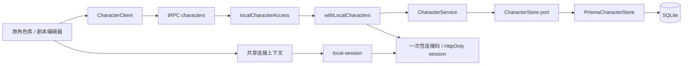
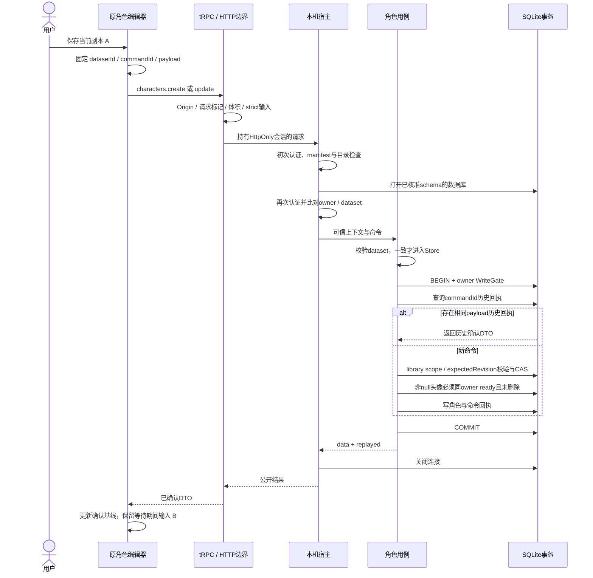

# M1-B · 角色创作运行链路

2026-09-12。角色后端与共享连接基础已实现，原页面接入以PROGRESS最新验收为准。接口见[角色契约](../api/LOCAL-CHARACTERS-M1-B.md)。本阶段不修改Prisma baseline，不引入外键或姓名唯一索引。

## 图示目的

面向前后端研发与验收：用依赖图区分业务端口与认证/资源边界，用六参与者时序图显示幂等重放与新事务两条分支。未添加装饰性配色，信息由标签和箭头表达；图示不代替源码测试。

## 分层与依赖

- UI编辑模型不等于持久化DTO：只有确认的ID/revision才可更新已有角色。
- service依赖端口，不依赖Prisma生成类型；Host组合持有实际数据库，HTTP层不接受目录或owner。
- Store仅是角色用例需要的查询/事务能力，不提供任意SQL给应用；没有通用BaseService。
- Host共享的是认证和资源生命周期，角色与剧本保留独立组合入口/错误白名单。
- demo前端演练存储不是网络失败时的备用库。正式角色不把IndexedDB图片ID作为Asset引用。

## 一次写入的时序

图中任何新命令事务内失败均回滚，包括CAS已执行后发现头像无效的情况。已有回执只返回历史结果，不重新校验今天的头像/实体状态；需要当前状态用get读取。新命令的头像变更与角色写入仍必须一起成功。

## 失败与重放

1. **提交前**：副本可任意编辑；只要本地未保存，就不携带假定已持久化的ID/revision。
2. **提交中**：同步ref锁先于React disabled生效；用户可继续写B，提交快照A不可变。
3. **结果未知**：保存原命令，不重新生成commandId；用户确认时仅重放A。一次401/403/5xx不证明A未落库。
4. **成功**：A成为新的已确认基线；B不被回执覆盖。后续保存B才生成新命令并用确认revision。
5. **dataset变化**：旧命令停止，旧实体身份和列表游标失效；文本保留，显式另建才产生新dataset的命令。
6. **连接变化**：连接上下文以client/mode scope和认证epoch识别旧回调；旧请求的401不应使新的成功连接再次掉线。

## 数据索引与查询语义

- primary key为业务UUIDv7；`(ownerId,commandId)`是已有真实幂等唯一键。
- `name`不唯一，同名角色可创建、删除后也可恢复；人物身份不是名字。
- library列表按`updatedAt DESC,id DESC` keyset分页；q为参数化`instr(name,q)`字面子串，`%`和`_`不作通配符。
- totalMatching与列表使用同一owner/scope/deleted/q过滤，列表与count在同一读事务内。下一页是另一次事务，不承诺整个滚动列表冻结不变。
- 跨owner、story内部scope与不存在ID返回同类NOT_FOUND。role template更新不写CharacterVersion，不让历史剧本被连带修改。

## 验收界限

主仓55文件746/746和双端typecheck通过。隔离生产构建的Chrome已覆盖原角色完整字段读写、刷新、进程重启、软删除/恢复、丢响应后仅一条及强制浏览器Storage不可用。组件回归覆盖冲突保留副本、demo/正式隔离和直接角色卡来源跨dataset显式恢复。Hegel/Dewey规格、Cicero质量审查通过；图片/剧本聚合另外验收。没有付费模型调用，不宣称视频闭环。

Mermaid为源码文档，尚未单独渲染验收。
