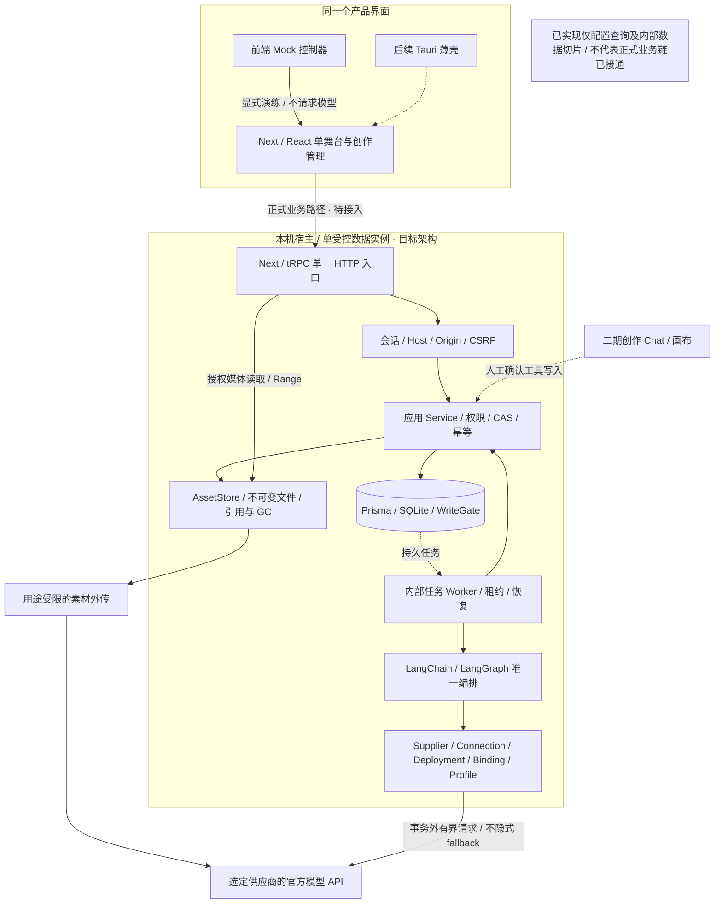
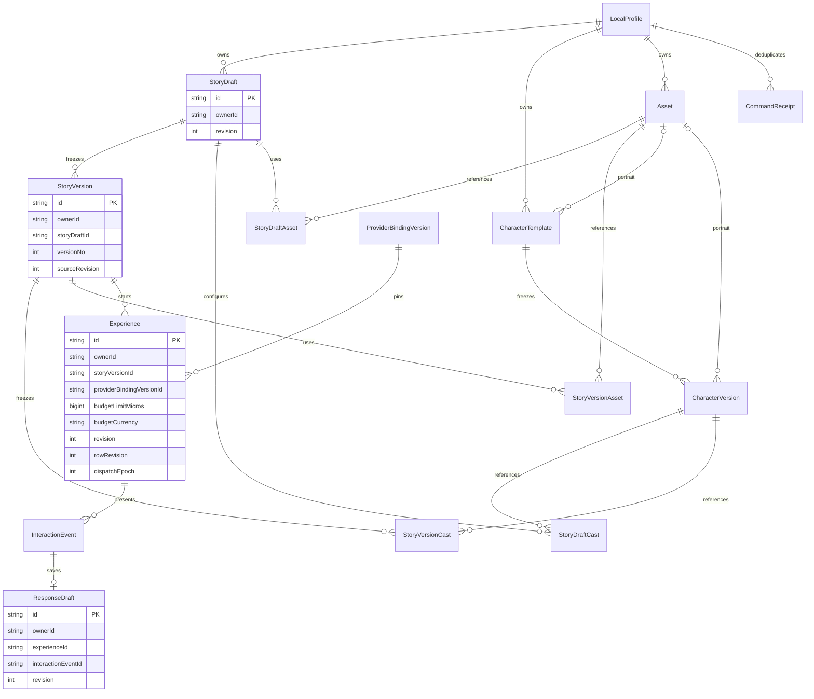
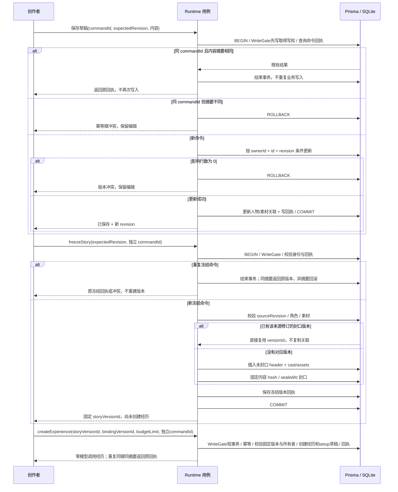
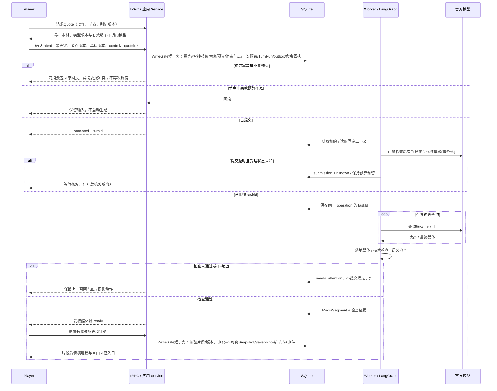
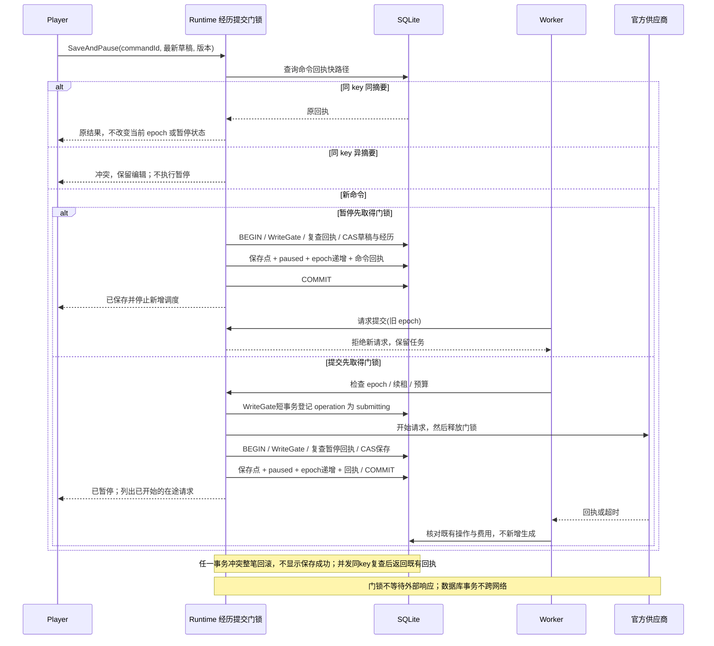
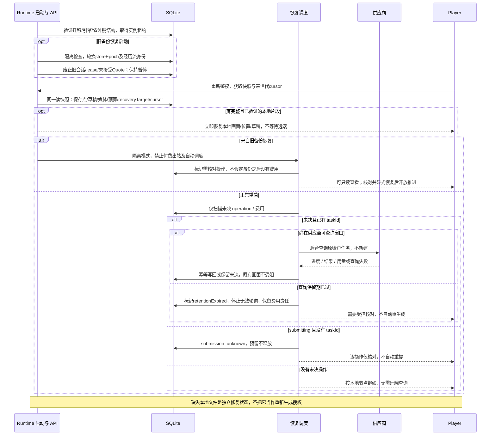
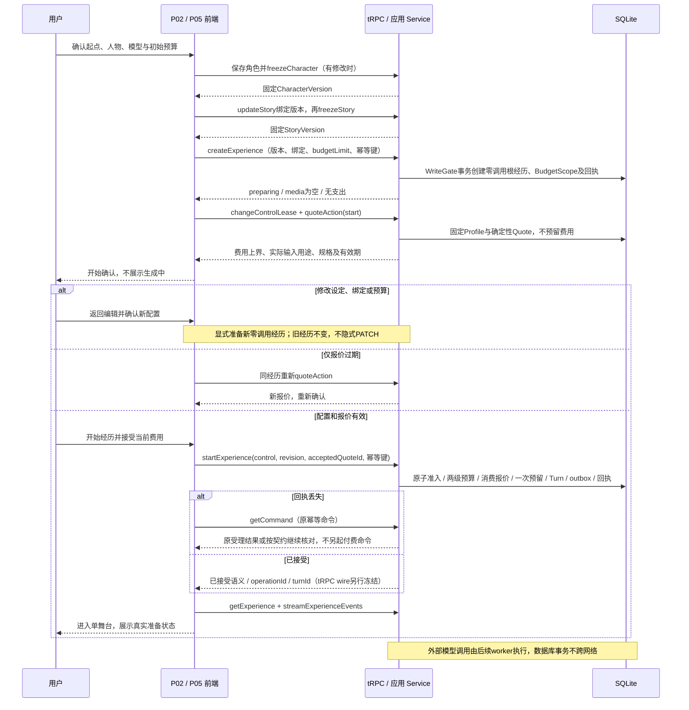
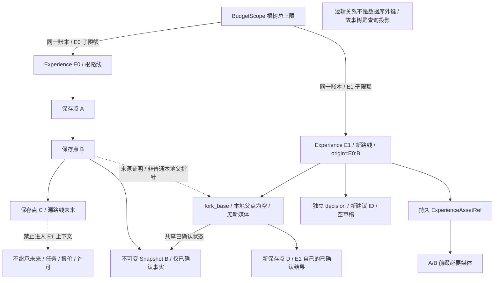
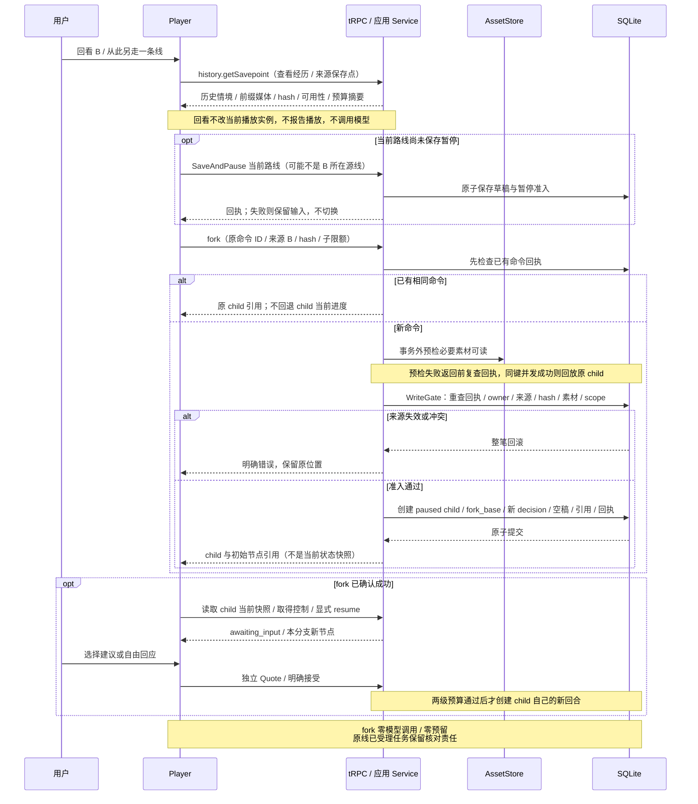
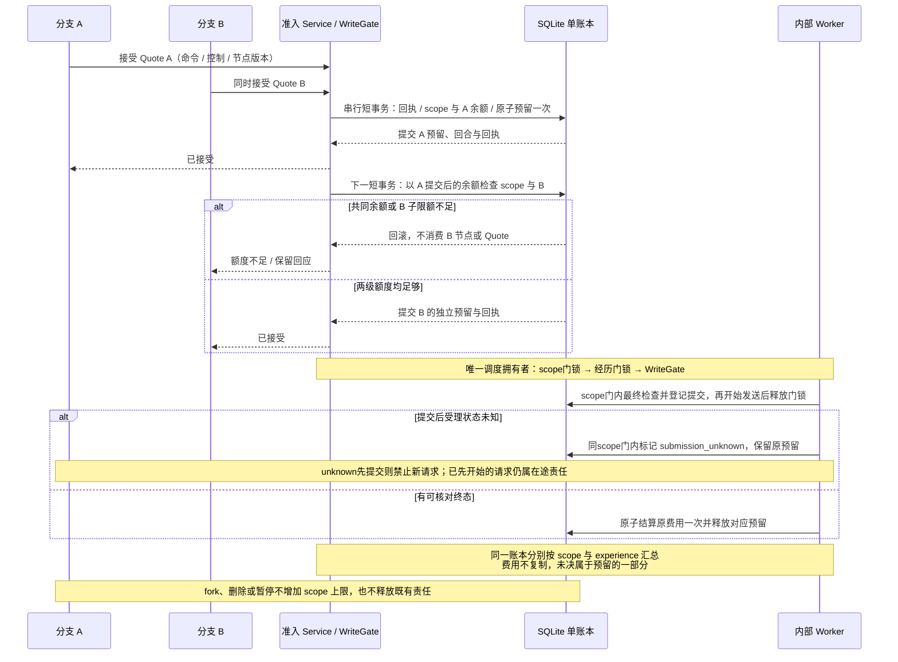

# 架构、关系与时序图册 · V1.4 / 技术方案1.2同步

2026-09-10 · 设计图不是实现验收。系统图已统一为T3单HTTP入口；M0关系图仍只画当前15模型，新增分支对象单独画，避免误认为已迁移。

图2是无物理外键的逻辑关系；其余序列中的旧操作名称表示领域动作，正式tRPC名称与wire由AppRouter/Zod按阶段冻结，不以图代替接口契约。模型调用始终在数据库事务外。

受众：产品、研发与维护者。系统图说明职责/边界，关系图说明来源/共享，时序图说明并发、失败与恢复；不把三类问题堆进一张大图。源文件、下方代码块及SVG保持同步。

| 图 | 解决的问题 | 范围 |
|---|---|---|
| 01 系统架构 | 一个入口、内部worker、前端Mock、供应商边界 | 总体目标，未接通部分详见技术方案 |
| 02 M0逻辑关系 | 当前15表及关联基数 | 已有基础，不包含未来全表 |
| 03 保存与冻结 | CAS、版本与原子回执 | 领域语义 |
| 04 回合与事实 | 事务外生成、检查播放、确认存档 | M2/M3 |
| 05 保存与派发竞争 | 暂停先到/受理先到 | M2/M3 |
| 06 重启恢复 | 恢复、未知受理、旧备份 | M0-C/M2/M3 |
| 07 开始确认 | 创建零调用、报价与开始分离 | M1/M2 |
| 08 分支来源 | 不可变快照、共享前缀、独立进度 | M3/B1待实施 |
| 09 分叉时序 | 暂停、幂等、素材预检、创建/恢复 | B1待实施 |
| 10 共同预算竞争 | 两分支共享总上限、记账一次、未决责任 | M2基础/B1复验 |

## 系统架构与运行边界

[打开矢量图](diagrams/rendered/01-system.svg) · [Mermaid源](diagrams/01-system.mmd)

## M0 逻辑数据关系

[打开矢量图](diagrams/rendered/02-data-foundation.svg) · [Mermaid源](diagrams/02-data-foundation.mmd)

## 保存草稿与冻结开局

[打开矢量图](diagrams/rendered/03-save-and-freeze.svg) · [Mermaid源](diagrams/03-save-and-freeze.mmd)

## 回合生成、播放与事实归并

[打开矢量图](diagrams/rendered/04-turn-and-facts.svg) · [Mermaid源](diagrams/04-turn-and-facts.mmd)

## 保存退出与请求发起竞争

[打开矢量图](diagrams/rendered/05-pause-race.svg) · [Mermaid源](diagrams/05-pause-race.mmd)

## 重启与旧备份恢复

[打开矢量图](diagrams/rendered/06-restart-reconcile.svg) · [Mermaid源](diagrams/06-restart-reconcile.mmd)

## P05开始确认与报价

[打开矢量图](diagrams/rendered/07-start-confirmation.svg) · [Mermaid源](diagrams/07-start-confirmation.mmd)

## 分支来源与共享关系

[打开矢量图](diagrams/rendered/08-branch-lineage.svg) · [Mermaid源](diagrams/08-branch-lineage.mmd)

## 从历史保存点创建新路线

[打开矢量图](diagrams/rendered/09-fork-sequence.svg) · [Mermaid源](diagrams/09-fork-sequence.mmd)

## 分支共同预算与并发准入

[打开矢量图](diagrams/rendered/10-branch-budget.svg) · [Mermaid源](diagrams/10-branch-budget.mmd)

