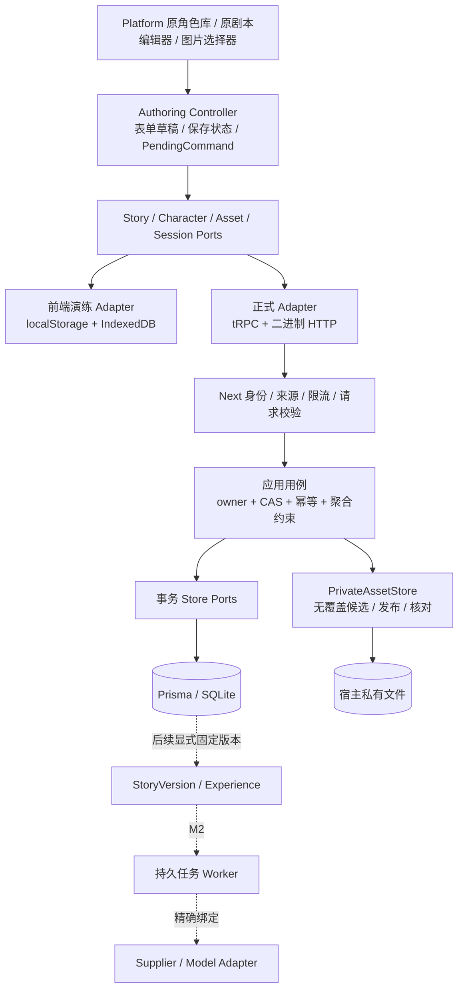
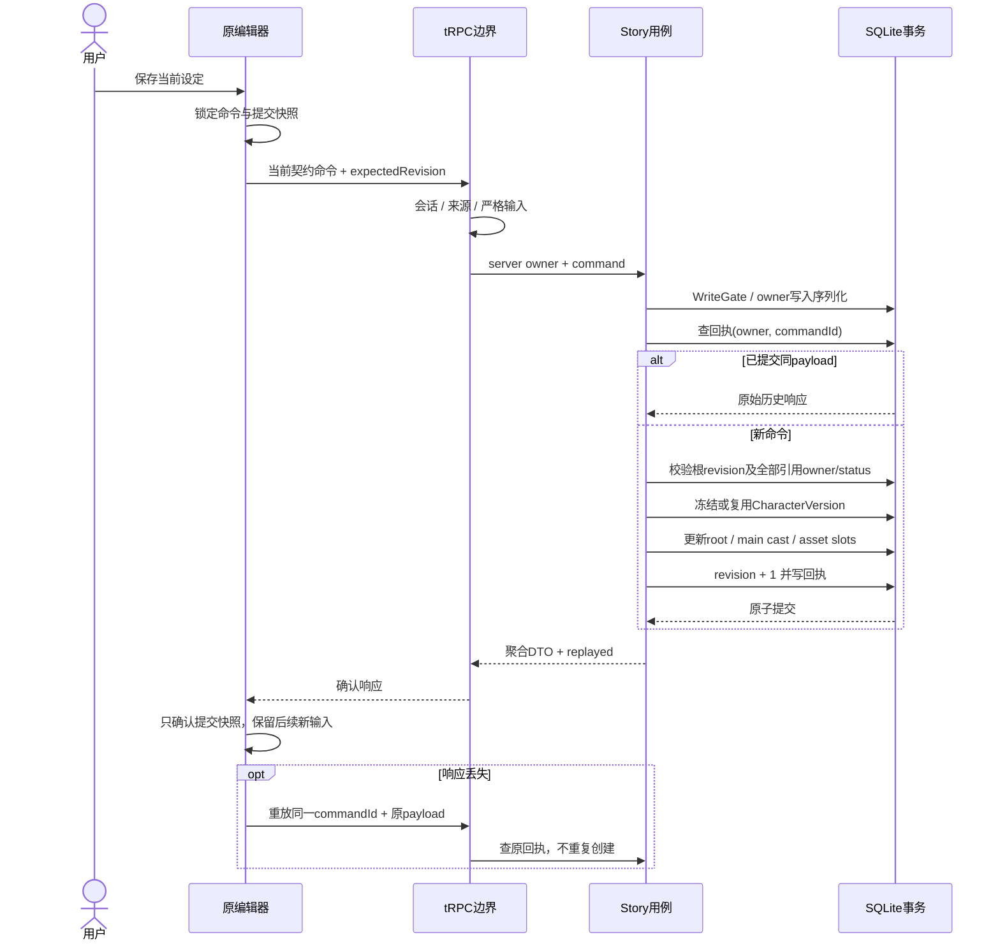
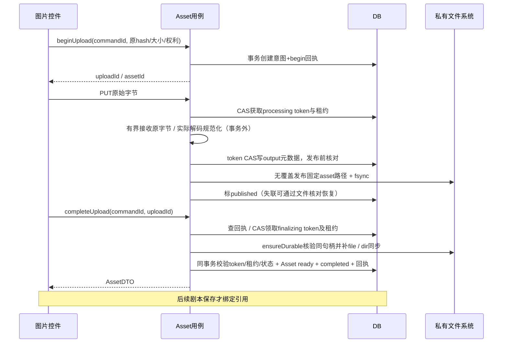

# M1 · 原创作页面前后端贯通技术方案

**版本：0.3 / 2026-09-13 / 聚合源码已接线，生产与主入口验收中，非整体验收。**

实施增量：M1-A1/A2新基线与dataset协议、M1-B原角色六操作已落地；C1a/b/c图片契约、私有文件、生命周期、真实Host/HTTP已提交并CI通过。C2原图片控件已完成本地主仓1340/1340、类型、生产五Chrome与独立规格/质量审查，见[实施记录](../implementation/M1-C2-ORIGINAL-IMAGES-2026-09-12.md)。显式有界资产维护已通过本地157聚焦/隔离1401全量与两阶段审查。原剧本聚合源码已接线、临时DatabaseDrafts与旧传输已删除；runtime和Web规格复审通过，主会话最终生产/质量/CI及当前3100正式启用仍待完成。维护提交0481b8e远端CI因旧面板导航时序失败，见PROGRESS；本地通过不替代远端结论。

用户已确认继续推进前端、后端、端到端及文档，随后明确：**不要旧协议/旧数据兼容，允许清空本项目业务数据重建。** 本文据此采用全新基线，不建设迁移兼容层。本方案承接[范围设计](../superpowers/specs/2026-09-12-integrated-authoring-design.md)，不是再创建一套原型。当前实现与测试证据只在 [PROGRESS](../PROGRESS.md) 登记。精确当前剧本请求/响应/错误以[聚合API](../api/STORY-AGGREGATE-M1.md)及runtime契约为准；下文SQL展示结构，实际基线以生成DDL及schema gate为准，不对用户旧库执行迁移。

## 1. 交付边界和真正的完成条件

**M1用户闭环：** 原角色库新建角色 → 上传图片 → 原剧本编辑器设定世界/开局/人物/关系/图片 → 保存 → 关闭浏览器与应用进程 → 重新连接 → 原页面完整读回 → 修改、软删除、恢复。

- 一个 Next 应用、一个3100主入口；不再增加3103站点，不把 DatabaseDrafts 扩成第二个编辑器。
- 前端演练和正式数据采用不同适配器，页面交互含义一致。无会话不等于空库；网络失败不等于回退演示。
- M1只闭环创作持久化；“开始生成视频、模型付费、经历分支”有后续独立门槛。不能用静态图或假进度替代真实生成验收。
- 保留当前桌面宽幅单视频舞台、按剧情阶段浮现交互的方向；本次不重做颜色与布局。
- 旧项目业务数据不迁移。新基线就绪后定向重置项目SQLite、项目素材引用/文件及该应用的浏览器业务缓存；不清理源码、密钥、下载资料或其他应用数据。先验证替代实现，再清理旧路径，不先把工作目录删空。

### 阶段现状

| 层 | 已有且需复用 | 本批缺口 |
|---|---|---|
| 前端 | 原角色库、原Editor完整表单、StoryController、原StoryLibrary及图片端口已接；临时面板已删除 | 最终生产回归与当前3100启用 |
| HTTP | 受保护六操作聚合协议、characters、assets及二进制路由、共享本机会话 | 最终集成与发布验证 |
| 应用 | 固定角色版本、完整聚合事务/历史回执、资产生命周期、owner+dataset、WriteGate及CAS | 全片质量复审 |
| 数据 | 新baseline16表、零FK、固定DDL指纹/checksum门禁；作用域/图片元数据/上传意图结构 | 引用用例/上传协议与受限重置流程 |
| 验收 | 原角色与原root真实生产Chrome CRUD/重启、unknown/跨库回归 | 图片/剧本聚合完整原页面链路、异常与隔离 |

## 2. 结构与设计模式：只抽取有实际边界的部分



| 模式/原则 | 用在哪里 | 不做什么 |
|---|---|---|
| Ports / Adapters，依赖倒置 | UI依赖创作端口；应用依赖事务Store/AssetStore | transport从React组件导入接口、页面直接操作Prisma |
| Strategy + Composition Root | 启动入口选演练或正式adapter，失连不切策略 | 组件到处读取环境变量、运行中自动fallback |
| 显式状态机 | 表单提交、unknown确认、上传恢复、后续视频阶段 | 多个互相矛盾的isLoading/isSaved/isFailed |
| Command + 幂等回执 | 同命令重放得到历史结果；原payload不变 | 每次重试换UUID导致重复创建 |
| 聚合 + Unit of Work | 剧本根、cast、图片槽同事务；父revision统一并发控制 | 分别发三次HTTP保存后宣布整体成功 |
| 不可变快照 | CharacterVersion / StoryVersion保留当时有效设置 | 模板更新追溯修改正在玩的旧剧本 |
| 恢复协议 | 文件先发布、再确认DB，重启可核对残留 | 假设数据库事务能回滚文件系统 |

不引入通用BaseService、万能Repository、微服务、额外HTTP后端、第二套Agent执行循环。tRPC/Query/Prisma继续负责已有基础能力，应用只补它们没有的业务一致性。

## 3. 前端逻辑

### 3.1 组合入口与模块责任

| 文件/模块 | 责任与变更 |
|---|---|
| `components/platform.tsx` | 保留导航和布局；组合一次数据源；不再自己承担正式CRUD、存储回退和字段转换 |
| `lib/authoring/story-ports.ts`、`asset-ports.ts` 与角色模块契约 | 业务异步端口，与React和Prisma解耦；旧ports.ts删除，无兼容re-export |
| `lib/authoring/story-client.ts`、`session-client.ts` | 非batch故事传输与单一本机会话；公开runtime compiled契约解析未知响应；旧database-client.ts删除 |
| `lib/authoring/*-controller.ts` | 各自管理加载、表单基线、提交快照、CAS、unknown；共享小型PendingCommand规则而非巨型控制器 |
| `components/story-editor.tsx` | 只操作编辑态、提交与渲染；保存等待Promise，成功才更新基线；进入准备页前等待确认 |
| `components/character-library.tsx` | 同上，新增读取/分页/删除恢复状态；不把Promise当同步boolean |
| `components/story-assets.tsx` | 注入素材端口；loading/error/missing明确区分；不直接固定IndexedDB |
| `lib/authoring/demo-*`（拟增） | 包装现有浏览器数据和素材实现；仍由前端维护Mock，服务端不注册假模型 |

环境与存储分开：`APP_ENV`负责演示功能开关；宿主连接配置负责正式能力。正式未配置/未连接显示明确入口状态，不展示示例冒充真实列表。新基线的演练数据仍由前端管理，正式数据只走服务端。旧浏览器正式保存分支和临时DatabaseDrafts页面在原页面接通时一并删除，不保留隐藏兼容入口。

### 3.2 表单状态与命令状态分开

```ts
// 设计类型，待各控制器落地；DTO使用runtime契约，不复制数据库实体。
type ReadState<T> =
  | { kind: 'loading'; previous?: T }
  | { kind: 'ready'; data: T }
  | { kind: 'error'; previous?: T; reason: string };
type WriteState<C, R> =
  | { kind: 'idle' }
  | { kind: 'submitting'; command: Readonly<C>; submittedSnapshot: string }
  | { kind: 'unknown'; command: Readonly<C>; submittedSnapshot: string }
  | { kind: 'confirmed'; result: R; submittedSnapshot: string }
  | { kind: 'rejected'; reason: string };
```

1. 表单工作副本不写进Query cache。缓存只放已确认服务端DTO，并按连接/owner范围分区；退出/切换连接清除该缓存。
2. 点击保存：校验 → ref锁防同帧双击 → 构造完整命令一次 → 冻结提交快照 → await。
3. 成功回执：以**提交快照**更新基线，不把等待时继续输入的内容标为已保存；再读当前详情，回执可能是历史revision，不得覆盖更高revision缓存。
4. 失败：明确领域拒绝可结束该次命令；网络中断/超时/代理异常视为结果未知。保留原commandId与payload，确认按钮只重放原命令。
5. 401/403重连不证明历史命令失败；仅在重连后datasetId仍相同时继续确认原命令，不自动新建。若库已重置、datasetId不同，停止重放并保留文本供用户另行新建，不把旧命令发到新库。冲突保留编辑副本，展示当前版本并人工合并后发新命令。
6. 普通导航：busy不卸载；dirty可确认放弃；unknown先确认结果，普通“放弃”不能丢掉唯一命令。beforeunload只是提示，不等于浏览器崩溃恢复。
7. 全新创建草稿保存只要求有效标题；世界/开局/角色等未填写仍可保存。**可保存**与**可进入生成准备**分开校验，不强迫用户一次填完。
8. 保存并进入准备页：仅在已确认、无后续脏修改、必需字段完整且读取到对应版本后进入；目前准备页仍不自动调用付费模型。

### 3.3 列表、查询与素材体验

- 初次读取失败有重试，不显示“你还没有剧本”。加载下一页失败保留旧列表和游标。
- 拟增查询：limit 1–100、deleted、q（最多120字符）、genre。默认updatedAt DESC / id DESC；cursor绑定owner、过滤条件。筛选变化重置分页。
- 返回 `totalMatching` 为同过滤条件的库内总数（同一读事务查询）；已加载条数单独显示。并发修改下键集翻页不是快照，前端去重，刷新获取最新，不承诺静态分页视图。
- 图片上传成功仅表示产生可用素材，未保存的剧本引用仍是dirty；保存失败不删除已上传文件。清除图片是解除选择，不是删文件。
- 正式图片失败分别处理401、403、404、暂不可用；无权资源对外404，不能把网络失败渲染成“尚未上传”。
- 一期M1不保证硬关浏览器后的未确认命令恢复。发布说明写清边界；持久PendingCommand日志在后续需处理owner绑定、敏感内容本地保存与完成清理，不能偷称已有。

## 4. 字段与版本契约

### 4.1 公共约束

- 正式实体ID由服务端UUIDv7生成；commandId由客户端UUIDv7生成并稳定重用；演示ID不作正式引用。
- ownerId只来自认证上下文，请求体不接受owner。新manifest生成随机datasetId，作为业务库世代；所有正式命令携带构造时固定的datasetId，服务端在查回执前与宿主datasetId比对。它不是认证凭据，不能用它选择任意库或替代owner认证。时间由服务端Clock提供，DTO为UTC ISO8601，revision为1..2147483647。
- JSON严格对象、拒绝未知字段、数值不隐式强转；字符串按Unicode码点限制，保存原文本，校验非空不代表静默trim。
- 更新是CAS，所有修改/删除/恢复带expectedRevision。删除/恢复也是命令；重复同命令重放，新的重复删除按状态返回明确拒绝。
- 主表保留id/ownerId/createdAt/updatedAt/deletedAt/revision；快照/回执是不可变实体，只记录创建时间，不机械添加可变字段。

### 4.2 统一创作契约（当前源码，直接替换M0契约）

```ts
type StorySettings = {
  world: string;         // 世界设定，最多12000
  opening: string;       // 原opening，最多12000，可空草稿
  genre: string;         // 最多80，可空，不做数据库唯一/固定枚举
  playerRole: string;    // 玩家身份，最多4000
  worldRules: string[];  // 世界规则，最多30条，每条最多1000，可含换行
  tone: string;          // 语气，最多500
};
type CharacterSettings = {
  personality: string;   // 性格/背景，最多8000，可空草稿
  appearance: string;    // 最多4000
  speakingStyle: string; // 最多2000
  boundaries: string;    // 最多4000，按原UI文本；非历史REST string[]候选
};
type PortraitOverride =
  | { mode: 'inherit' }
  | { mode: 'none' }
  | { mode: 'asset'; assetId: string };
```

Story.title（1–120）与Character.name（1–120）只在顶层存一份。同一新契约贯穿表单、端口、服务和数据库；高级规则/玩家身份/语气不因折叠控件未展开而丢失。新草稿使用明确默认值，编辑已有新基线草稿使用完整工作副本。

图片槽：`cover`仅封面；`opening`为开局参考；`character`为本剧本角色覆盖参考。`artId`及原静态image URL是演示展示字段，不写入正式素材引用。

一期角色槽 `main`。角色关系存 `StoryDraftCast.overrides.relationship`（最多4000）；可覆盖name及CharacterSettings的指定字段，缺省继承固定版本，显式空字符串表示清空。角色图片三态与文本覆盖分开，不将null/undefined混为继承。

### 4.3 单协议、单schema，不做旧版本读取或迁移

- 新创作协议只保留一个DTO/校验器，命令类型统一使用 `authoring.story.*.v1` / `authoring.character.*.v1`。这是新基线的版本标识，不同时注册M0命令处理器。
- schemaVersion可以保留为当前结构标识，但类型是单一字面量；不建立v1/v2联合、不做字段自动补齐/降级、旧回执hash兼容或旧游标转换。
- 新基线数据库从新Prisma baseline建立；旧库不原地ALTER升级、不逐条转换JSON、不导入旧CommandReceipt。旧业务数据按第6节重置。
- API请求、DTO、列表摘要、表单字段在同一次切换中对齐；不留下“新写旧读”或同时两套CRUD。
- 协议不匹配直接返回 `CLIENT_RELOAD_REQUIRED`；前端重新加载新应用。该拒绝只保护部署错配，不尝试兼容旧客户端。
- 重置后datasetId/owner/session重新初始化。会话状态返回当前datasetId；PendingCommand锁定原datasetId，跨世代重连不允许修改该字段重放。服务端datasetId不符返回DATASET_CHANGED且零业务写入，旧Cookie/游标/Query cache同样失效；原密钥文件和环境配置不随业务数据清除。
- **当前基线仍必须保证正常幂等**：同owner+commandId+payload返回同一历史响应，不同payload拒绝。不要把删除历史兼容误解为删除重试安全、CAS、不可变快照或版本标识。
- 角色/剧本未来演进仍靠明确版本与变更记录，不为尚未存在的旧版本实现兼容分支。

## 5. 后端用例与事务

### 5.1 tRPC与媒体契约（精确结构见各模块当前API文档）

继续使用同一AppRouter；不再补第二套同义REST CRUD。下表每个命令共同必填datasetId；二进制PUT通过专属header携带同一datasetId。上传意图及游标绑定datasetId；不可跨重置复用。未认证的session响应只返回authenticated:false，认证成功返回authenticated:true与datasetId；protocolVersion由每个故事请求显式携带，不伪称session响应包含协议版本。

| 操作 | 请求关键字段 | 输出/规则 |
|---|---|---|
| storyDrafts.create | commandId、protocolVersion:1、title、settings、mainCharacter（必填，可null）、assetSlots | 返回聚合详情+replayed；缺角色仍可草稿保存 |
| storyDrafts.update | id、expectedRevision、patch | patch中未出现的聚合部分保持原样；出现的settings为完整当前对象 |
| storyDrafts.get/list | id；分页/过滤 | get聚合读取root/cast/有效人物/槽；list轻量摘要+totalMatching |
| storyDrafts.delete/restore | commandId、id、expectedRevision | 软删除/恢复根；不篡改历史快照，不物理删除引用文件 |
| characters.create/update | commandId、name/settings/portraitAssetId；update另带id/revision | 对外只管理scope=library；完整DTO+replayed |
| characters.get/list/delete/restore | 标准id、分页或生命周期命令 | owner范围；内部story角色不混入库 |
| assets.beginUpload | commandId、原文件SHA256、输入字节数、文件名、权利声明 | uploadId、固定assetId、状态；同命令返回同一意图 |
| PUT /api/local-assets/uploads/:id | 原始文件body；与begin一致；同源header/会话 | 流式有界接收；不能以客户端path/URL读文件 |
| assets.completeUpload | commandId、uploadId | 经核对的AssetDTO+replayed；ready才可绑定 |
| assets.getUpload | uploadId | 恢复当前状态；不泄露私有存储路径 |
| GET /api/local-assets/:id | 会话Cookie | owner范围、ready且未删除的图片字节；private/no-store/nosniff |

`mainCharacter`输入明确为四种：null移除当前角色；`kind:inline`保存当前剧本角色；`kind:library`绑定 `{templateId, expectedTemplateRevision}`；`kind:bound`修改已有固定绑定（characterVersionId必须等于该剧本当前main槽，另带overrides），不能从任意其他剧本注入versionId。已有绑定更新不重新从活模板加载。每一分支严格判别，未知组合拒绝。清空角色同时清除character图片槽；保留cover/opening。

正式详情返回有效角色及来源versionId、overrides与素材DTO；不让前端为一个编辑器自己拼接三次非一致读取。聚合get使用读事务。删除对象的详情仅在显式includeDeleted且同owner时返回。

**错误契约：** 故事错误只用 `apps/web/contracts/story-http.ts` 精确枚举映射，禁止 `INVALID_*` 前缀推断未知写入失败。

| 当前故事原因 | HTTP | 前端含义 |
|---|---|---|
| INVALID_STORY_COMMAND / INVALID_STORY_QUERY / INVALID_CURSOR | 400 | 当前请求拒绝；不因此抹掉此前unknown |
| LOCAL_SESSION_INVALID / LOCAL_ORIGIN_DENIED | 401 / 403 | 重连或修正来源；不回退demo |
| STORY_NOT_FOUND / CHARACTER_NOT_FOUND / ASSET_NOT_FOUND | 404 | 不泄漏其他owner资源 |
| REVISION_CONFLICT / TEMPLATE_REVISION_CONFLICT / IDEMPOTENCY_CONFLICT | 409 | 保留原输入与原命令，不自动覆盖或改ID |
| STORY_NOT_DELETED / REVISION_EXHAUSTED / STORY_ASSET_NOT_READY | 409 | 当前生命周期、修订或新素材绑定不成立 |
| DATASET_CHANGED / CLIENT_RELOAD_REQUIRED | 412 | 世代/部署错配，显式恢复；不兼容重放 |
| STORY_REQUEST_TOO_LARGE | 413 | 不超过实际2MiB流上限 |
| STORY_INTERNAL_ERROR / 断连 / 非协议错误体 | 500 / 网络错误 | 写结果未确定，先确认原命令；不显示数据库诊断 |

其他角色/图片错误由各自纯契约表负责，不共用猜测式映射。原命令曾unknown时，即使后续确认在receipt之前被精确400拒绝，也不能证明最初提交回滚。连接码、会话token、密钥、图片与私人剧情不输出诊断日志；尚未声称已交付完整观测平台。

### 5.2 剧本聚合写入



任何引用校验失败，整个写事务回滚，不能出现标题保存了、角色没保存的半成功。文件解码和模型调用不放进此事务。关系行无独立公开更新API，以父revision协调替换；删除/恢复根不删除cast，恢复后重新校验可用性再允许生成。

### 5.3 角色作用域和固定版本

- `scope=library`：用户角色库模板；`sourceStoryDraftId=null`。
- `scope=story`：仅指定剧本的内部模板，sourceStoryDraftId必须为该剧本；不使用archive/delete作隐藏字段。root创建与inline模板创建同事务。
- 外部角色CRUD禁止通过传入scope提升/转移对象；内部模板仅剧本聚合用例写入。
- 首次绑定库模板：同事务核对模板revision，创建或复用 `(templateId, sourceRevision)` 的CharacterVersion，并绑定main槽。
- 后续修改库模板不改变旧版本、旧剧本。用户显式“更新到最新模板”才是新的绑定命令，并单独确认会替换哪些本剧本覆盖。
- inline编辑修改自己的内部模板并形成新版本；旧版本保留。root修订控制整个动作。
- “另存为角色模板”从当前有效设定新建library模板，独立幂等create；不更改原绑定。未保存的角色图片应已是ready正式Asset。
- portrait=inherit从CharacterVersion读取；none不继承任何图；asset必须与本剧本character槽一致。模板换图与另一个剧本换图不影响当前引用。

## 6. 数据结构、SQL和重建

### 6.1 明确不变的规范

新基线仍用Prisma + SQLite，schema无@relation、不生成FK、不加触发器。引用完整性在owner限定的写事务中校验；这不等于取消索引或事务。名称/标题/hash不是业务唯一。command、槽、不可变源修订等真唯一继续登记于UNIQUE-KEY-REGISTER。

日期沿用当前Prisma DateTime的SQLite存储方式，不新增字符串时间风格。Asset字节数字段BigInt在DTO使用十进制字符串，不能直接JSON序列化BigInt。客户端不会传createdAt/updatedAt/revision增量或storageKey。

### 6.2 新基线表结构（已生成并验收，未重置用户业务库）

M1-A1已生成并验收单个Prisma baseline，包含仍必要的表和下列结构；不用ALTER链条修补旧库。下例只展示本批变化的三表；实际完整基线还包括root/cast/version/receipt等表，不能单独拿这段启动服务。完整SQL见data/authoring.generated.sql。

```sql
-- 结构摘录；完整正式DDL已由Prisma baseline生成、审查并测试。
CREATE TABLE character_templates (
  id TEXT NOT NULL PRIMARY KEY, owner_id TEXT NOT NULL,
  scope TEXT NOT NULL DEFAULT 'library', source_story_draft_id TEXT,
  name TEXT NOT NULL, settings JSONB NOT NULL, portrait_asset_id TEXT,
  schema_version INTEGER NOT NULL DEFAULT 1,
  created_at DATETIME NOT NULL, updated_at DATETIME NOT NULL,
  deleted_at DATETIME, archived_at DATETIME, revision INTEGER NOT NULL DEFAULT 1
);
CREATE INDEX ix_character_templates_scope_list ON character_templates
  (owner_id, scope, deleted_at, updated_at, id);
CREATE INDEX ix_character_templates_story ON character_templates
  (owner_id, source_story_draft_id);
CREATE INDEX ix_character_templates_portrait ON character_templates (owner_id, portrait_asset_id);

CREATE TABLE assets (
  id TEXT NOT NULL PRIMARY KEY, owner_id TEXT NOT NULL,
  storage_key TEXT NOT NULL, sha256 TEXT NOT NULL, mime_type TEXT NOT NULL,
  byte_size BIGINT NOT NULL, original_name TEXT NOT NULL,
  width INTEGER NOT NULL, height INTEGER NOT NULL,
  rights_declaration TEXT NOT NULL, status TEXT NOT NULL,
  created_at DATETIME NOT NULL, updated_at DATETIME NOT NULL,
  deleted_at DATETIME, revision INTEGER NOT NULL DEFAULT 1
);
CREATE UNIQUE INDEX uq_assets_storage_key ON assets (storage_key);
CREATE INDEX ix_assets_owner_hash ON assets (owner_id, sha256);

CREATE TABLE asset_uploads (
  id TEXT NOT NULL PRIMARY KEY, owner_id TEXT NOT NULL, asset_id TEXT NOT NULL,
  input_sha256 TEXT NOT NULL, input_byte_size BIGINT NOT NULL,
  original_name TEXT NOT NULL, rights_declaration TEXT NOT NULL,
  status TEXT NOT NULL, output_sha256 TEXT, output_byte_size BIGINT,
  output_width INTEGER, output_height INTEGER,
  processing_token TEXT, lease_expires_at DATETIME,
  created_at DATETIME NOT NULL, updated_at DATETIME NOT NULL,
  expires_at DATETIME NOT NULL, revision INTEGER NOT NULL DEFAULT 1
);
CREATE INDEX ix_asset_uploads_recovery ON asset_uploads (status, lease_expires_at, id);
CREATE INDEX ix_asset_uploads_owner ON asset_uploads (owner_id, created_at, id);
```

不增加name/hash的unique。assetId在begin时由服务端独立分配，begin回执确保同命令只有一条意图；资产仍用id主键/storageKey真唯一兜底。上传表不独立软删除：expired/failed是操作生命周期，不假装用户内容实体。scope/sourceStory组合约束由用例校验及审计测试保证。

Asset只在完整发布核验后插入，宽高不为适应旧数据而允许NULL或填0；所有图片同一新格式/元数据契约。不同purpose的范围约束和删除引用检查在应用事务执行，不借添加FK实现。

### 6.3 重建、门禁与清理流程（代替迁移方案）

M1-A1已用202609120001_authoring_baseline替换旧迁移定义，schema gate只批准新schema：16业务/操作表、13真实业务唯一、0FK/0触发器。固定DDL指纹校验实际表/列/索引，另验迁移checksum；下列受限重置命令尚未实现，不允许“任何库都打开”。

1. 先在临时数据目录生成新baseline与新契约，完成角色/图片/原页面端到端验收；此时不动用户业务目录。
2. 实施受限reset命令：读取本项目manifest，解析真实绝对路径，列出即将删除的SQLite/WAL/SHM、项目素材目录、项目会话/连接码和manifest。拒绝根目录、home、仓库根、非项目目录与符号链接目标。
3. 停止该宿主/worker并取得目录独占锁，阻止新写入；无锁不清理，不能按端口随意终止其他进程。锁文件本身不得作为清理目标提前删除。
4. 用户已授权本项目业务数据重建，执行时只作用于核实过的精确目录。源码、`.env`、模型凭证、Git、下载zip/截图/研究文档一律不在清理清单。
5. 清理允许名单内旧业务数据，使用新baseline初始化新owner和manifest；重置中断留下明确标记，重试继续清理/初始化，不把半成品当健康宿主。
6. 浏览器由应用明确重置本项目专属localStorage键与IndexedDB库，绝不使用localStorage.clear()扫掉整个origin的其他应用资料；清理Query cache、旧连接Cookie和项目Service Worker缓存（如存在）。
7. 新初始化生成不同datasetId，旧标签页即使重连也不可把旧pending命令重放到新库；服务端检查datasetId后才进入业务事务。旧会话全部失效；新连接码只在本机终端输出；再次验证新建/读回/进程重启。保留清理清单和成功/失败记录，不记录私人内容。
8. 删除已被新流程替代的M0面板、旧导入/转换器和旧API处理分支，同步测试、README、接口文档、schema gate。历史研究与Git历史不删；当前入口不再宣称旧契约仍受支持。

不为开发期重建增加旧库升级/自动备份迁移框架。本次允许清空旧业务资料，但**不等于关闭将来正式用户数据的备份要求**；未来生产备份可独立实现，不参与当前兼容设计。当前尚未执行任何数据删除。

## 7. 图片协议与崩溃恢复

恢复增量决策见[ADR-0009](adr/0009-sqlite-asset-cleanup-coordination.md)：exists后不能仅凭只读verify进入ready，须ensureDurableCandidate补file/dir同步。终态cleanup先独立提交deleting，再用必选SQLite协调器执行同步小删除临界段，替换不可恢复的永久空文件锁；这是元数据/unlink/fsync进入写锁事务的有限例外，读图/解码/上传/网络仍在事务外。跨进程崩溃与超时语义在C1c验证，设计接受不是实现已验收。

文件系统威胁模型：防御不可信HTTP输入、其他OS用户和合作worker；同UID恶意进程/管理员属于宿主失陷。Node22路径重检不是原子dirfd防御，必须校验整条祖先权限并保持私有根/dataset目录运行期稳定；失败worker不自动按固定路径删除文件，终态cleanup负责残留。具体端口、检查和局限见[私有图片计划](../superpowers/plans/2026-09-12-private-asset-upload.md)。reset必须确认全部相关进程和在途操作停止，不能把租约过期当进程停止。

输入限制：JPG/PNG/WebP，原文件≤10MiB，每边≥256、最大边≤8000、总像素≤24MP；服务端按魔数+实际解码复核。拒绝动画、多页、SVG、URL/path输入及超限解码；按EXIF方向归一化，去除元数据，生成最大边2048的静态WebP，实际输出hash/宽高/字节数才是Asset元数据。实现需固定解码依赖与并发预算，不能仅检查前端accept。



- 上传意图持久化在读文件之前；源hash由服务端独立校验。客户端不能在相同uploadId下换文件。
- 已实现C1a/C1b使用有界内存接收/解码和固定候选文件无覆盖创建，不另写原图或token临时图。token区分处理权，文件路径由服务端dataset/asset ID生成；已有候选只有完整核验并完成必要同步才可用于后续确认，不按hash跨owner自动共享。
- 文件先发布再写ready，所以失败最多留下可核对孤儿，不产生“DB ready但从未写文件”的正常路径。ready文件之后被外部删除/损坏仍可能发生，读取检测后标记unavailable并停止绑定，禁止返回假成功。
- worker租约超时后新处理者须CAS领取新token。旧持有者即使继续执行也不得提交新状态；发布路径固定且不可覆盖，完整核对后由当前token确认，不能用过期删除动作破坏新结果。
- 重启后显式恢复：有正确文件可继续complete；无文件且租约过期允许原内容重传；不一致则failed，不静默发布。未完成/终态残留由[有界维护计划](../superpowers/plans/2026-09-12-asset-maintenance.md)提供后续显式命令；不宣称已有启动扫描/后台清理。
- complete也参加相同互斥协议：查回执后，CAS把published（或可接管的过期finalizing）置finalizing并领取新token/租约，再检查文件；最终事务要求状态仍为finalizing、token匹配且租约有效，才能同时提交Asset ready/completed/回执。
- 未完成意图拟定24小时过期。清理必须先CAS进入终态deleting：只接受非completed且没有有效租约的状态，抢占后所有旧processing/finalizing提交都失败。deleting不能再回到published/ready，不得复用其assetId/storageKey；清理可重试删除，但不会删新任务的文件。completed意图M1保留，清理永不删除它的ready文件。
- complete与清理竞争的安全结果只有两种：complete先提交completed，清理CAS失败；清理先提交deleting，complete的token/状态CAS失败并不创建Asset。即使租约过期后旧处理者继续运行，也只能留下受控孤儿，不能产生缺文件ready。故障测试必须刻意在“核验文件后/提交ready前”让清理接管。
- M1不实现ready未引用素材的自动GC，也不物理删除任何被模板、角色版本、剧本槽或故事版本引用的文件。长期GC需先完成全引用扫描与并发写入保护，再独立验收。
- 读取路径固定映射assetId，禁止字符串拼接用户文件名、symlink逃逸、跨owner访问；同源会话失效不给字节。Web多用户公网上传属于后续独立鉴权/配额方案，不复用本机连接码冒充公网账号。

## 8. 闭环验收矩阵与实施次序

| 编号 | 验收行为 | 数据/安全断言 | 证据形式 |
|---|---|---|---|
| A01 | 原端口提取、session畸形响应 | 无组件反向依赖；false POST不当连接成功 | 单测+typecheck |
| A02 | 统一契约创建/完整读回/同命令重试 | 单DTO；规则换行/隐藏字段不丢；重复命令无重复实体 | 契约+真实SQLite |
| B01 | 原角色库创建/改/删/恢复/重启 | scope过滤、revision增长、名字可重复 | tRPC+浏览器+重启 |
| B02 | 并发两客户端写角色 | 一次成功一次冲突，无最后写覆盖 | 事务集成 |
| C01 | 原页面图片上传/读取/清除 | 真字节校验；解绑不删文件；401无字节 | HTTP/浏览器 |
| C02 | 各文件/DB步骤注入崩溃；complete/清理交错及租约接管 | token失效零ready提交、无假ready、同意图不重复资产 | 故障注入+临时宿主 |
| C03 | 直接剧本角色/库角色两条路径 | 内部模板不进库；冻结版本不变 | 聚合集成 |
| C04 | 两剧本共用角色后改一个图片 | inherit/none/asset正确；另一个重启不变 | 集成+浏览器 |
| C05 | 保存原Editor全部字段后清缓存/重启 | world/opening/关系/规则/三图槽一致 | 无Mock真实浏览器 |
| D01 | 服务端提交后丢弃响应 | 原command确认；1条实体；输入继续编辑不丢 | 网络故障浏览器 |
| D02 | 结果未知后导航/重连 | 原命令保留；不是新建；无静默回退 | UI组合测试 |
| D03 | 空库/首读错误/分页搜索 | 错误不是空库，total不是当前页长度 | HTTP+UI |
| D04 | demo/未认证/越权写入 | demo零后端写、跨owner零读取/修改 | 网络/数据库断言 |
| D05 | 定向重置；旧标签页unknown create后重连 | 不同datasetId零重放写入；0FK、真唯一；源码/密钥/他库未改 | CLI+真实磁盘测试 |

顺序：**M1-A端口及契约 → M1-B角色原页面 → M1-C文件和聚合剧本 → M1-D单入口完整验收**。每批做RED→GREEN→独立复核→主仓复跑→更新进度。每批细化短执行计划；最终一次切换新基线，不长期并存旧路径。

### 当前小批次

M1-A端口/新契约/dataset与M1-B原角色页已完成本地验收；角色切片CI中过期smoke定位已修正，2caaec8远程CI34715399381成功。当前执行[私有图片计划](../superpowers/plans/2026-09-12-private-asset-upload.md)C1a严格契约/解码，再文件端口、上传事务/HTTP、原图片和剧本聚合。

## 9. M2生成闭环与未来扩展预留

创作闭环之后：固定StoryVersion/CharacterVersion/Asset引用 → 精确ProviderBindingVersion → 用户确认预算 → 写持久生成任务 → worker事务外submit/poll → 保存可用媒体 → 播放结束 → 动态建议/自由回应 → 下一任务。

- 保存剧本不调用模型。LangChain/LangGraph以后通过相同用例工具创建/更新草稿，不直接写Prisma绕过owner/CAS/回执。
- Supplier（MiniMax）/Connection（地区与credentialRef）/Model（官方精确ID）/Adapter（能力协议）分开。`h3 max`口头称呼不直接当已验证API ID；实施前核对官方文档与账户实际能力。
- 能力快照记录支持时长、比例、参考图、任务查询/取消等。仅依据已验证能力启用UI，不通过if模型名散落判断，不自动转fal。
- 任务ID、providerRequestId、租约、重复提交核对、取消是否真实支持、费用计量和模型媒体持久化是M2必做，不能用浏览器setTimeout模拟完成。
- 新一幕需要parent节点和用户动作、固定世界状态；从旧节点重玩新建分支保留原路线。与M1可变草稿分开，不用修改StoryDraft冒充历史存档。
- AI创作聊天/画布为二期独立入口，共用创作用例；游玩界面不恢复成常驻聊天机器人。

## 10. 文档与实施防漂移

- 当前已实现API看 [剧本根契约](../api/LOCAL-AUTHORING-M0-C.md)与[角色契约](../api/LOCAL-CHARACTERS-M1-B.md)；图片/聚合尚未注册HTTP，后续从runtime实际类型补对应契约及测试。旧REST/OpenAPI只作历史候选，不混作现行协议。
- SQL落地时同步Prisma schema、migration、门禁、UNIQUE-KEY-REGISTER、DATA-DESIGN和故障测试。
- 图与时序在本文件维护M1细节，总技术方案链接过来，不复制两份相互漂移的正文。
- 每次推进更新PROGRESS：改了什么、实际验证命令/结果、未验证范围、阻碍、下一最小交付、commit/CI/publish状态。没有测试证据不写完成，没有推送不写GitHub已更新。

## 11. 本轮评审结论

2026-09-12独立复审通过，批准作为分批实施基线。修复2个P1（complete与清理竞争、reset跨世代重放）及1个P2（已有角色绑定输入歧义）；增加相应事务规则、datasetId与验收场景。批准不代表M1代码已实现；实际端口小批次与测试结果见PROGRESS。

资产begin回执身份增量：[ADR0010](adr/0010-asset-begin-identity.md)。仅begin共享server uploadId/receipt主键作为独立于响应JSON的创建绑定；complete独立回执ID，首次签发与重放均核对不可变字段。无schema/FK/旧兼容修改，已通过本地主仓与独立复核；HTTP已接线；显式有界维护入口见部署文档，默认预览、无自动后台清扫。

聚合协议实施冻结见[原剧本聚合计划](../superpowers/plans/2026-09-12-story-aggregate.md)：新六操作请求统一protocolVersion:1+datasetId；持久DTO schemaVersion保留存储结构含义，不承担握手。此项尚未切换当前root接口；C2图片切片不修改它。
