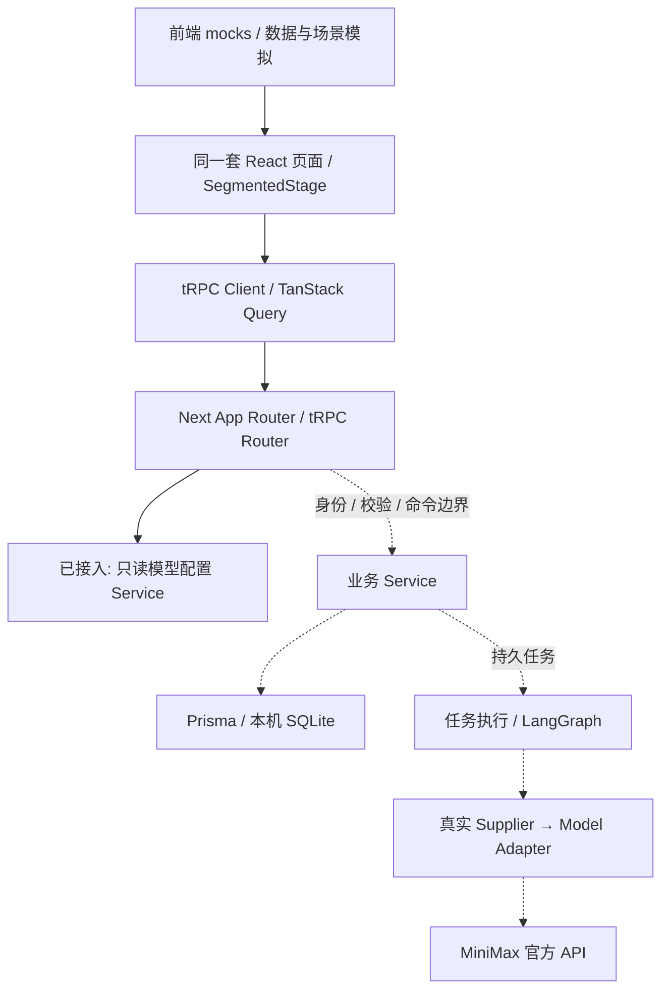

# T3 全栈与前端 Mock · 最新实施裁决

2026-09-10 · 用户已确认方向；本文区分已实现切片与后续计划。

## 1. 目标与取舍

一个本地优先应用，一套界面，一个开发入口。演示只是前端提供的数据与交互状态，不是另一套站点，不是注册在服务端的假模型Provider。基于现有Next工程增量采用T3组合，不重新运行脚手架覆盖用户文件。

T3采用Next.js + TypeScript + tRPC + Prisma + Tailwind；TanStack Query管理请求状态，Zod负责边界校验。LC/LangGraph仍是未来单一编排层，不新增第二套Agent循环。桌面壳后续复用界面和业务，不把Next服务端代码直接当作WebView代码。

## 2. 目标架构（虚线部分尚待实现）

- Mock及浏览器演练数据不穿过tRPC，不写正式SQLite，不调用模型，不依据密钥自动切换模式。
- 普通组件不直接导入fixture对象，演示页面入口/控制器注入副本；共用呈现组件只消费props。正式素材解析和空白创作默认值不是Mock。
- 服务端Router薄化；权限、CAS、幂等、关联检查和事务集中于Service。Next同进程承载HTTP与业务入口，不要求另起一个HTTP runtime代理CRUD。
- 现有`apps/runtime`只保留已验证的数据库基础切片与迁移；后续提取/复用其数据库访问层供业务Service使用，不复制数据库真值或另开用户入口。本轮未把其诊断CLI变成正式服务。
- 持久生成任务不占用HTTP请求等待全程；工作进程即使后续独立，也属于同一产品的内部执行组件。
- 本机启动身份、单实例、鉴权/CSRF、持久任务恢复、备份和桌面分发依旧是交付门槛，采用T3不意味着自动具备这些能力。

## 3. 当前代码职责

| 位置 | 职责 | 实施状态 |
|---|---|---|
| `apps/web/mocks` | 示例剧本、演练状态、模拟意图、MockSession | 已接入默认演练入口 |
| `apps/web/lib/presentation` | 空白剧本默认值、正常素材解析 | 已从demo-data拆出 |
| `apps/web/components/segmented-stage` | 单舞台、阶段门禁、可收纳建议/自由回应、画面适配 | Mock消费中；真实media分支只有呈现测试 |
| `apps/web/trpc` | 类型安全请求、Query上下文 | 已接入 |
| `apps/web/server/api` | AppRouter与HTTP来源门禁 | 仅只读`video.configuration` |
| `apps/web/server/services` | 当前模型配置查询；未来业务Service | 当前无真实写入或收费接口 |
| `apps/web/contracts` | Zod DTO边界 | 目前只有配置DTO；不是全量业务契约已迁移 |
| `apps/runtime` | 已有Prisma/SQLite事务切片 | 未接页面，无新增数据库迁移 |

凭证、内部文件路径、Prisma对象不进入响应或浏览器包。客户端仅type-import AppRouter。内部错误不返回stack；HTTP响应no-store。当前只允许固定本机开发origin，托管Web与桌面origin适配须另行安全评审，不能直接通配。

## 4. Mock与原数据

1. 示例种子每次返回深拷贝，初始化不访问用户库。静态素材不标成生成视频。
2. 演练流程：模拟等待 → 静态参考 → 显式“模拟片段结束” → 3项示例建议/自由回应 → 下一轮。固定等待仅用于UI演练，不表示真实生成延迟。
3. 播放阶段不提供输入；收起、全屏、改画面适配不新增回合。重复回应与旧回合完成事件被丢弃。模拟失败可重试同回合。
4. 本轮沿用浏览器原存储保存用户创作和带`recorded-demo`标识的回应；不把用户内容当Mock重置，不静默切SQLite。
5. 演练checkpoint按Save隔离、带版本保存阶段/轮次/未发送稿；回应与checkpoint在同一次浏览器写入中提交，避免跨key半成功。读取损坏/未知版本/轮数不一致时保护原数据，写入失败保留pending与重试。旧记录没有checkpoint时以已有回应数初始化演练，不冒充恢复旧视频。退出与替换草稿使用页面内确认。此恢复仅为Mock，不代表正式P07或真实媒体播放恢复通过。
6. 原静态设计源仅追溯保留，不另启动站点；历史不同origin的内容必须由用户显式导出后导入。

## 5. tRPC契约迁移而非再造REST

`AppRouter`是已上线tRPC操作的类型基准，Zod是运行边界，DTO不直接等同Prisma模型。

| 当前操作 | 类型 / 输入 / 输出 | 权限与副作用 |
|---|---|---|
| `video.configuration` | query / 无业务输入 / VideoConfiguration | 仅公开部署元数据；本机来源门禁；不读取用户库、不创建任务、不返回密钥 |

原`/api/video/status`客户端已改用该操作，不保留同义REST接口。旧fal实验链源码保留但默认应用未引用；前端演练不请求它，也不作为官方适配的fallback。

旧47项REST候选均未上线，旧OpenAPI保持原`x-implemented:false`作业务语义历史检查表，不再当作新客户端生成源。后续逐项映射为tRPC，不声称REST envelope与tRPC wire格式兼容。每项必须补输入/输出、权限、错误码、CAS、幂等、失败和迁移说明，再标实现。

保留字段与规则：UUIDv7身份、createdAt/updatedAt/deletedAt、revision、逻辑删除、禁止外键/伪唯一、真实唯一约束、金额十进制字符串、原子命令回执、任务结果未知先核对。CAS/幂等在tRPC业务命令输入中显式传递，不能仅依赖客户端按钮禁用。业务身份不得由输入ownerId决定。

## 6. 实施顺序与验收

2026-09-10补充：[M0-B内部剧本根CRUD](../implementation/M0-B-STORY-CRUD-2026-09-10.md)已验证create/get/list/update/soft-delete/restore及幂等/CAS。它不是新HTTP runtime，不改变现有tRPC公开操作清单；正式接入仍先完成宿主身份、会话与数据保护。

- **本轮：** T3传输骨架、前端Mock拆分、同一入口分段演练、历史文档标记、类型/构建/自动测试及浏览器冒烟。
- **下一切片：** 本机启动身份与受保护`story.create/get/update/delete`，复用事务Gate，完成一次真实SQLite保存→重开读取；随后角色、图片、版本冻结。
- **随后：** 官方供应商配置和不可变绑定、报价/授权、异步生成/核对、有效播放门禁、两轮连续性与恢复。
- **后续：** Tauri本机宿主、备份/升级、双端适配。不是另做桌面业务应用。

## 7. 参考

[T3官方tRPC用法](https://create.t3.gg/en/usage/trpc)与[tRPC TanStack Query集成](https://trpc.io/docs/client/tanstack-react-query/setup)。固定版本依据本机安装与锁文件，不借本次整合升级既有Next/React/Prisma大版本。

## 8. 技术方案1.2新增约束

[统一技术方案](TECHNICAL-SOLUTION-V1.md)与[分支专项](BRANCH-SAVEPOINTS-DESIGN.md)补齐后续来源与预算设计：M2首个真实预算即引入根树共享BudgetScope，M3单线确认事实即原子生成Snapshot/Savepoint，B1再开放fork新Experience和只读回看，B2做完整树形呈现。不是现在建立全部远期表，也不把前端演练checkpoint迁成已确认剧情。

前端Mock仍由前端管理；后台故障注入仅限隔离测试的依赖替身，不作为可选供应商、不接默认产品流。所有真实业务入口仍在同一AppRouter，分支候选接口和二期Chat目前均未实现。

## 9. 成熟组件复用修正

通用UI优先shadcn/ui；二期AI Chat优先AI Elements与官方@ai-sdk/langchain适配，不自写同义组件/流协议。tRPC覆盖CRUD和游戏命令；专用AI Chat流允许同一Next里的原生Route Handler，复用同一会话与Service，不算第二套CRUD。具体依赖当前尚未接入，实施前验证全屏portal、流事件和本机恢复，见[复用审计](FRAMEWORK-REUSE-AUDIT-2026-09-10.md)。
