# 未完 · V1 技术方案交付稿

> 2026-09-14 原应用游玩接线更新：见 [PLAY-FLOW-V1](../api/PLAY-FLOW-V1.md)，包含已实现架构/时序、报价接受、回应草稿与恢复契约。已通过本地替身链路验证；已补服务端计时播放会话与原子存档；基础历史分支已接入，真实供应商验收与结算仍未完成。

> **2026-09-14 主链实施：** [分段生成与播放 API 契约/时序](../api/GENERATION-RUNTIME-V1.md)覆盖报价、原子接受、可恢复执行、播放后节点和下一幕来源关系。播放 GET/完成回执已接原 Host/tRPC 和浏览器客户端；当前幕依据已接受报价的逻辑修订定位，不依赖系统时间。正式 executor、媒体服务与原页面绑定待继续，不代表产品闭环完成。

> **视频供应商边界：** Worker 已通过 `VideoJobAdapter` 调用纯 prepare/validatePrepared/reference 与异步 submit/read；供应商协议与模型枚举留在适配器内。固定 binding ID/hash 和账户身份在每次执行/恢复时校验。正式 MiniMax 传输支持该端口，其他供应商需独立实现和准入，不能仅替换 URL。

> **最新实施设计入口（2026-09-12）：** [M1 原页面前后端贯通](INTEGRATED-AUTHORING-M1.md)补齐前端状态、统一契约、角色/图片事务、新baseline、重置边界及验收。用户已明确不要旧数据兼容，允许清空本项目业务数据重建。当前进度以 [PROGRESS](../PROGRESS.md) 为准，下方历史设计不是当前功能完成声明。

> **2026-09-12 实施更新：** M0-C2/C3 已接入显式本机初始化、会话和同一页面的 SQLite 世界设定 CRUD；当前契约/验收以[实施记录](../implementation/M0-C2-C3-LOCAL-AUTHORING-2026-09-12.md)为准。下方此前状态保留为阶段记录，不代表新增能力仍未接入，也不代表角色、素材、模型和分支已完成。

**版本1.2 · 2026-09-10 · 技术设计评审版，非实现验收。**

本版统一T3单入口、当前M0-A/B实施状态、分支存档的数据关系与预算归属。数据规范1.3、架构1.4；旧REST/OpenAPI1.0保留历史语义，不当作当前AppRouter已上线清单。评审记录见[本轮设计审查](DESIGN-REVIEW-1.2-2026-09-10.md)。

> **复用选型补充：** 1.2评审通过的是业务边界，成熟框架复用仍需补齐。[Vercel / shadcn复用审计](FRAMEWORK-REUSE-AUDIT-2026-09-10.md)明确优先shadcn、AI Elements及官方LangChain适配；专用Chat流可复用同一Next中的原生流路由，不要求重写成tRPC。整体选型待最小兼容性验证，不表述为全部完成。

> **2026-09-11 实施补充：** 产品名恢复为「未完」；首个 shadcn 弹窗、组件化分区布局及 Web Docker 打包已落地。见[实施记录](../implementation/SHADCN-SHELL-2026-09-11.md)和[部署说明](../deployment/DOCKER.md)。这不改变下方1.2历史评审边界，也不表示正式数据库/模型链路已接通。

> **2026-09-12 M0-C1：** 剧本应用用例已抽取owner限定事务存储端口、Prisma适配器与组合入口；291项主仓测试、类型检查、构建通过。见[实施与执行时序](../implementation/M0-C1-STORY-STORE-2026-09-12.md)。正式宿主初始化、会话及受保护tRPC仍待M0-C2/C3；表内M0-A/B状态为历史切片，不代表页面已落SQLite。

## 1. 产品与本轮范围

产品是用户驱动的分段生成互动视频平台：设定世界/人物/图片 → 固定开局版本 → 生成 → 检查与播放 → 完成后选择或自由回应 → 下一幕 → 保存恢复。

游玩使用桌面宽幅单舞台和可收纳浮层，不在播放中伪装自由打断。AI对话创作/画布是二期独立能力，复用创作Service，不把游玩界面改成AI Chat。

新增分支方向：用户从一个已确认历史节点另开路线，原线保留。故事树是游玩中动态长出的经历关系，不是预制剧情树。**一期先设计好来源链、预算归属和稳定Savepoint；完整分支UI分阶段实现。**

## 2. 当前实现边界（2026-09-14）

| 范围 | 当前实现 | 验收边界 |
|---|---|---|
| 单一3100/T3入口 | 原剧本、角色、图片、准备与游玩页面接本机Host/tRPC/SQLite | 演示数据仅在前端；正式入口无生产Mock |
| 数据与身份 | Prisma、28表、18业务唯一、零FK；本机会话、写事务、revision和命令回执 | 用户库增量升级保留旧数据 |
| 分幕游玩 | 费用确认→执行/查询→私有视频→完整播放→情境建议/自由回应→下一幕 | 本地供应商替身链已验证；付费两幕未验收 |
| 播放与持久化 | 服务端计时会话、顺序回执、不可变已播存档、回应草稿与重启恢复 | 非真人观看证明；历史回看/fork/重启找回已接入 |
| Provider | 供应商/连接/model分层，OpenRouter文本、MiniMax官方视频安装器 | Pollo完整公开协议及模型ID待确认，不混用Key |
| 成本 | 显式报价确认、预留与未知责任保留 | 实际账单结算仍待完成 |
| 二期 | AI创作工作台、画布、物体/位置点击 | 不扩展本期交付范围 |

本节及[原游玩API](../api/PLAY-FLOW-V1.md)、[PROGRESS](../PROGRESS.md)是当前实施入口；下方早期方案保留设计背景，不能用历史表数或状态当作现状。

## 3. 单入口架构

- **React/Next界面**：Player、创作管理、历史查看。前端Mock由独立前端控制器注入；不注册后端假Provider，不偷偷切真实模式。
- **Next服务端/tRPC**：同一个HTTP入口，身份/Origin/CSRF、DTO与错误边界；薄Router调用应用Service，不另建一套同义REST CRUD。
- **Service/领域**：权限、来源完整性、CAS、幂等、冻结版本、fork、报价、任务/预算/事实事务。领域状态不藏在聊天数组中。
- **Prisma/SQLite与AssetStore**：本机持久真值、不可变媒体文件；图片用途和引用显式，文件/SQL跨介质失败有恢复协议。
- **任务worker**：后续常驻内部执行组件，不是第二网站；扫描持久任务、取得租约，在事务外有界调用模型。
- **LangChain/LangGraph**：唯一编排；工具经过Service。若用Vercel AI SDK，仅负责UI/流适配，不建立第二个Agent循环。
- **Provider**：供应商→地区/账号Connection→精确ModelDeployment→不可变Binding→本回合ExecutionProfile。官方MiniMax与fal不互相冒充、不自动fallback。

`apps/runtime`当前是已有数据库与内部用例模块/诊断CLI。后续供Next Service和内部worker复用；不因为目录叫runtime就另起HTTP代理。开发热更新不应创建第二个DB owner或任务worker，实例所有权需在M0-C验证。

## 4. 数据与事务基线

- SQLite＋Prisma；UUIDv7。可变根createdAt/updatedAt/deletedAt/revision，时间由Clock生成；不可变记录不伪造更新/删除字段。
- 禁止物理外键及关系触发器；标量ID＋应用事务验证所有者、存在性、可引用状态。
- 保留有真实基数依据的唯一约束。标题、角色名、hash、父节点/来源存档点不强行唯一。
- 所有写入先WriteGate，再检查回执、关联、版本并提交业务。回执和业务原子写入；历史回执不是当前状态。
- 文件先验证再以不可变身份落地；DB引用和GC状态通过受控事务维护，不能用软删除假装物理擦除。
- 当前M0的15表/13真实唯一不变。任务、存档点、快照、scope预算按后续迁移增加，不编辑已应用历史迁移。

详细规范：[数据1.3](DATA-DESIGN.md)；已实现内部契约：[M0-B](../api/INTERNAL-STORY-DRAFTS-M0-B.md)。

## 5. 分支存档：本版核心新增

采用[ADR-0001](adr/ADR-0001-branch-experience-and-shared-budget.md)：**显式fork新Experience，不新增重复拥有世界进度的Branch聚合。**

1. 普通片段有效观看并完成事实提交后，原子产生不可变StateSnapshot/Savepoint和可回应节点。生成中/未看完的恢复点不自动具备fork资格。
2. 从B分叉只继承B及以前的已确认状态、配置和必要素材引用，绝不读取源经历后来C/D的“最新记忆”。
3. 新child有自己的fork_base、decision/建议ID、空稿、控制身份和事件流；不重复消费source节点，不伪造新播放回执。
4. rootExperienceId组织故事树，sourceSavepointId标来源；同一父点允许多个child。树是查询投影，回看位置不改变当前进度。
5. 创建child零模型调用，初始暂停。当前路线保存/暂停、创建fork、进入child、取得控制/恢复、报价并提交回应，是明确且可恢复的步骤。
6. 共享前缀和媒体须有child持久引用；删除source不删坏child，访问范围也不因此扩展到source的未来。
7. 每棵树一个BudgetScope总上限，各Experience有新增消费子上限。同一费用只记一次，按两种作用域汇总；fork不复制钱、Quote、lease、任务或许可。

详细字段/事务/异常/BR01–12：[分支存档设计](BRANCH-SAVEPOINTS-DESIGN.md)；[逻辑关系与时序](DIAGRAMS.md)；[候选tRPC契约](../api/BRANCH-CONTRACT-DRAFT.md)。以上尚未落地。

## 6. Provider、费用与恢复不变量

| 不变量 | 技术保证 |
|---|---|
| 创建、回看、fork不是付费开始 | 这些命令不调用LLM/视频模型、不创建生成Job或预留；生成另行Quote/接受 |
| 一次意图只接受一次 | 当前child节点、独立版本/lease、幂等键、原子回执与CAS |
| 每次付费有绑定上界 | Quote固定profile、素材用途、动作、价格版本、币种与scope；接受时两级预算检查 |
| 生成候选不等于已发生事实 | 媒体验证→完整播放证据→事实/存档点事务；fork仅继承已确认过去 |
| 未知提交不盲重试 | 原账号/taskId核对；保留原operation及预留，scope未知责任不因分支消失 |
| 保存/切线不取消已受理任务 | 暂停只阻止新派发，原任务继续安全核对和费用结算 |
| 更换默认模型不改变历史 | 不可变Binding/Profile/素材版本；新的显式授权不影响旧操作 |

Provider专项规范仍为[供应商准入](PROVIDER-DESIGN.md)。真实端点、能力、费用、连续性与延迟必须官方来源及有预算实测，设计与适配代码不代表已验证可用。

## 7. 契约与文档权威

| 文档 | 职责 |
|---|---|
| [PRD](../../FINAL-PRD.md) / [页面细则](../product/PAGE-SPEC-V1.md) | 范围、产品动作与呈现 |
| [本稿](TECHNICAL-SOLUTION-V1.md) / [总体架构](ARCHITECTURE.md) | 当前统一交付架构；T3替代旧独立HTTP拓扑 |
| [数据规范](DATA-DESIGN.md) / [分支专项](BRANCH-SAVEPOINTS-DESIGN.md) | 持久真值、关系、事务、预算/来源约束 |
| [需求追踪](PRD-TECH-TRACEABILITY-V1.md) | F/P/AC、分支BR项与实施阶段 |
| 当前AppRouter / Zod / [T3裁决](T3-FRONTEND-MOCK-2026-09-10.md) | 已实现tRPC操作与真实运行边界 |
| [旧API语义](../api/CONTRACT.md) / OpenAPI | 既有业务语义与未上线REST历史检查表；不是新客户端生成基准 |
| [分支候选契约](../api/BRANCH-CONTRACT-DRAFT.md) | 待评审tRPC方法，未注册，implemented=false |
| [实施计划](../superpowers/plans/2026-09-10-local-first-implementation.md) | 分阶段开发闸门与实际验证 |

冲突时同步修正文档与契约，不由图或聊天历史暗中覆盖状态语义。模型动态卡片只渲染白名单数据，不执行模型返回的任意UI代码。

## 8. 落地顺序

2026-09-14 实施增量：[私有生成视频](../api/PRIVATE-GENERATION-MEDIA.md)给出实际架构图与时序、SQLite授权、不可变文件、恢复hint、ffprobe尺寸/轨道时长校验、认证Range及FD生命周期。无新增表、物理外键或唯一键。原生产供应商executor、费用确认、舞台状态机和播放覆盖凭据仍需接线；媒体基础设施通过验证不等于两幕生成闭环。

1. **M0-C：**稳定宿主身份、一次性启动材料、服务端会话/CSRF、单实例与备份/数据保护。
2. **M1：**同一个T3应用的受保护剧本/角色/素材保存、冻结版本、显式导入与重新打开。
3. **M2：**来源关联、BudgetScope基础、Quote/任务/账本/核对、官方供应商能力验证。
4. **M3：**有效播放、事实/Snapshot/Savepoint原子提交、两轮真实生成、单线保存恢复。
5. **B1/B2：**先分支事务/预算/引用/回看，再完整故事树；排期单独确认，不能跳过前置验证。
6. **M4/二期：**桌面交付；AI创作Chat/画布按独立提案推进，不挤入视频生成热路径。

“方案OK”指关系、职责、错误和验收能支撑相应切片实施，不指产品全部可用。本轮审查结论及仍需实测的门槛见[评审记录](DESIGN-REVIEW-1.2-2026-09-10.md)。
