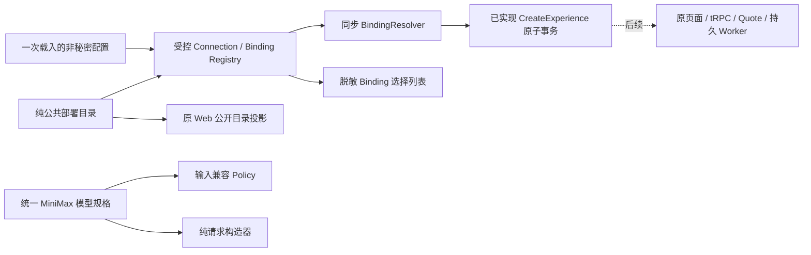

# M2-A3 · 单一部署目录、宿主登记与输入兼容策略

2026-09-13 · **已实现纯 runtime 登记和兼容检查，宿主启动加载/原页面 tRPC 接线是下一步。** 本文补充既有 Provider 设计，不引入第二个模型目录、应用或数据库。

## 1. 分层与唯一来源



- `contracts/video-deployments.ts` 为供应商—公开型号—精确远端型号的唯一映射。现有 Web catalog 只保留演练/live配置判定和这一公共目录的投影，不再拥有第二个部署数组。
- `providers/minimax-request.ts` 从原 Web 迁入 runtime；原实现删除，官方 jobs 调用方直接 import 包出口。浏览器可用的纯请求出口不导入 Host、Prisma、文件/秘密读取器。
- `providers/minimax-constraints.ts` 为请求构造与登记/策略共用的规格约束，不复制两套时长/分辨率矩阵。
- `application/video-binding-registry.ts` 只处理本地有界配置和内存查表；没有自动 fallback、网络、凭据探测、默认账户。
- `providers/minimax-capabilities.ts` 区分官方文档、已实现请求子集、未知账户实测，以及输入兼容检查。

现有 fal live factory 不被改造成官方 job；`video.configuration.available` 原有 live 语义不升级成正式开始资格。

## 2. 非秘密配置

`createVideoBindingRegistry(unknown)` 输入以下精确字段。它应由宿主启动固定加载一次；当前尚未开放 HTTP 任意配置输入，也未开始每请求读文件。

```json
{
  "schemaVersion": 1,
  "connections": [
    {
      "id": "personal-international",
      "providerId": "minimax",
      "region": "international",
      "accountScopeId": "my-declared-account",
      "credentialRef": "env:MINIMAX_API_KEY"
    }
  ],
  "bindings": [
    {
      "bindingKey": "video-primary",
      "versionNo": 1,
      "connectionId": "personal-international",
      "catalogId": "minimax-h3-max",
      "operationKind": "text-to-video",
      "generation": {"duration": 5, "resolution": "768P", "ratio": "16:9"}
    }
  ]
}
```

此示例不是已配置账户，也不会设置或读取 `MINIMAX_API_KEY`。credentialRef 只接受 `env:`/`keyring:`引用形态；拒绝原始 key 字段和不带引用类型的值。账户 scope 是宿主声明的稳定身份，不是已验证账号证据。

| 规则 | 实施 |
|---|---|
| 地区 | 仅显式 `cn` / `international`，由代码映射受控 endpointProfile；不接收任意URL |
| 数量 | connections≤32、bindings≤128；另受共用JSON深度/节点/字符串/总大小限制 |
| 真实唯一 | connection.id；bindingKey+versionNo。不按标题、模型、同账号绑定数量去重 |
| 引用 | 每个Binding必须引用存在Connection；provider/catalog必须是受支持的精确组合 |
| 参数 | generation仅duration/resolution/ratio；额外model/auth/URL字段均拒绝 |
| 隔离 | 输入先规范化脱离外部对象，返回每次也脱离内部记录；不同owner组装只使用本次受信上下文 |
| 无配置 | 显式空数组是有效空目录；没有静默MiniMax/fal默认值 |
| 漂移 | 当前登记可产生新快照候选，但已存同版本账户/地区/参数变化由CreateExperience严格报冲突，不覆盖历史 |

不新增Connection表、FK或迁移；固定连接身份仍存既有Binding.parameters。`list()`只返回公开选择、generation、canPrepare=true、canDispatch=false和accountVerification=unknown；不返回credentialRef、账户scope或端点。

## 3. 输入兼容，不是付费准入

`checkVideoCompatibility(binding,{prompt,images})`先完整解码已知Binding/capability版本，再按精确模型和输入场景检查。opaque schema1、伪造verified、未知版本、错地区endpoint、错model都不会获得肯定结果。

```ts
type Compatibility = {
  compatible: true;
  requiresImageTransport: boolean;
  accountVerification: 'unknown';
  canDispatch: false;
};
```

没有自动报价、预算预留、授权、上传或任务派发；**不能把compatible改名成“模型已就绪”**。图片只是元信息校验，文件真实字节、转码与远端租约仍由后续素材传输负责；纯请求构造器已在URL解析前限制每地址8192个UTF-8字节，最终JSON（含转义）限制65536个UTF-8字节。这是URL-only适配的保守实施上限，不把官方64MB误写成64KiB。

官方规格依据：[国际创建接口](https://platform.minimax.io/docs/api-reference/video-generation-v2-create)、[国内创建接口](https://platform.minimax.cn/docs/api-reference/video-generation-v2-create)，本轮实际读取日期2026-09-13。H3与Max的时长/分辨率、t2v与首尾帧组合、图生输入决定比例，分别进入固定版本矩阵；不存在实时流或随时打断的承诺。

具体范围：
- 文生仅非空prompt、无图片；图生必须1–2张首/尾帧，角色不可重复，比例adaptive。
- prompt上限7000字符；图片仅JPEG/PNG/WEBP/HEIC/HEIF元信息，维度256–5760，宽高比0.4–2.5；实施使用保守30,000,000字节上限。
- H3文档中的参考输入仍明确标记**adapter未实现**；不把头像/风格参考偷映射成首帧，也不降规格凑成功。
- `documented`固定来源/日期/规格，`implemented`记录请求子集、尚无媒体传输/持久派发，`verified.status=unknown`。后续真实账号测试证据和价格/授权包络另行建立，禁止用户输入一个verified布尔值取得派发权。

本版检查固定已知快照的一致性，不宣称文档永远有效；正式Quote之前还需时效/账户/价格和完整素材组合的策略，历史任务查询继续使用固定身份而不是新默认配置。

## 4. 验证和下一接线

纯测试覆盖空登记、地区/account映射、重复真实身份、悬空/错组合、额外URL/key、getter、返回值/原对象变动、跨owner、未知/伪造能力和输入边界。真实SQLite补验具体registry→CreateExperience持久绑定，以及换账号同版本被拒绝但旧command原样回放。

后续沿原Host `withLocalDatabase`增加窄的opening wrapper，固定启动登记；新增受认证binding目录及opening create/getPreparing tRPC，必须一起接入来源、请求标记、非batch、请求限额和严格输出parser。原保存确认后的准备浮层消费目录，不读取私密配置，不在弹窗挂载/自动会话时创建经历。正式Quote和worker还未完成时，仍明确“已准备，尚未生成”。
