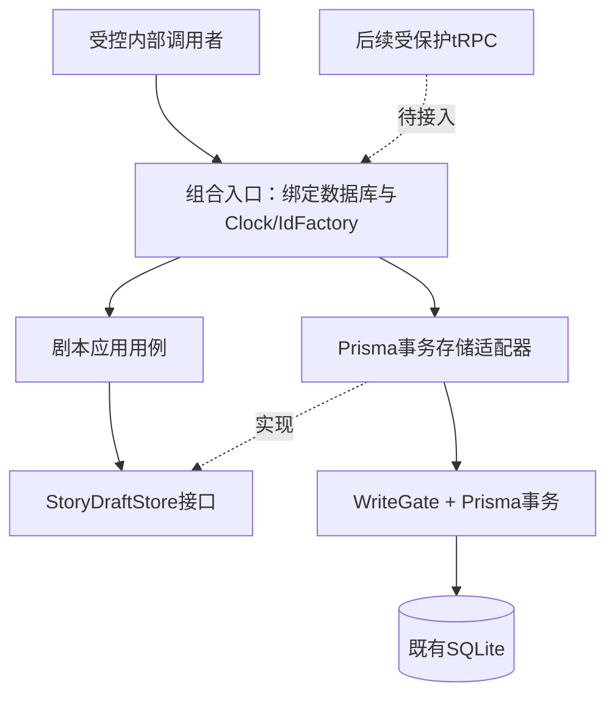
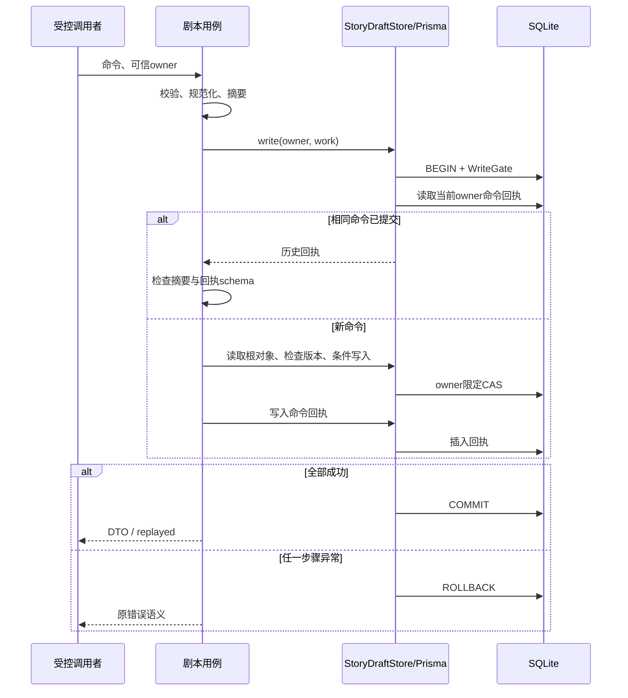

# M0-C1 · 剧本事务存储边界

2026-09-12 · 基础切片已完成；不是完整正式持久化交付。

承接[闭环审计](../architecture/CLOSURE-AUDIT-2026-09-12.md)及[已批准范围](../superpowers/specs/2026-09-12-story-store-boundary-design.md)。这是M0-C的基础切片，不是完整正式持久化交付。

## 本切片的作用

已有内部剧本根CRUD混合了业务校验和Prisma查询。后续Next/tRPC与worker应复用同一套业务规则，因此在接HTTP前建立具体的事务存储端口。没有增加第二套CRUD服务、HTTP入口、数据库或通用Repository框架。

已实现依赖方向：

组合入口知道具体实现，应用用例只知道端口。这里的“owner限定”是可信内部上下文的作用域，不是新做了HTTP鉴权。

## 写命令执行顺序

回执检查早于根对象的当前状态/CAS；重放不把旧状态重新写回数据库。回执与业务必须共享同一个事务回调，禁止将它们分成两个独立提交。

## 明确不变

- 命令/DTO/错误码、UUIDv7、createdAt/updatedAt/deletedAt/revision规则。
- 15张现有表、13项已登记真实唯一、零数据库外键、零关系触发器。
- 同源HTTP门禁、公开操作只有video.configuration；没有新写入路由。
- 页面、前端Mock、浏览器草稿与用户图片均不切换、不迁移。
- 镜像0.1.0仍为Web原型版本，不为本内部切片重打已发布标签。

## 下一步M0-C2/C3的准入条件

1. **显式初始化**：本机命令选择数据目录并校验；“打开页面”不应隐式创建身份或修改任意数据库。重复初始化识别同一宿主，不新增owner；中途失败可恢复且不覆盖既有数据。
2. **实例与生命周期**：明确哪个进程拥有数据目录及任务调度。端口唯一、进程内global变量不能独自证明实例唯一；进程退出/崩溃、热更新、误指向同一数据目录须有测试。
3. **身份和会话**：稳定本机owner与浏览器会话分开。Origin检查不是身份；受控一次性启动凭据只用于建立会话，不能当永久查询参数或进入访问日志。正式远程Web身份另行评审。
4. **迁移与恢复**：下一迁移需要更新批准清单及升级验证，不编辑已应用迁移，不删除Schema保护。WAL备份用一致性方案；同一清单跟踪必要素材，恢复在副本验证后再切换。
5. **契约与前端接入**：先根草稿读写，再人物与素材关系。现有UI字段与DraftSettings并不一一对应，应制定映射/版本，不丢弃人物、开局或图片。导入先预览、用户确认、幂等映射；旧浏览器数据保留。

这些条件尚未因C1接口抽取而满足。正式写入开放前再完成具体安全设计和集成验收。

## 验证记录

- 改动前基线：主仓278项测试通过。
- 实现代理RED：依赖方向测试检出旧应用层Prisma与infrastructure导入，退出码1；再实现端口与适配器。
- 主仓全量：`pnpm test`，29文件291项通过，比基线新增13项。
- 主仓类型检查：`pnpm typecheck`通过，覆盖runtime源码/测试及Web。
- 主仓生产构建：`pnpm build`通过；路由清单未增加正式写入。
- 原28项草稿集成用例保持92处expect；规格审查已复核仅变更适配器注入，未减少原断言。
- 新增10项真实SQLite存储契约测试＋3项依赖/端口测试；覆盖owner限定、CAS计数、回执唯一冲突回滚、回调异常回滚、Gate回滚、双连接读快照、游标/删除筛选及组合入口六操作。
- 计划评审Bohr通过；规格评审Kepler通过；代码质量评审Hegel通过，未发现新增P1/P2。
- `git diff --check`通过。未运行真实模型、浏览器迁移或正式应用重启验收。

## 回滚与交付边界

本切片没有数据库迁移或数据转换。代码回滚需同时恢复应用函数、测试与组合入口，不能只回滚适配器而留下新调用签名。当前没有正式HTTP消费者，因此不涉及已上线客户端DTO升级。未发布新镜像，既有v0.1.0标签保持不动。

非阻断维护项：当前依赖方向测试采用正则遍历导入，未来可改成TypeScript AST以处理注释等复杂语法；本次实际源码的依赖方向已人工复核，不将该守卫等同完整静态分析器。
