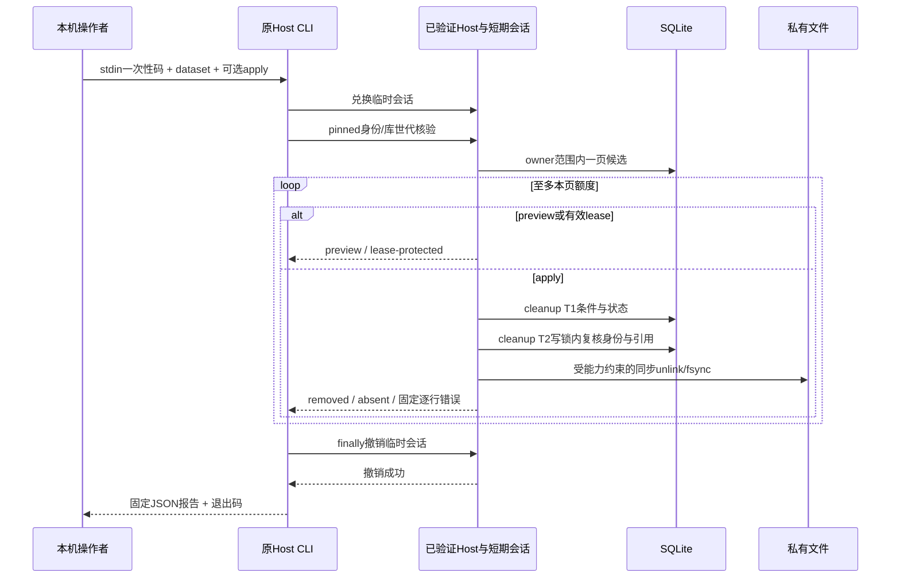

# M1 显式有界资产维护

状态：维护切片本地验收及两阶段审查通过。不是自动后台清理，也不表示剧本聚合已完成。

## 入口及运行语义

复用现有Host CLI新增 `maintain-assets`，参数为 `--directory` 绝对私有宿主目录、`--environment dev|prod`、必填 `--dataset UUID`，可选 `--limit 1..100`、`--cursor`、`--apply`。默认preview、默认检查25候选；只在明确apply时调用已验收cleanup。每次只做一页，不自动循环扫完、不另起守护服务。

凭据仅标准输入接收一次性connect code，43个ASCII字符加可选LF/CRLF，最多45字节，等EOF至多10秒。兑换的临时会话不写argv/URL/输出；finally撤销后才打印固定JSON报告。成功exit0、含逐行失败exit2、命令或撤销失败exit1。错误不输出异常对象、文件路径或凭据。

## 查询与清理

- 使用owner + (createdAt,id)严格keyset，游标绑定owner和dataset；额度按返回并检查的候选计，包括失败行与lease保护行，不按成功删除计。
- failed/deleting，或过期且非completed成为候选。枚举不是删除许可：cleanup T1/T2仍复查当前lease、所有Asset别名/历史身份与文件能力。
- 逐行错误固定标识并继续下一候选；fatal会话/库世代错误停止。满页可返回cursor，下一页可能空；重新不带cursor开始一轮才能复查迟到publisher/过期lease。
- preview/无候选不创建资产目录、不解码、不自动complete、不扫目录删除无记录文件。preview仍会在security中兑换/撤销认证凭据，不声称零磁盘写入。
- 原owner/createdAt/id索引实际EXPLAIN为SEARCH。全局assetId身份核对由SCAN变为新增非唯一 `ix_asset_uploads_asset(asset_id)` SEARCH；仅新baseline、DDL及指纹同步，16表/13业务真唯一/0FK/0触发器不变。

## 明确限制

候选25/100不是SQLite扫描CPU、总时长或RSS的硬上限：SQL可能经过非候选索引项。10秒是stdin期限，不以Promise.race伪取消同步unlink/fsync。保留deleting记录，不自动删除历史操作或资产回执。

正常错误与退出执行finally；SIGKILL不会执行finally，未输出的临时会话依既有8小时TTL失效。本批复跑既有两个进程T2/SIGKILL与超过事务timeout的证据，不将它称为新CLI强杀覆盖。

## 验证

Hegel报告维护5文件55项及旧Host/gate/T2合8文件143项通过；分批TDD覆盖分页同时间戳/跨库cursor/lease/默认预览/错误行继续/无EOF超时/命令进程argv无code/凭据撤销/真实文件删除后新进程absent。主会话完整复制15文件到稳定隔离树，另重新跑主仓8文件与隔离全量/类型/构建/五条Chrome。最终结果和审查问题只在PROGRESS登记，未通过前不标门槛已闭合。

## 时序

该顺序不宣称数据库事务能回滚文件操作，也不宣称SIGKILL时finally能执行。每条真实清理继续使用既有恢复协议；CLI不另写文件删除算法。

初轮主会话已实际取回143聚焦与隔离1387全量/双端类型/生产五Chrome的exit0，但Dewey随后真实SQLite发现首候选非法业务ID会阻断分页，已派Hegel修复并新增真实DB回归。该开放P2未关闭前，本片继续保持未最终验收。

原非法业务ID P2已修复并经Dewey独立69/69复审PASS，当前规格P1/P2=0。主会话最终9文件157/157 exit0；最后隔离全量/类型/五Chrome及Cicero质量仍待取回。位置key最大128 UTF8字节，与业务UUID分离；存储原值无损核对、控制/编码/时间损坏fail-closed边界已进部署文档。

## 最终本地门槛

2026-09-13 UTC：主会话取回9文件157/157 exit0；冻结C2+角色修复+维护16文件隔离树88文件1401/1401、双端typecheck、production build及五Chrome全部exit0。Dewey规格与Cicero质量各独立69/69 PASS，当前确认P1/P2为0。该隔离树不含在途故事聚合；整体主仓全量在聚合/原UI稳定后另跑。提交/精确CI见PROGRESS，未发布tag或新镜像。
