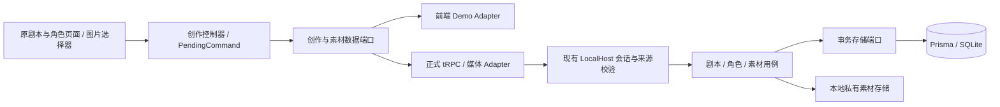

# M1 · 原创作页面前后端贯通（范围已确认）

**2026-09-12 新决策：用户要求不做旧兼容，允许清空本项目业务数据重建。下文已按单一新基线修订，细节以 [M1技术方案](../../architecture/INTEGRATED-AUTHORING-M1.md) 为准。**

承接已确认的 T3 单应用、前端 Mock、Prisma/SQLite、无外键设计。此文是下一批实施范围，不是功能已交付声明。现有 M0-C2/C3 真实保存仅覆盖独立 DatabaseDrafts 面板里的世界设定；原 Editor、CharacterLibrary 和图片选择器尚未贯通正式后端。

## 1. 用户目标与验收

同一应用、原有页面：创建角色 → 上传角色图片 → 创建剧本并配置角色/开局/封面 → 保存 → 关闭/重启应用 → 原页面读回相同设定与图片。

有无后端不改变页面含义，正式模式不静默回退 localStorage/IndexedDB。服务未连接时显示连接/重试状态，保留当前输入，不展示演示内容假装加载成功。不导入旧浏览器/数据库数据；新基线验收后仅重置本项目业务数据，不动源码、密钥与用户下载资料。

本批不重做视觉原型，不另开站点，不新增数据库专用创作页面，不伪装真实视频已生成。

## 2. 方案比较与建议

1. **推荐：共享原页面 + 显式数据端口。** 组件消费异步创作/素材端口；前端 demo adapter 维护演练，正式 adapter 使用 tRPC/受保护媒体路由。功能和反馈一套，数据来源明确。
2. 独立数据库面板继续加功能：最快，但用户需要学习两套创作路径，会继续出现“后端有功能、主页面未接通”。只作为 M0 历史验证，不继续扩张。
3. 直接把所有保存函数换成 fetch：表面改动少，但旧字段映射、UUID、同步回调、版本冲突和文件提交会丢失语义。不采用。

## 3. 依赖和边界

- 同一 Next 进程与现有 3100 入口。正式本机继续使用受控 loopback 启动器；普通 Web 公网身份方案不借本次接入扩大。
- 明确区分部署环境 APP_ENV 与是否连上宿主。缺失连接不会创建另一个 owner，也不会从正式存储降级到演练。
- 提取演示/正式入口的组合与控制器；页面、Editor、CharacterLibrary 不自行判断 process.env、查库、操作 IndexedDB 或实例化 Provider。
- tRPC 为业务 DTO/命令唯一接口。二进制上传和读取可走同一 Next 的受保护媒体路由，不把文件转成 base64 塞入普通 JSON mutation。
- 复用 owner、Clock、UUIDv7、WriteGate、回执与 CAS；不建立通用 BaseService/万能 Repository。

## 4. 先冻结字段映射，再改保存

当前正式 DraftSettings v1 为 premise/playerRole/worldRules/tone；原页面 Story 含 world/opening/genre、角色字段、关系和图片槽，二者并不等价。当前 API 写入这些额外字段会拒绝，省略则丢数据。

实施前必须冻结统一新契约和全字段往返测试：

| 原页面内容 | 正式归属 | 约束 |
|---|---|---|
| 标题 | StoryDraft.title 顶层唯一来源 | 不在 settings 重复保存 |
| 世界、开局、题材、玩家身份/规则/语气 | StoryDraft 的版本化 settings | 不把开局拼进 premise 伪装存储；单一当前格式，不读取旧v1行或做自动转换 |
| 姓名 | CharacterTemplate.name 顶层唯一来源 | 不在 settings 重复保存 |
| 性格背景、外貌、表达习惯、边界 | CharacterTemplate 的版本化 settings | 与历史未上线 REST 候选分别标明；旧前端字段不得丢失 |
| 角色头像 | portraitAssetId | 同 owner、ready 的正式 Asset，拒绝浏览器素材 ID 冒充 |
| 剧本主角及剧本内改写 | CharacterVersion + StoryDraftCast/overrides | 绑定固定版本，修改模板不篡改已有剧本；一期一位主角 |
| 初始关系 | 剧本内角色 overrides | 不反写模板 |
| 封面、开局参考图 | StoryDraftAsset 的槽和用途 | 封面不送模型；解绑不是物理删除文件 |

不通过复制 DTO 的方式维护两套相同 CRUD。现有 storyDrafts 操作直接替换为统一新输入/输出，不并存M0 API、旧回执转换或版本联合。新Prisma baseline与schema gate一起测试；旧业务库定向重建，SQL仍禁止外键。

## 5. 角色、版本和素材

### 角色

创建/读取/分页/更新/删除/恢复，明确 owner、revision 和命令回执。角色名不设业务唯一。将模板加入剧本时校验模板修订，在同一写事务里冻结或复用角色版本、绑定槽并递增父剧本 revision。模板后续修改不修改已冻结快照；剧本内改写也不反写模板。

直接在剧本里填写角色，不强制先去角色库：以**剧本作用域的内部模板**产生该剧本独立 CharacterVersion，默认不展示在用户角色库。作用域明确建模，不滥用 archivedAt/deletedAt 充当隐藏标志；M1-A 冻结对应字段、新库约束及schema门禁。只有用户显式“另存为角色模板”，才从当前剧本内有效设定创建独立的角色库模板，不把原剧本改成可被其未来编辑联动的引用。此路径与从库选择模板分别验收。

剧本内角色图片使用三态覆盖：inherit 继承已冻结 CharacterVersion 的头像；none 明确不用参考图；asset 指向本剧本 character 槽的正式素材。清除按钮选择 none，不因移除引用而重新继承模板图片。更换图片只写本剧本槽及覆盖状态，更新父 revision；不改模板、不可变版本或其他剧本。M1-C/D 必测两个剧本引用同一版本后仅改一个的图片，以及模板换图后旧剧本重启仍保持原样。

### 图片

沿用目前用户界面约束：JPG/PNG/WebP，输入最多 10 MiB、每边至少 256、最长边不超过 8000、最多 2400 万像素，输出最大边 2048。服务端独立检查实际字节、类型、解码和尺寸，不信扩展名及前端校验；不接收 SVG、任意远程 URL 或客户端文件路径。

文件放宿主私有目录，DB 保存元数据与引用。原始文件名不作为路径；内容读取检查 owner 和引用访问，返回私有媒体响应。保存时不上传外部模型。

文件与数据库不是同一事务：先写受限临时文件、校验处理、发布受控文件，再写 Asset/回执。失败/崩溃必须可核对，不在文件缺失时返回 ready；同命令重试不创建多条未知素材。正式启用前补齐中断与残留文件回收/核对方案及测试，不能靠“上传成功回调”宣称完成。普通解绑/删除不清理历史引用文件。

## 6. 异步页面行为

- 原同步 boolean 保存回调改为明确 Promise<DTO>，成功回执后才标已保存/进入准备页。
- 初次载入、空列表、失败重试、会话过期、冲突、保存中分别展示。网络失败不清空列表/表单。
- 外层导航显式接收 unknown 状态；结果待确认期间不得用普通“放弃修改”确认卸载控制器。先确认原命令或走明示的恢复处理。强制关闭浏览器的恢复属于持久命令日志能力，不把 beforeunload 提醒当作保证。
- PendingCommand 保留命令、原载荷、未知结果状态；复用 M0 丢失响应后的确认原则，不重复 create、不覆盖等待期间的新输入。
- 首次读取失败不当作空库，素材读取区分 loading/network-error/unauthorized/missing。列表搜索/筛选由后端查询处理；分页已加载条数不当作库总数。
- Query cache 仅缓存已确认 DTO；成功更新缓存和列表，冲突保留输入并提示重新载入。缓存不是主存储。
- 本批完成后正式入口收敛到原页面；独立 DatabaseDrafts 不作为第二条用户创作主流程。

## 7. 分批交付

1. **M1-A：契约和创作端口。** 完整 Story/Character/素材字段表及单一契约测试、页面异步保存接口、数据组合入口；保持已有演示回归。
2. **M1-B：正式角色 CRUD 和原角色库。** 真实 tRPC/SQLite、删除恢复、owner/CAS/unknown、刷新和进程重启。
3. **M1-C：图片与剧本绑定。** 文件/DB一致性、受保护读取、角色版本和槽关联，再贯通原剧本编辑器所有字段。
4. **M1-D：主流程验收。** 真浏览器创建角色/图片/剧本、清理页面缓存后读取、进程重启、并发更新、响应丢失、未授权素材访问，以及 demo 零后端写入。

每一批独立提交测试与当前能力说明；不可用的后续入口明确标为待接入。

## 8. 后续生成链路

本批创作完成后，继续供应商→精确模型绑定、凭证、不可变开局、预算确认、持久生成任务/轮询/失败恢复、媒体播放和下一幕。模型调用不得阻塞整个 HTTP 请求生命周期；不自动转到 fal，不承诺尚未验证的实时打断。真实付费验收单独确认凭证与额度。

## 范围复核记录

2026-09-12：独立前端核查与规格复审完成。补齐了顶层 title/name 唯一来源、剧本直接创建角色的作用域、图片继承/清除/替换、外层 unknown 保护和分页/错误状态。结论为“分期范围已确认，按用户新指令取消兼容层”，不等于角色/图片/主编辑器已实现。

### 本轮已做的前置修复（不是 M1 全部实施）

修复现有 Platform 外层导航卸载 unknown 保存命令的问题：编辑器显式上报 unknown，侧栏/存储 tab/新建入口先阻断，确认原命令后恢复导航。增加真实组件组合回归，先 RED 后 GREEN，并经独立源码复核。

验证：默认并行全量测试在本机出现 4 项 5 秒超时；未放宽断言/超时，改用 `vitest run --maxWorkers=2` 后 362/362 通过。修正测试类型选项后，最终聚焦 37/37 及 runtime/Web 类型检查通过。本轮未重新声称生产构建、Docker 或原页面角色/图片贯通已验收。
